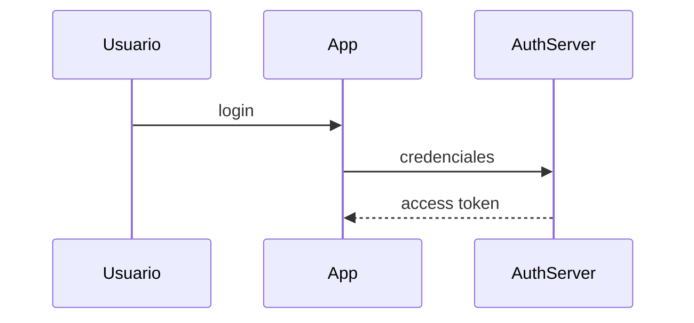

# 🎨 Estilo Tesla — cómo suenan y se ven los apuntes

> **Qué es:** la guía de estilo del procedimiento `generar-apunte`: formato visual md-nativo, voz, arquetipos, diagramas y síntesis. Se lee al generar y sintetizar una sección (P2 y P4).
> **Las reglas invariables** (una sección por archivo, quote-gancho, sin preámbulo, específico y no ambiguo, "Lo que debiste llevarte", capturas, estructura del apunte) viven en `apuntes/AGENTS.md` (A1-A12). Esta guía no las repite.
> **Origen:** `sistema/manual_apuntes.md` v3.0 (2026-06-08), partido el 2026-09-15 entre este archivo y `apuntes/AGENTS.md`. Se conserva la numeración de secciones (§2-§6).

---

## 2. Formato visual (md-nativo)

### 2.1 Jerarquía y la identidad del workspace

La jerarquía se expresa con **encabezados estándar** + el **split por archivos**:

- `#` — título de la sección (uno por archivo).
- `##` — subsección.
- `###` — sub-subsección (ocasional, si la complejidad lo pide).

**Identidad del workspace:** ya **no se usan colores** de heading (eran de Notion y no se ven en md). La identidad la dan **la carpeta del workspace** (`apuntes/ia/…`) y **el emoji** del workspace en el `#` del título y en el índice.

| Workspace | Emoji |
|-----------|-------|
| IA / LLMs | 🤖 |
| Cloud Computing | ☁️ |
| Code 301 (Full Stack) | 🦉 |
| CSS | 🎨 |
| GIT | 🐙 |
| JavaScript | 🐤 |
| Node.js | 🐶 |

Para un workspace nuevo: asignar un emoji conceptual que represente el dominio.

### 2.2 Quotes (el gancho)

Posición invariable: inmediatamente después del heading. Blockquote nativo de markdown.

```markdown
> **Definición central en negrita.**
>
> Contexto adicional o aclaración en la misma voz.
```

- Primera línea siempre en **negrita**.
- Para separar ideas dentro del quote: línea de quote vacía (`>` solo).

### 2.3 Callouts → blockquote con emoji + label

Los callouts de Notion (`:::💡`) se reemplazan por un **blockquote con emoji y label en negrita**. Renderiza limpio en MPE, en el preview nativo, en GitHub Pages y en el editor — sin depender de plugins.

```markdown
> 💡 **Tip:** preferir `const` salvo que necesites reasignar.

> ⚠️ **Importante:** este token expira en 30 minutos.

> 🎯 **Idea clave:** el modelo pide, el sistema ejecuta.
```

Emojis/labels sugeridos (no forzar uno en cada bloque, usar según el contenido):

- 💡 **Tip** — consejo, atajo, buena práctica.
- ⚠️ **Importante / Cuidado** — advertencia, error común.
- 🎯 **Idea clave** — el núcleo que hay que retener.
- 🔑 **Matiz** — distinción fina, excepción.
- 📝 **Nota** — aclaración secundaria.

### 2.4 Código → fenced code blocks

Bloques de código estándar con su lenguaje. Ya **no** van envueltos en callouts.

````markdown
**Sintaxis:**

```js
const [nombre] = [valor]
```

**Ejemplo:**

```js
const saludo = "hola" // valor que no se reasignará
```
````

- Secuencia: sintaxis abstracta primero → ejemplo práctico después (etiquetado **Ejemplo**).
- Comentarios extensivos dentro del código cuando aclaran el porqué.
- Para diagramas ASCII usar ```` ```text ```` (no es código de programación).

### 2.5 Tablas

Tablas markdown nativas. El editor las **re-padea/alinea** al guardar — esa forma alineada es la **canónica** (escribirlas ya alineadas evita ruido en git).

- Para comparativas con 3+ categorías, agregar **leyenda emoji**: `🔵 = X · 🔴 = Y · 🟡 = Z`.
- Cuando dos conceptos piden comparación directa, la tabla es preferible a apilar párrafos.

### 2.6 Emojis

- **En títulos:** sí. El emoji del workspace precede al título de la sección.
- **En callouts:** sí (son parte del label).
- **En tablas comparativas:** 🔵🔴🟡 como leyenda.
- **En formato Mito/Realidad:** ❌ y ✅.
- **Dentro de párrafos de texto corrido:** NO. Los emojis nunca aparecen dispersos en la prosa.

### 2.7 Listas

- Marcador canónico: **`-`** (guion). Consistencia en todo el apunte.
- **Las listas reducen fricción:** cuando una explicación tiene ítems paralelos (causas, características, pasos no secuenciales, condiciones), preferir lista sobre párrafo. Mejora el escaneo al releer semanas después.
- **Cuándo lista:** 3+ ítems comparables, el orden importa poco, cada ítem se lee independiente.
- **Cuándo párrafo:** secuencia argumentativa con conectores ("primero… entonces… por eso…"), solo 1-2 ítems, o cuando partir rompería el hilo de una idea.

---

## 3. Voz y Tono

### 3.1 Persona gramatical

| Contexto | Persona | Ejemplo |
|----------|---------|---------|
| Definiciones y quotes | Impersonal / 3ra persona | "Es un protocolo de autorización" |
| Explicaciones | 1ra plural inclusiva | "Vamos a ver", "podemos utilizar" |
| Instrucciones directas | 2da persona informal (tú) | "Debes recordar", "Imagina que tu código" |

### 3.2 Nivel de formalidad

**Didáctico-casual.** Como un tutor amable explicando a un estudiante: ni académico (evita jerga innecesaria) ni demasiado informal (mantiene claridad). Equilibra accesibilidad con precisión técnica.

### 3.3 Muletillas y conectores característicos

Usar con naturalidad: *"En otras palabras"*, *"En términos simples"*, *"Es decir"*, *"Debes recordar que"*, *"Se utiliza para…"*, *"Se usa frecuentemente para…"*, y la etiqueta **"Ejemplo"** para abrir ejemplos.

### 3.4 Preguntas retóricas

Muy presentes. Tres funciones: (1) marcadores de sección como heading (*"¿Qué significa?"*, *"¿Cómo llega a este estado?"*), (2) ganchos didácticos antes de explicar (*"¿Por qué necesitamos el DOM?"*), (3) formato visual.

### 3.5 Patrón "Dolor / Problema que resuelve"

**Patrón clave del estilo.** Antes de explicar qué es algo, explicar **por qué lo necesitas**. Secuencia: (1) ¿Qué problema/dolor existe? → (2) ¿Qué es? → (3) ¿Cómo funciona? → (4) Detalles y ejemplos.

### 3.6 Formato "Mito / Realidad"

Cuando el tema tiene concepciones erróneas comunes (tecnologías con hype, conceptos que se confunden):

```markdown
❌ **Mito:** "Los LLMs entienden lo que dicen."
✅ **Realidad:** Los LLMs predicen la siguiente palabra más probable según patrones estadísticos.
```

Aparece al inicio de secciones para desmontar ideas falsas antes de la explicación real.

---

## 4. Arquetipos de Notas

Existen 4 arquetipos base. En notas avanzadas **se combinan**. El tema dicta la combinación.

### 4.1 El Constructor Teórico

**Cuándo:** definir de cero un concepto, lenguaje, paradigma o elemento.
**Estructura:** ¿Qué es X? → Tipos/Clasificaciones → Detalles de cada tipo.
**Secuencia:** heading con pregunta → quote (definición) → lista de características → callout de casos de uso → subsecciones por tipo (cada una con su quote).

### 4.2 El Sintaxis Coder

**Cuándo:** enseñar a usar un comando, propiedad, método o herramienta.
**Estructura:** Intro → Categoría → Sintaxis → Ejemplo → Resultado.
**Secuencia:** heading del atributo → quote (qué soluciona) → bloque **Sintaxis** (código abstracto) → bloque **Ejemplo** (código real) → resultado/diagrama.

### 4.3 El Flujo Analógico

**Cuándo:** flujos multi-paso, procesos complejos, lógica abstracta; hacer intuitivo algo abstracto.
**Estructura:** Conceptos/Áreas → Estados/Lifecycle → Analogía(s) extendida(s).
**Sobre las analogías:** escenarios cotidianos (hotel, restaurante, transporte, teatro, fotografía); múltiples analogías por nota, integradas en el flujo (no en sección aparte); cada una mapea componentes técnicos a elementos reales; señalar **dónde deja de funcionar** la analogía.

### 4.4 El Documento Técnico

**Cuándo:** protocolos, arquitecturas, comparaciones multi-dimensionales; donde tablas e información densa sirven más que la narrativa.
**Estructura:** ¿Qué es? → Tabla de características → Tabla comparativa → Flujo por fases → Diagrama.

### 4.5 Arquetipos híbridos

Las notas actuales **combinan arquetipos**. No forzar uno solo. Ejemplos: *¿Qué es Cloud Computing?* = Constructor + Flujo Analógico; *Modelos de Servicio* = Documento Técnico + Flujo Analógico; *Qué es LLMs?* = Constructor + Flujo Analógico + Desmitificación. Dejar que la naturaleza del tema dicte la combinación.

---

## 5. Diagramas

### 5.1 ASCII en ```` ```text ````

**Cuándo:** flujos lineales simples, árboles de decisión, comparaciones lado a lado, líneas de tiempo, fases.

```text
¿Necesitas control total del servidor?
├── SÍ → IaaS
└── NO → ¿Necesitas control del código?
    ├── SÍ → PaaS
    └── NO → SaaS
```

### 5.2 Mermaid nativo (ya no se genera SVG a mano)

**Gran simplificación respecto a Notion:** Markdown Preview Enhanced **renderiza Mermaid directamente**. El agente escribe el bloque ```` ```mermaid ```` y MPE lo muestra como diagrama. Ya no hay paso manual de generar SVG y pegar imágenes.

````markdown

````

**Cuándo Mermaid:** flujos con múltiples actores, diagramas de secuencia (request/response), protocolos con bifurcaciones, arquitecturas de sistema.

**Posición:** siempre inmediatamente después de la explicación textual del flujo que representan.

### 5.3 Criterio de selección

| Situación | Usar |
|-----------|------|
| Flujo lineal A → B → C | ASCII |
| Árbol de decisión | ASCII |
| Comparación visual lado a lado | ASCII |
| Múltiples actores interactuando | Mermaid |
| Request/response bidireccional | Mermaid |
| Protocolo con bifurcaciones | Mermaid |
| Arquitectura de sistema | Mermaid |

### 5.4 Capturas e imágenes de apoyo

Viven en `apuntes/AGENTS.md` (A9): cuándo vale una imagen, pie de foto, datos sensibles y dónde se guarda.

---

## 6. Patrones de Síntesis

### 6.1 Densidad y extensión

No comprimir artificialmente. Si el tema lo requiere, la sección puede ser extensa. Pero la **densidad ahora se reparte entre archivos** (un archivo por sección), así que cada archivo individual se mantiene legible.

### 6.2 Criterio de selección

Favorecer definiciones que caben en una oración; priorizar comprensión sobre completitud; descomponer lo complejo en unidades simples; eliminar redundancia activamente.

### 6.3 Nivel de reescritura

**Muy alto.** Todo filtrado por *"¿cómo explicaría esto de forma que lo entienda realmente?"*. Definiciones personalizadas, ejemplos creativos, flujo didáctico (no enciclopédico).

### 6.4 Estrategia de descarte

| Se descarta | Por qué |
|------------|---------|
| Explicaciones teóricas largas | Se comprimen en 1 oración en negrita (el quote) |
| Casos extremos / edge cases | Van a notas separadas |
| Información repetida | Se consolida en tablas |
| Contexto histórico irrelevante | Se omite si no ayuda al aprendizaje |
| Disclaimers genéricos | Se eliminan (ruido) |

### 6.5 Aporte personal identificable

Analogías originales, puentes de reformulación ("Es decir" + explicación propia), tablas de comparación de estructura propia, callouts de juicio personal, y énfasis selectivo (qué va en negrita, quote o callout).

### 6.6 Definir términos donde se introducen

Si un término técnico aparece por primera vez en una sección, su definición va **en esa misma sección**, no como apéndice. Definición corta: inline en negrita. Definición media: en un quote inmediatamente después. Definición con ejemplos: en una subsección propia justo después del bloque donde aparece.

---

> Lo que sobrevive de la v2 (voz, arquetipos, síntesis) se conservó; lo propio de Notion (toggles, colores, callouts `:::`, columnas, SVG manual) se reemplazó o soltó.
