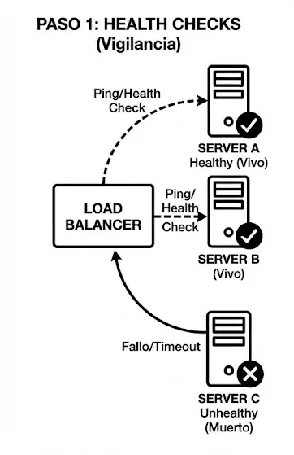

# Servicio Core: Networking

## Que es Networking? **Redes y Conectividad**

> Networking se refiere a cómo tus recursos en la nube (VMs, bases de datos, storage) se comunican entre sí y con el mundo exterior (Internet, tu oficina, otras nubes).
Networking = **cómo viajan los datos** entre computadoras.
> 

**Antes del Cloud:**

- Comprabas routers, switches, firewalls físicos ($1,000 - $50,000)
- Contratabas técnicos de redes para configurarlos
- Tirabas cables Ethernet por toda la oficina
- Si necesitabas más capacidad, comprabas más equipos

**Con Cloud:**

- No conectas cables físicos
- "Alquilas" infraestructura de red virtual bajo demanda
- La configuras en minutos desde una consola web
- Pagas solo por el tráfico que usas (por GB transferido)
- Escalas hacia arriba o abajo según necesidad

👉 En cloud, **Networking = alquilar infraestructura de red por Internet**.

### Networking en la nube


### 3. ¿Por qué Networking es CRÍTICO en Cloud?

Porque controla **3 pilares fundamentales**:

### 1. Seguridad

- Quién puede acceder
- Desde dónde
- A qué recurso

### 2. Rendimiento

- Latencia (tiempo de respuesta)
- Distribución de tráfico
- Cercanía al usuario

### 3. Costos

- Tráfico interno vs externo
- Uso de CDN
- Arquitecturas eficientes

👉 **Una mala red = sistema lento, inseguro y caro**

## Conceptos fundamentales de Networking

| Concepto | Definición | Analogía del Mundo Real |
| --- | --- | --- |
| **IP Address (Dirección IP)** | Identificador único de un dispositivo en la red (ej: 192.168.1.10). | Como la dirección de tu casa (Calle 123, Ciudad). |
| **Public IP** | IP accesible desde Internet (ej: 54.123.45.67). | Como tu dirección postal que cualquiera puede usar para enviarte cartas. |
| **Private IP** | IP solo accesible dentro de tu red privada (ej: 10.0.1.5). | Como el número de apartamento dentro de un edificio (solo visible para residentes). |
| **Subnet (Subred)** | Segmento de red con un rango de IPs (ej: 10.0.1.0/24 = 256 IPs). | Como un piso de un edificio (todos los apartamentos del piso 3). |
| **CIDR** (Classless Inter-Domain Routing) | Notación para definir rangos de IPs (ej: 10.0.0.0/16 = 65,536 IPs). | Como decir "todas las casas de la Calle 123" en lugar de listarlas una por una. |
| **Route Table (Tabla de Rutas)** | Reglas que definen a dónde va el tráfico (ej: "tráfico a Internet → Internet Gateway"). | Como un mapa de carreteras que dice "para ir al centro, toma la autopista A1". |
| **Gateway (Puerta de Enlace)** | Punto de entrada/salida de una red (ej: Internet Gateway, NAT Gateway). | Como la puerta principal de un edificio. |
| **Firewall** | Sistema que controla qué tráfico entra/sale según reglas (ej: "permitir HTTP, bloquear SSH"). | Como un guardia de seguridad que decide quién entra al edificio. |
| **DNS** (Domain Name System) | Traduce nombres de dominio a IPs (ej: [google.com](http://google.com/) → 142.250.185.46). | Como una guía telefónica que convierte nombres en números de teléfono. |
| **Latency (Latencia)** | Tiempo que tarda un paquete en viajar de A a B (milisegundos). | Como el tiempo que tarda una carta en llegar de tu casa al destinatario. |
| **Bandwidth (Ancho de Banda)** | Cantidad de datos que pueden viajar por segundo (Mbps, Gbps). | Como el número de carriles de una autopista (más carriles = más autos simultáneos). |
| **Throughput (Rendimiento)** | Cantidad real de datos transferidos por segundo (puede ser menor que bandwidth). | Como la velocidad real del tráfico (aunque haya 4 carriles, si hay congestión, vas lento). |
| **Peering** | Conexión directa entre dos redes sin pasar por Internet público. | Como un túnel privado entre dos edificios en lugar de salir a la calle. |
| **VPN** (Virtual Private Network) | Túnel cifrado para conectar redes privadas a través de Internet. | Como un túnel secreto entre tu casa y la oficina que nadie más puede ver. |
| **Load Balancer** | Distribuye tráfico entre múltiples servidores. | Como un recepcionista que dirige clientes a diferentes cajas en un banco. |
| **CDN** (Content Delivery Network) | Red de servidores distribuidos globalmente para servir contenido rápido. | Como tener copias de tu tienda en múltiples ciudades para que los clientes compren cerca. |

### 1. **Direcciones IP y CIDR**

**IP Address:** Identificador único de 32 bits (IPv4) o 128 bits (IPv6).

**Formato IPv4:** `192.168.1.10` (4 números de 0-255)

**CIDR Notation:** `10.0.0.0/16`

- **10.0.0.0** = Dirección base de la red
- **/16** = Máscara de red (primeros 16 bits son fijos, últimos 16 son variables)

**Ejemplos:**

| CIDR | Rango de IPs | Total de IPs | Uso Típico |
| --- | --- | --- | --- |
| `10.0.0.0/8` | 10.0.0.0 - 10.255.255.255 | 16,777,216 | Red corporativa gigante |
| `10.0.0.0/16` | 10.0.0.0 - 10.0.255.255 | 65,536 | VPC completa |
| `10.0.1.0/24` | 10.0.1.0 - 10.0.1.255 | 256 | Subnet (ej: web servers) |
| `10.0.1.0/28` | 10.0.1.0 - 10.0.1.15 | 16 | Subnet muy pequeña (ej: bases de datos) |

**Regla de oro:** Mientras más grande el número después de `/`, más pequeña la red.

### 2. **Public vs Private IP**

### IP Privada

- **Quién la ve:** Solo las máquinas dentro de tu misma red en la nube.
- **Uso:** Comunicación entre tu Servidor Web y tu Base de Datos.
- **Seguridad:** Altísima. Nadie desde Internet puede tocar una IP privada directamente.

### IP Pública

- **Quién la ve:** Todo el mundo en Internet.
- **Uso:** Servidores web que deben atender a usuarios, Balanceadores de Carga.
- **Seguridad:** Riesgosa. Necesita firewalls estrictos

| Tipo | Rango | Accesible desde | Costo | Uso |
| --- | --- | --- | --- | --- |
| **Private IP** | 10.0.0.0/8, 172.16.0.0/12, 192.168.0.0/16 | Solo dentro de tu VPC | Gratis | Comunicación interna entre VMs |
| **Public IP** | Resto de IPs (ej: 54.123.45.67) | Desde Internet | Pago (pequeño) | Exponer servicios a Internet |

### 3. **Subnets (Subredes)**

> Una subnet es una división lógica de tu red en segmentos más pequeños.
> 

**¿Por qué dividir en subnets?**

1. **Seguridad:** Separar web servers (públicos) de bases de datos (privadas)
2. **Organización:** Agrupar recursos por función (frontend, backend, datos)
3. **Disponibilidad:** Distribuir en múltiples zonas de disponibilidad

**Ejemplo:**

```
VPC: 10.0.0.0/16 (65,536 IPs)
  ├── Subnet Pública 1 (us-east-1a): 10.0.1.0/24 (256 IPs) → Web servers
  ├── Subnet Pública 2 (us-east-1b): 10.0.2.0/24 (256 IPs) → Web servers
  ├── Subnet Privada 1 (us-east-1a): 10.0.10.0/24 (256 IPs) → App servers
  ├── Subnet Privada 2 (us-east-1b): 10.0.11.0/24 (256 IPs) → App servers
  ├── Subnet Privada 3 (us-east-1a): 10.0.20.0/24 (256 IPs) → Databases
  └── Subnet Privada 4 (us-east-1b): 10.0.21.0/24 (256 IPs) → Databases

```

## VPC (Virtual Private Cloud)

> Una VPC (Virtual Private Cloud) es tu **red privada virtual en la nube**. Es como tener tu propio datacenter aislado, pero en la infraestructura del proveedor.
> 

### **Características:**

- **Aislamiento:** Tu VPC está separada de otras VPCs (incluso de otros clientes del mismo proveedor)
    - Es tu propio pedazo de la nube donde tú defines las reglas: qué IPs usar, quién puede entrar y quién puede salir.
- **Control Total:** Defines rangos de IPs, subnets, rutas, firewalls
    - **Sin VPC:** Tus servidores estarían flotando en el "Internet público", expuestos a ataques constantes.
    - **Con VPC:** Tus servidores viven dentro de una "burbuja" segura. Tú decides si abres una puerta para que entren clientes.
- **Escalable:** Puedes tener miles de recursos dentro de una VPC
- **Seguro:** Tráfico interno no sale a Internet (a menos que lo configures)

<aside>

## VPC ≠ Internet

Este punto es **clave**:

> 🔒 Una VPC NO es pública por defecto
> 
- Todo dentro de la VPC es **privado**
- Para conectarte a Internet necesitas componentes extra
</aside>

### Arquitectura VPC

### 1. El Marco Exterior: La VPC

- **Lo que ves:** El recuadro grande con borde grueso llamado **"VPC (Virtual Private Cloud) - Tu Red Privada Lógica"**.
- **Qué significa:** Es el límite de tu propiedad. Todo lo que está dentro de este cuadro está bajo tu control total (IPs, seguridad, rutas). Lo que está fuera es el "Mundo Exterior" (Internet) o infraestructura de otros clientes.

### 2. La Zona Pública (Arriba)

- **Subnet Pública:** Es el recuadro superior. Se llama "Pública" porque tiene una ruta directa hacia la salida.
- **Servidor Web (VM):** Aquí vive tu aplicación (la cara visible). Necesita recibir visitas de usuarios, por eso se coloca aquí.
- **Internet Gateway:** Es la "Puerta Principal". Fíjate en la flecha que conecta el Servidor Web directamente con esta puerta para salir a la nube etiquetada como **"INTERNET (Mundo Exterior)"**. Sin esta pieza, nadie podría entrar a ver tu web.

### 3. La Zona Privada (Abajo)

- **Subnet Privada:** Es el recuadro inferior. Observa que **NO** tiene una flecha directa hacia el Internet Gateway. Está aislada.
- **Base de Datos (VM):** Aquí guardas la información sensible (usuarios, contraseñas). Al estar aquí, ningún hacker puede intentar conectarse directamente desde internet porque no hay "camino" o cable directo.

### 4. El Intermediario: NAT Gateway

- **El Problema:** Tu Base de Datos (en la zona privada) necesita actualizaciones de seguridad desde Internet, pero no tiene puerta de salida.
- **La Solución (NAT Gateway):** Fíjate en el recuadro pequeño situado entre las dos subnets.
- **El Flujo de la Flecha:** La flecha sale de la **Base de Datos** → va al **NAT Gateway** → y este la reenvía al **Internet Gateway**.
    - Esto permite que la base de datos *salga* a buscar actualizaciones, pero impide que Internet *entre* a iniciar una conexión con ella. Funciona como un espejo unidireccional.


### Componentes de una VPC

### 1. **Subnets (Subredes)**

> Divisiones de tu VPC en segmentos más pequeños.
Es una subdivisión lógica del rango de direcciones IP de tu VPC. Los recursos (VMs) **deben** vivir dentro de una subnet, no pueden estar sueltos en la VPC.
> 
- Una **Subnet** es una **porción del rango de IPs de una VPC**, asociada a una **zona de disponibilidad (AZ)**.
    - Una subnet **pertenece a una sola AZ**.

**Tipos:**

- **Subnet Pública:** Tiene una ruta directa al **Internet Gateway**. Si pones un servidor aquí y le das IP pública, internet puede alcanzarlo. (Ideal para: Servidores Web, Load Balancers).
- **Subnet Privada:** **NO** tiene ruta al Internet Gateway. Está aislada. (Ideal para: Bases de Datos, Servidores de Backend).

| Tipo | Tiene ruta a Internet | Uso |
| --- | --- | --- |
| **Public Subnet** | ✅ Sí (vía Internet Gateway) | Recursos que necesitan ser accesibles desde Internet |
| **Private Subnet** | ❌ No (o solo salida vía NAT Gateway) | Recursos internos que no deben ser accesibles desde Internet |

<aside>

Una subnet **no es pública o privada por nombre**, sino por su **tabla de rutas**.

</aside>

### 2. **Internet Gateway (IGW)**

> Puerta de entrada/salida a Internet para tu VPC.
> 

**Función:**

- Permite que recursos con **Public IP** en subnets públicas accedan a Internet
    - Sin IGW, tu VPC es una red cerrada (como una LAN sin router).
- Permite que Internet acceda a tus recursos públicos
- Habilitar IPs públicas

<aside>

**Importante :** Es un recurso **asociado a la VPC**, no a una subnet.

Solo puedes tener **un** IGW conectado a una VPC a la vez.

</aside>

**Características:**

- **Gratis** (no tiene costo)
- **Altamente disponible** (redundante automáticamente)
- **Escalable** (maneja cualquier cantidad de tráfico)

### 3. **NAT Gateway**

> Permite que recursos en **subnets privadas** accedan a Internet (solo salida, no entrada).
Servicio gestionado que permite que las instancias en una **Subnet Privada** se conecten a Internet (ej: para descargar parches o librerías) pero **impide** que Internet inicie conexiones con ellas.
> 

<aside>

### Problema que resuelve

Las instancias privadas necesitan:

- Actualizaciones
- Descargar paquetes
- Acceder a APIs externas

Pero **no deben ser accesibles desde Internet**.

</aside>

**Función:**

- VMs privadas pueden descargar actualizaciones, llamar APIs externas
- Internet **NO** puede iniciar conexiones hacia las VMs privadas

**Características**

- Vive en una **subnet pública**
- Usado por **subnets privadas**
- Tráfico solo **de salida**
- Servicio administrado (alta disponibilidad)}

**Cómo funciona:**

1. La Base de Datos (Privada) envía la petición al NAT Gateway.
2. El NAT Gateway (que vive en la Subnet Pública) sale a Internet con su propia IP.
3. Recibe la respuesta y se la pasa a la Base de Datos.
4. Si un hacker intenta entrar directo al NAT, este ignora la conexión porque no la solicitó nadie de adentro.

### 4. **Route Tables (Tablas de Rutas)**

> Un conjunto de reglas (rutas) que determinan hacia dónde se dirige el tráfico de red desde tu subnet segun el IP de destino
> 

**Reglas Clave:**

- Cada subnet debe estar asociada a una Route Table.
- **Ruta Local:** Permite que todas las instancias dentro de la VPC se hablen entre sí (ej: `10.0.0.0/16 -> local`).
- **Ruta a Internet:** `0.0.0.0/0 -> Internet Gateway` (Esto es lo que convierte a una subnet en "Pública").

**Ejemplo de Route Table para Subnet Pública:**

| Destino | Target | Significado |
| --- | --- | --- |
| 10.0.0.0/16 | Local | Tráfico interno de la VPC se queda en la VPC |
| 0.0.0.0/0 | Internet Gateway | Todo lo demás va a Internet |

**Ejemplo de Route Table para Subnet Privada:**

| Destino | Target | Significado |
| --- | --- | --- |
| 10.0.0.0/16 | Local | Tráfico interno de la VPC |
| 0.0.0.0/0 | NAT Gateway | Tráfico a Internet sale vía NAT |

### 5. **Security Groups (SG)**

> Firewall **stateful** a nivel de **instancia** (VM, base de datos, etc.).
> 

**Características:**

- **Stateful (Con estado):** Si permites la SALIDA de una petición, la respuesta de ENTRADA se permite automáticamente (el portero recuerda que tú saliste).
- **Permisivos:** Por defecto niegan todo ("Deny All"). Solo puedes agregar reglas para **Permitir** (Allow). No existen reglas de "Denegar explícitamente".
- **Defensa Específica:** Protege al servidor individual.
    - **A nivel de instancia:** Cada VM puede tener su propio Security Group

**Ejemplo de reglas:**

| Tipo | Protocolo | Puerto | Origen | Descripción |
| --- | --- | --- | --- | --- |
| Inbound | HTTP | 80 | 0.0.0.0/0 | Permitir tráfico web desde Internet |
| Inbound | HTTPS | 443 | 0.0.0.0/0 | Permitir tráfico web seguro desde Internet |
| Inbound | SSH | 22 | 203.0.113.0/24 | Permitir SSH solo desde IP de oficina |
| Outbound | All | All | 0.0.0.0/0 | Permitir todo tráfico de salida |

### 6. **Network ACLs (NACLs)**

> Firewall **stateless** a nivel de **subnet**.
Capa de seguridad opcional que actúa como firewall a nivel de **Subnet**.
> 

**Características:**

- **Stateless (Sin estado):** No tienen memoria. Si permites salir tráfico por el puerto 80, también tienes que crear explícitamente una regla para dejar entrar la respuesta.
- **Allow & Deny:** Aquí SÍ puedes bloquear IPs específicas (ej: bloquear un rango de IPs de hackers conocidos).
- **Orden Numérico:** Las reglas se evalúan por número (la regla #100 gana a la #200).
- **A nivel de subnet:** Afecta a todos los recursos de la subnet

**Diferencia con Security Groups:**

| Aspecto | Security Groups | Network ACLs |
| --- | --- | --- |
| **Nivel** | Instancia (VM) | Subnet |
| **Estado** | Stateful (respuesta automática) | Stateless (reglas explícitas) |
| **Reglas** | Solo ALLOW | ALLOW y DENY |
| **Evaluación** | Todas las reglas | Orden numérico (primera que coincide gana) |
| **Uso típico** | Firewall principal | Capa extra de seguridad (opcional) |

**Regla de oro:** Usa Security Groups para la mayoría de casos. Usa NACLs solo si necesitas bloquear IPs específicas o tener control granular a nivel de subnet.

### 7. **VPC Peering**

> Conexión directa  y privada entre dos VPCs (tuyas o de otra cuenta) sin pasar por Internet.
> 

**Como funciona:**

- Permite conectar tu **VPC A** con la **VPC B** (incluso si es de otra cuenta o región) como si estuvieran en la misma red.
- El tráfico viaja por la fibra óptica privada del proveedor, nunca sale al Internet público (máxima seguridad y velocidad).
- **Importante:** No es transitivo. Si A conecta con B, y B conecta con C, **A NO habla con C** automáticamente.

**Casos de uso:**

- Conectar VPC de producción con VPC de desarrollo
- Conectar VPC en diferentes regiones
- Conectar VPC de diferentes cuentas (multi-tenancy)

**Características:**

- **Privado:** Tráfico no sale a Internet
- **Baja latencia:** Conexión directa
- **No transitivo:** Si VPC A está conectada a VPC B, y VPC B a VPC C, VPC A NO puede hablar con VPC C (necesitas peering directo)

### 8. **VPN Gateway**

> Conexión cifrada entre tu VPC y tu datacenter on-premise (o tu oficina).
El punto de anclaje en tu VPC para crear una conexión segura (túnel encriptado) hacia tu datacenter físico (On-Premise) o red corporativa.
> 

**Casos de uso:**

- Migración híbrida (parte en cloud, parte on-premise)
- Acceso seguro desde oficina a recursos en cloud
- Disaster recovery

**Tipos:**

- **Site-to-Site VPN:** Conecta tu datacenter completo a la VPC
- **Client VPN:** Conecta usuarios individuales (laptops) a la VPC

**Características:**

- **Cifrado:** Tráfico viaja por Internet pero cifrado (IPsec)
- **Latencia variable:** Depende de tu conexión a Internet

**Uso:** Para arquitecturas Híbridas (Nube + Oficina). Es seguro pero usa Internet, por lo que la velocidad depende de tu proveedor de internet. (Para velocidad garantizada se usa *Direct Connect* / *ExpressRoute*, que es un cable físico dedicado).


### Los Servicios de VPC por Proveedor

### AWS: VPC (Virtual Private Cloud)

- **Qué es:** Servicio de redes virtuales de AWS.
- **Filosofía:** Control total y flexibilidad extrema.
- La VPC es **Regional** (vive en una región como `us-east-1`).
- **Subnets:** Viven en una **Availability Zone (AZ)** específica.
- **Peculiaridad:** Es el estándar. Tienes que crear el IGW, Route Tables y Subnets explícitamente (o usar el Wizard).

### Azure: Virtual Network (VNet)

- **Qué es:** Servicio de redes virtuales de Azure.
    - Se llama **VNet**, no VPC.
- **Filosofía:** Integración con ecosistema Microsoft y simplicidad.
- **Seguridad:** Usan **NSG (Network Security Group)** que se puede aplicar tanto a la Subnet como a la VM (es más flexible).
- **Peculiaridad:** Es muy fácil conectar VNets entre sí (VNet Peering).

### GCP: VPC Network

- **Qué es:** Servicio de redes virtuales de GCP.
- **Filosofía:** Simplicidad y redes globales.
- **Diferencia Masiva:** La VPC en Google es **GLOBAL**.
    - En AWS, una VPC está en Virginia.
    - En Google, una sola VPC abarca Virginia, Tokio y Londres al mismo tiempo.
- **Subnets:** Las subnets son Regionales.
- **Ventaja:** No necesitas configurar complejas conexiones entre regiones; Google lo hace automático por su fibra óptica global.

### Tabla Comparativa: VPC

- **Flexibilidad**: AWS VPC (más opciones, más control)
- **Simplicidad**: Azure VNet (menos conceptos, más automático)
- **Escalabilidad Global**: GCP VPC (VPC global, subnets regionales)

| **Característica** | **🟧 AWS VPC** | **🟦 Azure VNet** | **🟥 GCP VPC** |
| --- | --- | --- | --- |
| **Alcance** | Regional (una VPC por región) | Regional | **Global** (una VPC multi-región) |
| **Subnets** | Zonales (una subnet por AZ) | Zonales | Regionales (una subnet por región) |
| **Internet Gateway** | Explícito (debes crearlo) | **Implícito** (automático) | Implícito |
| **NAT** | NAT Gateway (managed, pago) | NAT Gateway (opcional) | Cloud NAT (managed) |
| **Firewall** | Security Groups (instancia) + NACLs (subnet) | NSG (instancia/subnet) + ASG (lógico) | Firewall Rules (VPC-wide) |
| **Peering** | VPC Peering (no transitivo) | VNet Peering (no transitivo) | VPC Peering (no transitivo) |
| **VPN** | VPN Gateway | VPN Gateway | Cloud VPN |
| **Conexión Dedicada** | Direct Connect | ExpressRoute | Cloud Interconnect |
| **Precio NAT** | ~$0.045/hora + $0.045/GB | ~$0.045/hora + $0.045/GB | ~$0.045/hora + $0.045/GB |

### Mejores Prácticas de VPC

| Práctica | Por qué |
| --- | --- |
| ✅ **Usa subnets públicas y privadas** | Separa recursos expuestos (web) de recursos internos (DB) |
| ✅ **Distribuye en múltiples AZs** | Alta disponibilidad (si una AZ falla, la otra sigue) |
| ✅ **Usa Security Groups restrictivos** | Principio de menor privilegio (solo abre puertos necesarios) |
| ✅ **Usa NAT Gateway para subnets privadas** | VMs privadas pueden actualizar software sin exponerse |
| ✅ **Habilita VPC Flow Logs** | Auditoría y debugging de tráfico de red |
| ✅ **Usa CIDR no solapados** | Si planeas VPC Peering, evita rangos duplicados (ej: no uses 10.0.0.0/16 en todas las VPCs) |
| ⚠️ **No expongas bases de datos a Internet** | Siempre en subnets privadas |
| ⚠️ **No uses 0.0.0.0/0 en Security Groups de entrada** | Restringe a IPs específicas (ej: IP de oficina) |

## LOAD BALANCERS (Balanceadores de Carga)

<aside>

**Introduccion**
Ya tienes la Red (VPC) lista. Ahora, imagina que tu aplicación se vuelve viral y entran 1 millón de usuarios. Un solo servidor explotaría.

Necesitas a alguien que organice esa fila. Aquí entran los **Load Balancers**.
**¿Cómo distribuyo el tráfico de forma inteligente, segura y confiable?**

</aside>

> Un Load Balancer es un servicio(dispositivo virtual) que **distribuye el tráfico entrante entre múltiples servidores (backends)** para:
> 
> - Evitar sobrecarga de un solo servidor
> - Aumentar disponibilidad (si un servidor falla, el tráfico va a otros)
> - Escalar horizontalmente (agregar más servidores sin cambiar la aplicación)

### Analogía del Mundo Real

> Un Load Balancer es como un recepcionista en un banco.
> 
> - Llegan clientes (requests HTTP)
> - El recepcionista (Load Balancer) ve qué cajeros (servidores) están disponibles
> - Dirige a cada cliente al cajero menos ocupado


### Problemas que resuelve: ¿Por qué necesitas un Load Balancer?

### Problema 1: **Un solo servidor no es suficiente**

**Escenario:** Tu app tiene 1 servidor. Llegan 10,000 usuarios simultáneos. El servidor colapsa.

**Solución:** Tener 10 servidores idénticos. El Load Balancer distribuye los 10,000 usuarios entre los 10 servidores (1,000 cada uno).

### Problema 2: **Alta disponibilidad**

**Escenario:** Tu servidor falla (hardware, software, actualización). Tu app está caída.

**Solución:** Tener 3 servidores. Si uno falla, el Load Balancer deja de enviar tráfico ahí y usa los otros 2.

### Problema 3: **Escalabilidad**

**Escenario:** Black Friday. Tráfico aumenta 10x. Necesitas más servidores rápido.

**Solución:** Agregas más servidores al Load Balancer. No necesitas cambiar código ni DNS.

### Conceptos Clave de Load Balancers

| Concepto | Definición |
| --- | --- |
| **Backend / Target** | Servidor que recibe tráfico del Load Balancer (ej: EC2, VM, contenedor). |
| **Health Check** | Verificación periódica de que un backend está funcionando (ej: HTTP GET /health cada 30s). |
| **Healthy / Unhealthy** | Estado del backend. Si falla el health check, se marca como "unhealthy" y no recibe tráfico. |
| **Listener** | Puerto y protocolo que el Load Balancer escucha (ej: HTTP:80, HTTPS:443). |
| **Target Group / Backend Pool** | Grupo de backends que reciben tráfico (ej: "web-servers", "api-servers"). |
| **Algorithm (Algoritmo)** | Regla para decidir a qué backend enviar cada request (Round Robin, Least Connections, etc.). |
| **Sticky Session / Session Affinity** | Enviar requests del mismo usuario al mismo backend (para mantener sesión). |
| **SSL/TLS Termination** | Load Balancer maneja HTTPS (descifra) y envía HTTP a backends (simplifica backends). |
| **Cross-Zone Load Balancing** | Distribuir tráfico entre backends en múltiples AZs (alta disponibilidad). |

### Tipos de Load Balancers

> Los tipos de Load Balancers se diferencian principalmente por **"qué tanto miran dentro del paquete de datos"** antes de decidir a dónde enviarlo. Se basan en el **Modelo OSI**.
> 

### 1. **Layer 4 (Transport Layer) - Network Load Balancer**

**Qué es:** Load Balancer que opera a nivel de **TCP/UDP** (capa 4 del modelo OSI).

**Cómo funciona:** Es como un cartero que solo lee la dirección en el sobre (IP y Puerto). No abre la carta para ver qué dice adentro.

- No entiende HTTP, URLs ni headers.

**Decisión:** "Viene tráfico para la IP `1.2.3.4` puerto `80`, lo mando al Servidor A".

**Características:**

- **Muy rápido:** Millones de requests/segundo, latencia ultra-baja (<1ms)
- **No inspecciona contenido:** Solo ve IP y puerto, no el contenido HTTP
- **Protocolo:** TCP, UDP, TLS
- **Casos de uso:** Aplicaciones de alto rendimiento, gaming, IoT, streaming

### 2. **Layer 7 (Application Layer) - Application Load Balancer**

**Qué es:** Load Balancer que opera a nivel de **HTTP/HTTPS** (capa 7 del modelo OSI).

**Cómo funciona:** Este cartero **abre la carta**, lee el contenido y decide. **Entiende el lenguaje de la web** (HTTP/HTTPS).

**Características:**

- **Inteligente:** Puede inspeccionar contenido HTTP (headers, path, query strings)
- **Routing avanzado:** Enviar `/api/*` a un grupo de servidores, `/web/*` a otro
- **SSL/TLS Termination:** Maneja HTTPS, envía HTTP a backends
- **WebSockets:** Soporta conexiones persistentes
- **Casos de uso:** Aplicaciones web, APIs REST, microservicios

| **Característica** | **Layer 4 (Transporte)** | **Layer 7 (Aplicación)** |
| --- | --- | --- |
| **¿Qué ve?** | Solo **IP y Puerto** (TCP/UDP). | Ve el **Contenido** (URL, Cookies, Headers). |
| **Inteligencia** | Baja (Es "ciego" al contenido). | **Alta** (Toma decisiones complejas). |
| **Velocidad** | **Muy Alta** (Millones de req/s). | Alta (Requiere más CPU para leer datos). |
| **Protocolos** | TCP, UDP, TLS. | HTTP, HTTPS, gRPC. |
| **Ruteo** | Simple (Round Robin a IPs). | Avanzado (Por URL `/api`, por Host `blog.com`). |
| **Caso de Uso** | Bases de Datos, Streaming, Gaming. | Sitios Web, APIs, Microservicios. |
| **Ejemplo AWS** | Network Load Balancer (NLB). | Application Load Balancer (ALB). |

### 3. **Global Load Balancer**

**Qué es:** Load Balancer que distribuye tráfico entre **múltiples regiones** geográficas.

**Características:**

- **Geo-routing:** Enviar usuarios de Europa a servidores en Europa, usuarios de Asia a servidores en Asia
- **Failover:** Si una región falla, enviar tráfico a otra región
- **Latencia:** Reduce latencia enviando usuarios a la región más cercana

**Casos de uso:** Aplicaciones globales (Netflix, Spotify, Google)

### Como funciona Load Balancers: La mecanica detras

El Load Balancer no adivina; sigue un ciclo constante y estricto. Su trabajo se resume en un bucle infinito de 3 pasos:

1. **Escuchar:** Recibe la petición del usuario (Internet).
2. **Elegir:** Decide a cuál servidor (backend) enviarla basándose en reglas.
3. **Vigilar:** Verifica constantemente quién está vivo y quién murió.

Aquí están los 4 conceptos técnicos que hacen que esto funcione:

### 1. Health Checks (Verificaciones de Salud)

> Health Checks son verificaciones periódicas que el Load Balancer hace a cada backend para saber si está funcionando.
El Load Balancer envía una pequeña señal (ping o petición HTTP) a cada servidor cada pocos segundos para preguntar: "¿Estás vivo?".
> 

**Ejemplo de Health Check HTTP:**

```
Cada 30 segundos:
  - Load Balancer envía: GET /health HTTP/1.1
  - Backend responde: 200 OK
  - Si responde 200: Backend está "healthy"
  - Si no responde o responde 500: Backend está "unhealthy"
  - Si falla 3 veces seguidas: Backend se marca como "unhealthy" y no recibe tráfico
  - Si pasa 2 veces seguidas después de fallar: Backend vuelve a "healthy"
```



### ¿Cómo se configura?

Tú defines las reglas de "vida o muerte":

- **Protocolo:** HTTP (puerto 80) o TCP.
- **Ruta (Path):** `/health` (Una ruta simple en tu código que responde "200 OK").
- **Intervalo:** Cada **5 segundos**.
- **Threshold (Umbral):**
    - **Unhealthy Threshold:** Si fallas **3 veces seguidas**, te marco como MUERTO (dejo de enviarte tráfico).
    - **Healthy Threshold:** Si respondes bien **2 veces seguidas**, te marco como VIVO (vuelvo a enviarte tráfico).

| Parámetro | Qué es | Ejemplo |
| --- | --- | --- |
| **Protocol** | Protocolo del health check | HTTP, HTTPS, TCP |
| **Path** | Ruta a verificar | `/health`, `/api/status` |
| **Interval** | Frecuencia de verificación | 30 segundos |
| **Timeout** | Tiempo máximo de espera | 5 segundos |
| **Healthy Threshold** | Checks exitosos para marcar como healthy | 2 |
| **Unhealthy Threshold** | Checks fallidos para marcar como unhealthy | 3 |

**Mejores prácticas:**

- ✅ Crea un endpoint `/health` que verifique dependencias críticas (DB, cache)
- ✅ Responde rápido (<1s) para no saturar el servidor
- ✅ No hagas health checks muy frecuentes (cada 10-30s es suficiente)

### 2. Algoritmos de Distribución (La Decisión)

¿Cómo elige el Balanceador a quién le toca el siguiente usuario? No es al azar.

### A. Round Robin (El Estándar)

- **Cómo funciona:** Turno rotativo. Uno al A, uno al B, uno al C, y repite.
- **Cuándo usarlo:** Cuando todos tus servidores son **iguales** (misma CPU/RAM) y las peticiones son similares. Es el algoritmo por defecto.

### B. Least Connections (El Inteligente)

- **Cómo funciona:** Envía el usuario al servidor que tenga **menos conexiones activas** en ese momento.
- **Cuándo usarlo:** Cuando algunas peticiones son muy largas (ej: procesar un video) y otras cortas.
    - *Ejemplo:* El Servidor A está ocupado con 1 usuario pesado. El Servidor B tiene 5 usuarios ligeros. Round Robin enviaría al A (error), pero Least Connections envía al B (correcto).

### C. IP Hash (La Fidelidad)

- **Cómo funciona:** Toma la IP del usuario, hace una fórmula matemática, y asegura que **esa IP siempre vaya al mismo servidor**.
- **Cuándo usarlo:** Raro hoy en día. Se usa si necesitas que el usuario no cambie de servidor porque guardaste datos en la memoria local de ese servidor (mala práctica, pero existe).

| Algoritmo | Cómo funciona | Cuándo usar |
| --- | --- | --- |
| **Round Robin** | Envía requests en orden circular (servidor 1, 2, 3, 1, 2, 3...). | Servidores idénticos con capacidad similar. |
| **Least Connections** | Envía request al servidor con menos conexiones activas. | Servidores con capacidad diferente o requests de duración variable. |
| **IP Hash** | Usa la IP del cliente para decidir el servidor (mismo cliente → mismo servidor). | Cuando necesitas sticky sessions sin cookies. |
| **Weighted Round Robin** | Como Round Robin pero algunos servidores reciben más tráfico (ej: servidor 1 recibe 70%, servidor 2 recibe 30%). | Servidores con capacidad diferente (ej: uno tiene más RAM). |
| **Random** | Envía request a un servidor aleatorio. | Servidores idénticos, simplicidad. |


- **Petición Web:** Un cliente envía una solicitud (ej. abrir la página de inicio).
- **Algoritmo de Distribución:** El Load Balancer utiliza un algoritmo para elegir. En este caso, usa **Round Robin (Turno Rotativo)**.
- **Decisión:** El algoritmo determina que es el turno del **Server A**. El Load Balancer se prepara para redirigir la petición a este servidor sano.

### 3. Session Stickiness / Session Affinity (El Pegamento)

**El problema:** Las apps web modernas a veces guardan cosas temporalmente (como un carrito de compras no guardado en DB).

Si el Usuario 1 hace login en el **Servidor A**, y su siguiente clic lo manda al **Servidor B**, el Servidor B no lo conoce y le pedirá login de nuevo.

> Solución (Sticky Sessions): El Load Balancer crea una Cookie especial en el navegador del usuario. Esa cookie le dice al Balanceador: "Oye, este usuario pertenece al Servidor A. Mándalo siempre allá durante esta sesión".
Sticky Sessions aseguran que requests del mismo usuario siempre vayan al mismo backend indicado
> 

⚠️ **Peligro:** Si abusas de esto, puedes desbalancear la carga (un servidor con 100 usuarios "pegados" y otro con 0).

- ❌ Distribución desigual (algunos servidores pueden tener más usuarios)
- ❌ Si el servidor falla, el usuario pierde su sesión

**Alternativa mejor:** Guardar sesión en base de datos (Redis, DynamoDB) en lugar de memoria del servidor.

### 4. SSL Termination / Offloading (El Descanso)

Encriptar y desencriptar HTTPS (candadito verde) requiere mucha matemática y CPU.

> Concepto: En lugar de que tus servidores web gasten CPU haciendo criptografía, el Load Balancer hace el trabajo sucio.
SSL/TLS Termination significa que el Load Balancer **maneja HTTPS (descifra) y envía HTTP a los backends.**
> 

**El Flujo:**

1. Usuario -> (HTTPS encriptado) -> **Load Balancer** (Tiene el certificado SSL y desencripta).
2. Load Balancer -> (HTTP plano y rápido) -> **Tus Servidores** (Dentro de la VPC segura).

```
Cliente (HTTPS) → Load Balancer (descifra) → Backend (HTTP)
   🔒 Cifrado         🔓 Descifrado           Sin cifrado

```

**Beneficio:** Tus servidores web son mucho mas rapidos porque solo procesan tráfico simple, y tú solo administras el certificado en un lugar (el LB) en vez de en 50 servidores.

### ¿Dónde vive un Load Balancer en la arquitectura?

El Load Balancer se despliega **dentro de una VPC , normalmente en subnets publicas**

1. **Vive en la Subnet Pública:** Necesita estar "visible" para internet.
2. Los servidores backend suelen estar en **subnets privadas
Se sitúa "DELANTE" de tus servidores:** Actúa como un escudo. Tus servidores se esconden detrás de él en la zona privada.


### ¿Por qué se pone ahí?

1. **Seguridad (El Escudo):**
    - El usuario de Internet **SOLO ve la IP del Load Balancer**.
    - Nadie sabe las IPs reales de tus servidores (Server A, B, C). Son invisibles para el mundo.
    - Si atacan tu web (DDoS), atacan al Load Balancer (que es robusto y de Amazon/Google), no a tus pequeños servidores.
2. **Accesibilidad:**
    - El Load Balancer tiene que vivir en la **Subnet Pública** para poder recibir el tráfico que entra por el *Internet Gateway*.
    - Luego, él tiene "permiso especial" para cruzar hacia la **Subnet Privada** y hablar con tus servidores.

> El Load Balancer (Público) vive en la **Subnet Pública**, actuando como puente entre el **Internet Gateway** y tus **Instancias Privadas**.
> 

### Los Servicios de Load Balancers por Proveedor

### 🟧 AWS: Elastic Load Balancing (ELB)

**Filosofía:** "Una herramienta especializada para cada tarea".

AWS divide sus balanceadores en distintos productos según lo que necesites. No es un "todo en uno", sino un kit de herramientas.

1. **Application Load Balancer (ALB):** El "Inteligente" (Capa 7). Es el que usarás el 90% del tiempo para sitios web y microservicios.
2. **Network Load Balancer (NLB):** El "Rápido" (Capa 4). Úsalo si necesitas millones de peticiones por segundo (juegos, finanzas).
3. **Gateway Load Balancer (GWLB):** El "Especialista". Se usa para insertar firewalls de terceros en tu red. (Nivel avanzado).

### 🟦 Azure: Load Balancer & Gateway

**Filosofía:** "Seguridad y Capas separadas".

Microsoft separa claramente el balanceo "tonto y rápido" del balanceo "inteligente y seguro".

1. **Azure Load Balancer:** Es su balanceador de Capa 4. Muy básico, muy rápido y gratuito en su versión estándar básica. Se usa mucho para conectar servidores internos.
2. **Application Gateway:** Es su balanceador de Capa 7.
    - **Diferencia clave:** Viene con un **WAF (Web Application Firewall)** muy potente integrado. En Azure, balanceo web es casi sinónimo de seguridad.

### 🟥 GCP: Cloud Load Balancing

**Filosofía:** "Global por defecto".

Esta es la gran diferencia de Google.

- **Global Load Balancing:**
    - En AWS y Azure, normalmente creas un balanceador en Virginia y otro en Frankfurt.
    - En **Google**, creas **UN solo balanceador para todo el mundo**. Te dan una sola IP (Anycast IP).
    - Si un usuario entra desde Japón, Google lo mete por la puerta de Japón. Si entra desde Perú, por la de Perú. Todo con la misma IP. Es magia de infraestructura.

### Tabla Comparativa: Load Balancers

- **Flexibilidad**: AWS (4 tipos de LB, más opciones)
- **Seguridad**: Azure (WAF integrado en App Gateway)
- **Simplicidad Global**: GCP (un solo LB global, CDN integrado)

| **Característica** | **🟧 AWS ALB/NLB** | **🟦 Azure App Gateway** | **🟥 GCP Load Balancing** |
| --- | --- | --- | --- |
| **Layer 7 (HTTP)** | ALB | Application Gateway | HTTP(S) Load Balancer |
| **Layer 4 (TCP)** | NLB | Load Balancer | TCP/UDP Load Balancer |
| **Alcance** | Regional | Regional | **Global** (multi-región) |
| **SSL/TLS Termination** | ✅ | ✅ | ✅ |
| **WAF Integrado** | ❌ (AWS WAF separado) | ✅ | ✅ (Cloud Armor) |
| **Autoscaling** | ✅ | ✅ | ✅ |
| **CDN Integrado** | ❌ (CloudFront separado) | ❌ (Azure CDN separado) | ✅ (Cloud CDN) |
| **Precio (Layer 7)** | ~$0.0225/hora | ~$0.246/hora | ~$0.025/hora |

### ¿Cuándo usar Load Balancer?

✅ **Usa Load Balancer cuando:**

- Tienes múltiples servidores (horizontal scaling)
- Necesitas alta disponibilidad (failover automático)
- Necesitas SSL/TLS Termination
- Necesitas routing avanzado (path-based, host-based)

### Mejores Prácticas Load Balancers

| Práctica | Por qué |
| --- | --- |
| ✅ **Usa múltiples AZs** | Alta disponibilidad (si una AZ falla, la otra sigue) |
| ✅ **Configura health checks** | Detectar backends fallidos automáticamente |
| ✅ **Usa SSL/TLS Termination** | Simplifica backends (no necesitan certificados) |
| ✅ **Habilita Cross-Zone Load Balancing** | Distribución uniforme entre AZs |
| ✅ **Monitorea métricas** | Latency, Request Count, Healthy/Unhealthy Targets |
| ⚠️ **No uses sticky sessions si puedes evitarlo** | Guarda sesión en base de datos (Redis, DynamoDB) |

## CDN (Content Delivery Network)

<aside>

**Introduccion**
Ahora imagina que tu "casa" está en Virginia, EE.UU., pero tienes clientes en Japón, Perú y España. Por más rápido que sea tu recepcionista, la señal tarda en viajar por los cables submarinos. La física es cruel.

Cuanto más lejos está el usuario del servidor:

- Más latencia
- Páginas más lentas
- Peor experiencia

Aquí es donde entra la **CDN** para romper los límites de la velocidad.

</aside>

> Una **CDN** (Red de Entrega de Contenido) es una red masiva de servidores distribuidos geográficamente por todo el mundo.
Su objetivo es **almacenar copias** de tu contenido estático (imágenes, videos, CSS) en lugares cercanos a tus usuarios para que descarguen todo rapidísimo.
> 
- Complementan tu backend
- **Sin CDN:** Un usuario en Perú pide una foto a tu servidor en Alemania. La foto viaja 10,000 km. Tarda 2 segundos.
**Con CDN:** El usuario en Perú pide la foto. La CDN se la entrega desde un servidor en Lima**(servidor cercano)**. La foto viaja 10 km. Tarda 20 milisegundos.


### ¿Por qué necesitas un CDN?

### Problema 1: **Latencia geográfica**

**Escenario:** Tu servidor está en Virginia (us-east-1). Un usuario en Singapur accede a tu sitio. Latencia: 250ms (ida y vuelta).

**Solución:** CDN tiene un edge location en Singapur. Usuario accede al edge (latencia: 5ms). El edge tiene el contenido cacheado.

### Problema 2: **Carga del servidor**

**Escenario:** 1 millón de usuarios descargan la misma imagen. Tu servidor procesa 1 millón de requests.

**Solución:** CDN cachea la imagen. Tu servidor procesa 1 request (la primera vez). CDN sirve los otros 999,999 requests.

### Problema 3: **Ancho de banda**

**Escenario:** Pagas $0.09/GB por transferencia desde tu servidor. Sirves 10TB/mes = $900.

**Solución:** CDN cachea contenido. Pagas $0.085/GB en CDN (más barato) y reduces tráfico de tu servidor.

### Conceptos Clave de CDN

| Concepto | Definición |
| --- | --- |
| **Origin Server** | Servidor original donde está tu contenido (ej: tu web server, S3 bucket). |
| **Edge Location / PoP** | Servidor del CDN cerca de usuarios (ej: CDN tiene 200+ edge locations globalmente). |
| **Cache** | Copia del contenido guardada en edge location. |
| **Cache Hit** | Contenido está en cache (edge sirve directamente, rápido). |
| **Cache Miss** | Contenido NO está en cache (edge pide al origin, lento la primera vez). |
| **TTL** (Time To Live) | Tiempo que el contenido permanece en cache antes de expirar (ej: 1 hora, 1 día). |
| **Invalidation / Purge** | Borrar contenido del cache manualmente (ej: actualizaste una imagen). |
| **Cache Key** | Identificador único del contenido (ej: URL, query strings, headers). |
| **Origin Shield** | Capa extra de cache entre edge y origin (reduce carga en origin). |

### Cómo funciona un CDN : Mecanica detras

El secreto de la CDN no es velocidad de transmisión (la luz viaja igual de rápido para todos), sino la **distancia**. 

Su magia es simple: **Mueve el archivo físicamente cerca del usuario.**

El proceso se basa en dos estados posibles: **CACHE MISS** (No lo tengo) y **CACHE HIT** (Sí lo tengo).

### El Flujo de Vida de una Petición (Paso a Paso)

Imagina que un usuario en **Chile** quiere ver `gato.jpg` que está alojado en tu servidor en **Nueva York (Origen)**.

### 1. La Primera Petición (El Sacrificio) - "CACHE MISS"

El primer usuario paga el precio de la latencia.

1. **Petición:** El usuario pide `gato.jpg`.
2. **Edge Location (Chile):** La CDN local revisa su memoria. *"¿Tengo `gato.jpg`?"* -> **NO**.
3. **Fetch (Búsqueda):** La CDN de Chile viaja hasta el **Origen (Nueva York)** y descarga la foto.
4. **Entrega y Guardado:**
    - Entrega la foto al usuario (Lento).
    - **GUARDA una copia** en su disco local en Chile.

### 2. Las Siguientes Peticiones (La Magia) - "CACHE HIT"

El segundo, tercer y milésimo usuario se benefician.

1. **Petición:** Otro usuario en Chile pide `gato.jpg`.
2. **Edge Location (Chile):** *"¿Tengo `gato.jpg`?"* -> **SÍ**.
3. **Entrega:** Entrega la copia local inmediatamente.
    - **Origen (Nueva York):** Ni se entera. No recibe tráfico.
    - **Resultado:** Velocidad instantánea.


### Componentes clave

### 1. Caching (Almacenamiento en Caché)

Es el acto de guardar una **copia temporal** de un archivo original.

- **Regla:** La CDN nunca "crea" contenido, solo "replica" lo que hay en el origen.

### 2. TTL (Time To Live - Tiempo de Vida)

> TTL define cuánto tiempo el contenido permanece en cache antes de expirar.
 ¿Cuánto tiempo debe guardar la CDN esa copia en Chile? ¿Una hora? ¿Un día? ¿Un año?
> 
- Tú configuras el TTL (ej: `TTL = 24 horas`).
- Durante 24 horas, la CDN **NO volverá a preguntar al Origen** si la foto cambió. Servirá la copia que tiene, aunque tú hayas borrado la original.
- **Problema típico de Junior:** *"Subí una nueva versión de la imagen pero sigo viendo la vieja en la web"*.
    - **Causa:** El TTL no ha expirado. La CDN sigue sirviendo la copia vieja.

**Ejemplos:**

| Tipo de Contenido | TTL Recomendado | Por qué |
| --- | --- | --- |
| **Imágenes, CSS, JS** | 1 día - 1 semana | Cambian poco, maximiza cache hits |
| **HTML** | 5 minutos - 1 hora | Puede cambiar frecuentemente |
| **API responses** | 0 segundos - 5 minutos | Datos dinámicos, necesitan estar frescos |
| **Videos** | 1 semana - 1 mes | Archivos grandes, cambian raramente |

### 3. Invalidation (Invalidación - El Botón de Pánico)

> Invalidation es borrar contenido del cache manualmente (antes de que expire el TTL).
> 

¿Qué haces si subes una foto errónea y necesitas que desaparezca YA, sin esperar a que expire el TTL de 24 horas?

- Usas una **Invalidation**.
- Es una orden forzosa que le dice a **TODOS** los servidores Edge del mundo: *"Borren `gato.jpg` de su memoria ahora mismo"*.
- La próxima vez que alguien pida la foto, será un **Cache Miss** y la CDN se verá obligada a buscar la nueva versión al origen.
    - *Nota:* Las invalidaciones suelen costar dinero si abusas de ellas.

### 4. Origen vs. Edge

- **Origen (Source of Truth):** Donde vive el archivo real y definitivo (Tu Bucket S3 o tu Servidor Web). Aquí subes los cambios.
- **Edge (La Copia):** Los miles de servidores de la CDN alrededor del mundo. Aquí es donde los usuarios leen.

### ¿Por qué es crucial para la CDN? (El Geo-DNS)

El DNS normal(de internet) es "tonto": siempre devuelve la misma IP.

Pero el **DNS de la Nube** (como AWS Route 53) es **Inteligente**.

### El Truco: Enrutamiento basado en Geolocalización

Cuando tú escribes `netflix.com`:

1. Tu computadora le pregunta al DNS: *"¿Cuál es la IP de Netflix?"*.
2. El DNS **no responde inmediatamente**. Primero mira **tu** dirección IP y dice: *"Ajá, veo que me preguntas desde **Perú**"*.
3. El DNS busca en su lista cuál es el servidor (o CDN) más cercano a Perú.
4. Te responde: *"La IP para ti es `200.1.1.1` (Servidor en Lima)"*.

Si tu amigo hace la misma pregunta desde **Japón**:

1. El DNS ve su IP japonesa.
2. Le responde: *"La IP para ti es `150.2.2.2` (Servidor en Tokio)"*.

**Conclusión:** El DNS es el que decide **a qué Edge Location te envía**. Si el DNS falla o no es inteligente, la CDN no sirve de nada porque te podría mandar al servidor de Alemania estando tú en Lima.

## Los Servicios de DNS por Proveedor

No solo sirven para traducir nombres, sirven para gestionar el tráfico global.

| **Proveedor** | **Servicio** | **Característica Clave** |
| --- | --- | --- |
| **AWS** | **Route 53** | Es extremadamente potente. No solo es DNS, hace "Health Checks" y Geo-Routing. Se llama "53" porque el DNS usa el puerto 53. |
| **Azure** | **Azure DNS** | Muy rápido e integrado con sus redes privadas. |
| **GCP** | **Cloud DNS** | Famoso por tener 100% de SLA (garantía de que nunca se cae), algo rarísimo en la industria. |

### ¿Cuándo usar CDN?

✅ **Usa CDN cuando:**

- Tienes usuarios globales (reduce latencia)
- Sirves contenido estático (imágenes, videos, CSS, JS)
- Tienes alto tráfico (reduce carga en origin)
- Quieres reducir costos de bandwidth

**No uses CDN para:**

- Contenido 100% dinámico (ej: API que siempre devuelve datos diferentes)
- Contenido privado (a menos que uses signed URLs)

### Los Servicios de CDN por Proveedor

### 🟧 AWS: Amazon CloudFront

**Filosofía:** "Integración nativa y Seguridad".

CDN global de AWS.

- **Edge Locations:** 400+ en 90+ ciudades
- **El Estándar:** Si usas AWS, usarás CloudFront. Está diseñado para encajar perfectamente con **S3** (para guardar archivos) y **EC2** (servidores).
- **Seguridad:** Su gran ventaja es que funciona como primera línea de defensa. Como está "al borde" de la red, detiene los ataques (DDoS) allí mismo antes de que toquen tus servidores.
- **Programable:** Permite ejecutar código pequeño en los bordes (Lambda@Edge), por ejemplo, para cambiar el tamaño de una imagen al vuelo según el dispositivo del usuario.

### 🟦 Azure: Azure CDN / Azure Front Door

**Filosofía:** "Flexibilidad y Entorno Empresarial".

CDN global de Azure.

Aquí Microsoft hace algo curioso: no solo ofrece su propia red, sino que te deja elegir el "motor" de otros gigantes.

- **Edge Locations:** 100+ (depende del proveedor)
1. **Azure CDN:** Cuando creas una, puedes elegir quién la maneja por detrás:
    - **Standard Microsoft:** La red propia de Microsoft.
    - **Standard Akamai / Verizon:** Microsoft te permite usar las redes de Akamai o Verizon (gigantes históricos de las telecomunicaciones) integradas en tu factura de Azure. Es genial si tu empresa confía en esas marcas.
2. **Azure Front Door:** Es su servicio "Premium". Combina CDN + Balanceador Global + Seguridad en un solo paquete. Es lo que usa Microsoft para que **Office 365** funcione rápido en todo el mundo.

### 🟥 GCP: Cloud CDN

**Filosofía:** "La Red de Google (Fibra Óptica)".

CDN global de Google.

Google juega con ventaja física. Son dueños de una de las redes de fibra óptica privada más grandes del planeta.

- **Edge Locations:** 200+ (usa la red de Google)
- **El Factor YouTube:** Cuando usas Cloud CDN, tus datos viajan por los mismos cables y servidores que usa **YouTube** y **Google Search**.
- **Anycast:** Usan una sola dirección IP global. No importa dónde estés, siempre te conectas al punto de Google más cercano y de ahí "subes" a su autopista privada de fibra hasta llegar al destino. Evitas el tráfico del "internet público" casi por completo.

> ¿Cuál es mejor?
> 
> 
> Sinceramente, para el 90% de los casos, la "mejor" CDN es **la que ya está en la nube que estás usando**.
> 
> - Si tus servidores están en AWS, usa **CloudFront** (es más fácil de configurar y más barato por la transferencia de datos interna).
> - Si estás en Azure, usa **Azure CDN**.
> - Rara vez vale la pena tener tus servidores en AWS y tu CDN en Azure (te cobrarán extra por sacar los datos de una nube a otra). **Quédate en casa.**

## Tabla Comparativa: CDN

| **Característica** | **🟧 AWS CloudFront** | **🟦 Azure CDN** | **🟥 GCP Cloud CDN** |
| --- | --- | --- | --- |
| **Edge Locations** | 400+ | 100+ (depende proveedor) | 200+ |
| **Origins** | S3, EC2, ALB, custom | Storage, Web Apps, custom | Storage, GCE, LB |
| **SSL/TLS Gratis** | ✅ | ✅ | ✅ |
| **Signed URLs** | ✅ | ✅ | ✅ |
| **Edge Computing** | Lambda@Edge | ❌ | ❌ |
| **WAF Integrado** | ❌ (AWS WAF separado) | ❌ (Azure Front Door) | ❌ (Cloud Armor) |
| **Precio (10TB)** | $0.085/GB | $0.081/GB | $0.08/GB |
| **Cache Fill** | Incluido en precio | Incluido | **$0.02/GB** (separado) |

### Mejores Prácticas CDN

| Práctica | Por qué |
| --- | --- |
| ✅ **Usa TTL largos para contenido estático** | Maximiza cache hits (menos carga en origin) |
| ✅ **Usa versioning en lugar de invalidation** | Más barato y más rápido (ej: style.v2.css) |
| ✅ **Habilita compresión (Gzip, Brotli)** | Reduce tamaño de archivos (más rápido, más barato) |
| ✅ **Usa HTTPS** | Seguridad y mejor SEO (Google prioriza HTTPS) |
| ✅ **Monitorea cache hit ratio** | >80% es bueno, <50% significa TTL muy bajo o contenido muy dinámico |
| ⚠️ **No cachees contenido privado** | Usa signed URLs para contenido privado |