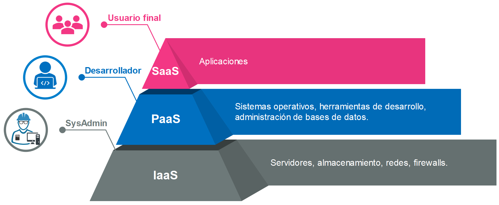

# TEMA 2: Modelos de Servicio: IaaS, PaaS, Saa

## Que es un modelo de servicio?

> Un **modelo de servicio** define:
> 
> - **QUÉ** se ofrece como servicio
> - **QUIÉN** lo gestiona
> - **HASTA DÓNDE** llega tu responsabilidad
> 
> Concepto:
> 
> **Es el contrato técnico que separa lo que hace el proveedor y lo que haces tú.**
> Un **modelo de servicio cloud** es una clasificación que define el nivel de abstracción y responsabilidad en la entrega de recursos tecnológicos a través de internet. Estos modelos establecen qué componentes de la infraestructura tecnológica son gestionados por el proveedor cloud y cuáles por el cliente.
> 

<aside>

Un modelo de servicio **no define la tecnología**, define **el nivel de abstracción y responsabilidad**.

</aside>

### ¿Qué relación tiene con Cloud Computing?

> Cloud Computing **necesita** modelos de servicio para existir.
Sin modelos de servicio, **la nube sería solo servidores remotos.**
> 
> 
> **Porque?** Cloud = **Infraestructura** como SERVICIO
> 

Antes del cloud:

```
Comprar → Instalar → Mantener → Escalar

```

Con cloud:

```
Consumir → Pagar uso → Escalar bajo demanda

```

<aside>

**El modelo de servicio es lo que convierte infraestructura en servicio.**

</aside>

### Cloud y abstracción

Cloud funciona porque **oculta complejidad** de forma progresiva:

```
Hardware físico
   ↓
Virtualización
   ↓
MODELOS DE SERVICIO
   ↓
Consumo simple

```

Cada modelo decide **qué se oculta** y **qué se expone**.

## Modelos de servicio Cloud

> Los modelos de servicio (IaaS, PaaS, SaaS) son las diferentes **capas de abstracción** que permiten consumir estos servicios según las necesidades específicas
**Principio fundamental**: **A mayor abstracción del modelo, menor control técnico** pero mayor facilidad de uso y menor carga operativa.
> 

### Nivel de Abstracción por Modelo

**SaaS (Alta Abstracción : Menos Control, Mas velocidad)**

- Aplicación completa lista para usar , ofrece software ya desarrollado en la nube
- Solo configuras parámetros de usuario
- Cero gestión técnica de infraestructura
- "Lo uso" (Ej. Gmail, Salesforce)

**PaaS (Abstracción Media : Balance Dev/Ops)**

- Permite el desarrollo de aplicaciones en la nube
- Te abstraes del sistema operativo y gestión de infraestructura
- Te enfocas solo en tu código y datos
- El proveedor gestiona escalabilidad, parches, actualizaciones
- "Construyo encima" (Ej. Vercel)

**IaaS (Baja Abstracción : Maximo Control , Mas Gestion)**

- Brinda infrastructura de TI
- Control total sobre máquinas virtuales, redes, almacenamiento
- Debes gestionar sistema operativo, middleware, aplicaciones
- Máxima flexibilidad y personalización
- "Lo administro" (Ej. EC2, VMs)



## Modelo IaaS (Infrastructure as a Service)

> ***La nube como un data center alquilado.***
Modelo donde el proveedor ofrece **infraestructura virtualizada** (servidores, red, storage) y el cliente gestiona **todo lo demás**.
> 
> 
> IaaS es un modelo de servicio cloud que proporciona **recursos de infraestructura computacional virtualizados** bajo demanda a través de internet.
> 
> El proveedor te alquila los recursos brutos de cómputo: Servidores (virtuales o dedicados), redes y almacenamiento.
> 
> - **Tú gestionas:** Sistema Operativo, datos, aplicaciones, middleware, runtimes.
> - **Ellos gestionan:** Virtualización, servidores físicos, cables, electricidad.

### **Qué incluye (Lo que te dan)**

- **Compute:** Máquinas Virtuales (VMs) o instancias "Bare Metal".
- **Networking:** Firewalls, Routers virtuales (VPCs), Balanceadores de carga.
- **Storage:** Discos duros virtuales (Block Storage).

### Ejemplos de Proveedores

| Proveedor | Servicio Principal | Características Distintivas |
| --- | --- | --- |
| **AWS** | EC2 (Elastic Compute Cloud) | Mayor variedad de tipos de instancias, marketplace extenso |
| **Microsoft Azure** | Azure Virtual Machines | Integración con ecosistema Microsoft, Windows Server |
| **Google Cloud** | Compute Engine | Pricing por segundo, descuentos automáticos por uso sostenido |
| **DigitalOcean** | Droplets | Simplicidad, pricing predecible, enfocado en developers |
| **Linode/Akamai** | Linode Compute | Relación precio/rendimiento, atención al cliente |

### Casos de Uso Ideales

1. **Migraciones "Lift and Shift":** Tienes una app vieja (Legacy) y quieres moverla a la nube sin reescribir código.
2. **Entornos de Desarrollo y Testing**: Crear/destruir ambientes rápidamente sin inversión en hardware
3. **Aplicaciones con Requisitos Específicos**: Cuando necesitas control total del stack (OS personalizado, kernel específico)
4. **High Performance Computing (HPC)**: Procesamiento científico, renderizado 3D, análisis de big data
5. **Hosting de Sitios Web con Tráfico Variable**: Escalar recursos según demanda
6. **Disaster Recovery**: Replicar infraestructura en diferentes regiones geográficas

### Ventajas

✓ **Control Total**: Acceso root/administrador, instalación de cualquier software
✓ **Flexibilidad**: Configuración personalizada de red, seguridad, sistema operativo
✓ **Escalabilidad**: Aumentar/disminuir recursos en minutos
✓ **Sin CAPEX**: No requiere inversión inicial en hardware
✓ **Pago por Uso**: Solo pagas por lo que consumes
✓ **Múltiples Regiones**: Despliegue global en minutos
✓ **Recuperación Rápida**: Backups y snapshots automatizados

### Desventajas

✗ **Complejidad Operativa**: Requiere expertise en administración de sistemas
✗ **Responsabilidad de Seguridad**: Debes gestionar parches, actualizaciones, hardening
✗ **Costos Variables**: Puede ser difícil predecir costos exactos
✗ **Tiempo de Setup**: Requiere configuración inicial (networking, security groups, etc.)
✗ **Gestión Continua**: Monitoring, mantenimiento, optimización son tu responsabilidad

### Cuándo Elegir IaaS

**ELIGE IaaS SI:**

- Necesitas **control completo** del sistema operativo y software
- Tienes aplicaciones legacy que no pueden modificarse fácilmente
- Requieres configuraciones de red complejas o personalizadas
- Tu equipo tiene experiencia en administración de sistemas
- Necesitas instalar software específico no disponible en PaaS
- Quieres evitar vendor lock-in manteniendo portabilidad

**NO ELIJAS IaaS SI:**

- Solo quieres desplegar aplicaciones web estándar rápidamente
- No tienes equipo de DevOps/SysAdmin
- Buscas minimizar overhead operativo
- Tu prioridad es speed-to-market sobre control

## Modelo PaaS (Platform as a Service)

> ***Subes tu app, la plataforma se encarga del resto.*
"Dame el entorno para ejecutar mi código, olvídate del servidor."**
> 
> 
> El proveedor gestiona el hardware **Y** el sistema operativo. Te entrega un entorno (Runtime) listo para desplegar código (Java, Python, Node.js). Abstrae la administración de servidores.
> El cliente **solo gestiona el código de la aplicación y los datos**.
> 

### Qué Incluye PaaS

- Todo lo de IaaS (servidores, redes, discos) **oculto**.
- **Runtime:** Entorno de ejecución (ej. Node.js v18).
- **Middleware:** Servidores web pre-configurados.
- **OS:** Gestión y parches automáticos del Sistema Operativo.

### Ejemplos de Proveedores PaaS

| Proveedor | Especialidad | Ideal Para |
| --- | --- | --- |
| **Heroku** | Simplicidad extrema, Git-based deployment | Startups, MVPs, prototipado rápido |
| **Vercel** | Frontend, Next.js, edge computing | Aplicaciones React/Next.js, JAMstack |
| **Railway** | Full-stack, databases incluidas | Proyectos pequeños a medianos, simplicidad |
| **Netlify** | Static sites, serverless functions | Sitios estáticos, blogs, portfolios |
| **Google App Engine** | Escalabilidad automática, integración GCP | Apps empresariales con tráfico variable |
| **AWS Elastic Beanstalk** | Multi-lenguaje, integración AWS | Migración gradual a AWS |
| **Azure App Service** | Windows/.NET especializado | Aplicaciones .NET, integración Azure |
| [**Fly.io**](http://fly.io/) | Edge computing, baja latencia global | Apps que necesitan presencia global |
| **Render** | Unified platform, preview environments | Equipos que quieren alternativa a Heroku |

### Casos de Uso Ideales

1. **Desarrollo Rápido de Aplicaciones Web**: Deploy en minutos sin configurar servidores
2. **Startups y MVPs**: Validar ideas rápidamente sin invertir en DevOps
3. **APIs REST/GraphQL**: Backends escalables sin gestión de infraestructura
4. **Aplicaciones con Tráfico Variable**: Auto-scaling automático basado en demanda
5. **Microservicios**: Desplegar múltiples servicios independientes fácilmente
6. **Aplicaciones de Equipo Pequeño**: Cuando no tienes especialista en infraestructura

### Ventajas

✓ **Time-to-Market Rápido**: Deploy en segundos con un simple `git push`
✓ **Abstracción Total de Infraestructura**: No configuras servidores, OS, networking
✓ **Escalabilidad Automática**: El sistema escala según demanda sin intervención
✓ **Actualizaciones Automáticas**: Parches de seguridad, runtime updates gestionados
✓ **CI/CD Integrado**: Pipeline de despliegue incluido
✓ **Menor Costo Operativo**: No necesitas equipo DevOps grande
✓ **Developer Experience**: Enfoque 100% en escribir código
✓ **Entornos Múltiples**: Preview/staging/production con un clic

### Desventajas

✗ **Vendor Lock-in**: Difícil migrar entre proveedores PaaS
✗ **Menos Control**: No puedes instalar software arbitrario ni acceder al OS
✗ **Limitaciones de Runtime**: Solo lenguajes/versiones soportadas por el proveedor
✗ **Costos Más Altos a Escala**: Puede ser más caro que IaaS optimizado para cargas grandes
✗ **Restricciones de Configuración**: Limitado a lo que el proveedor permite configurar
✗ **Performance Variable**: Menos optimización fina que en IaaS
✗ **Cold Starts**: En planes gratuitos/económicos puede haber latencia inicial

### Cuándo Elegir PaaS

**ELIGE PaaS SI:**

- Tu objetivo es construir y desplegar aplicaciones rápidamente
- Equipo pequeño sin especialistas en infraestructura
- Usas lenguajes y frameworks estándar (Node.js, Python, Ruby, etc.)
- Quieres minimizar overhead operativo
- Necesitas auto-scaling sin gestión manual
- Prefieres pagar más por menos complejidad

**NO ELIJAS PaaS SI:**

- Necesitas software o configuraciones muy específicas
- Requieres acceso root o control del sistema operativo
- Tienes requisitos estrictos de performance/optimización
- Quieres evitar vendor lock-in a toda costa
- Costos son críticos y tienes expertise para optimizar IaaS

## Modelo SaaS (Software as a Service)

> ***Usas la aplicación, no sabes ni te importa cómo funciona.***
> 
> 
> **"Solo quiero usar la herramienta."**
> 
> SaaS es un modelo de servicio cloud que entrega **aplicaciones de software completas** a través de internet, listas para usar sin instalación ni gestión técnica. El proveedor gestiona toda la infraestructura, plataforma, aplicación, datos y acceso. El usuario solo consume la funcionalidad a través de un navegador web o aplicación cliente.
> 

### Componentes Completamente Gestionados

- **Infraestructura**: Servidores, almacenamiento, redes
- **Plataforma**: Sistema operativo, middleware, runtime
- **Aplicación**: Software completo con todas sus funcionalidades
- **Datos**: Almacenamiento, backups, replicación
- **Seguridad**: Encriptación, autenticación, compliance
- **Actualizaciones**: Features nuevas sin intervención del usuario

### Ejemplos por Categoría

| Categoría | Ejemplos | Función |
| --- | --- | --- |
| **Comunicación** | Gmail, Outlook, Slack, Zoom, Microsoft Teams | Email, mensajería, videoconferencias |
| **Productividad** | Google Workspace, Microsoft 365, Notion, Asana | Documentos, hojas de cálculo, gestión de proyectos |
| **CRM** | Salesforce, HubSpot, Pipedrive | Gestión de relaciones con clientes |
| **Colaboración** | Miro, Figma, Canva | Diseño colaborativo, whiteboarding |
| **Contabilidad** | QuickBooks, Xero, FreshBooks | Finanzas, facturación, contabilidad |
| **ERP** | SAP S/4HANA Cloud, Oracle NetSuite | Planificación de recursos empresariales |
| **RRHH** | Workday, BambooHR, Gusto | Gestión de recursos humanos, nómina |
| **Marketing** | Mailchimp, HubSpot, Hootsuite | Email marketing, redes sociales |
| **Almacenamiento** | Dropbox, Google Drive, OneDrive | Archivos en la nube |
| **Desarrollo** | GitHub, Jira, Atlassian Cloud | Control de versiones, gestión de proyectos |

### Casos de Uso

1. **Empresas sin IT Interno**: Acceso a software empresarial sin equipo técnico
2. **Colaboración Remota**: Equipos distribuidos trabajando en tiempo real
3. **Reducción de CAPEX**: Eliminar costos de licencias on-premise y servidores
4. **Acceso Universal**: Trabajar desde cualquier dispositivo con internet
5. **Escalabilidad de Usuarios**: Agregar/quitar usuarios según necesidad
6. **Cumplimiento Normativo**: Providers especializados en compliance (HIPAA, SOC2, GDPR)

### Características Clave de SaaS

**Modelo de Subscripción:**

- Pago mensual o anual por usuario
- Tiers: Free, Básico, Profesional, Enterprise
- Facturación predecible

**Multi-tenancy:**

- Una instancia de software sirve a múltiples clientes
- Datos aislados pero infraestructura compartida
- Eficiencia de costos

**Actualizaciones Automáticas:**

- Nuevas features sin downtime
- Sin gestión de versiones por parte del usuario
- Siempre en la última versión

**Accesibilidad:**

- Browser-based o aplicaciones móviles
- Trabajo desde cualquier lugar
- Sincronización automática

### Ventajas

✓ **Cero Gestión Técnica**: No instalación, configuración ni mantenimiento
✓ **Acceso Inmediato**: Registro y uso en minutos
✓ **Costos Predecibles**: Subscripciones fijas mensuales/anuales
✓ **Actualizaciones Automáticas**: Siempre última versión sin intervención
✓ **Escalabilidad de Usuarios**: Añadir/quitar usuarios fácilmente
✓ **Accesibilidad Universal**: Cualquier dispositivo, cualquier lugar
✓ **Backups Incluidos**: Recuperación de datos gestionada por proveedor
✓ **Soporte Incluido**: Atención al cliente como parte del servicio

### Desventajas (Limitaciones)

✗ **Cero Personalización Técnica**: No puedes modificar el código fuente
✗ **Dependencia Total del Proveedor**: Si cae el servicio, no puedes hacer nada
✗ **Vendor Lock-in Extremo**: Migrar a otro proveedor puede ser muy difícil
✗ **Limitaciones Funcionales**: Solo puedes usar features que el proveedor ofrece
✗ **Costos Acumulativos**: Múltiples subscripciones pueden ser costosas a largo plazo
✗ **Privacidad de Datos**: Tus datos residen en servidores del proveedor
✗ **Integraciones Limitadas**: Solo APIs y integraciones que el proveedor permite
✗ **Performance No Controlable**: Compartes recursos con otros tenants

### Cuándo Usar SaaS

**IDEAL PARA:**

- Funcionalidades estándar de negocio (email, CRM, contabilidad)
- Equipos sin recursos técnicos
- Empresas que priorizan time-to-value sobre personalización
- Trabajo colaborativo y remoto
- Reducir CAPEX y simplificar IT

**NO USAR SI:**

- Necesitas personalización profunda del software
- Tienes requisitos muy específicos de tu industria
- Preocupaciones críticas de soberanía de datos
- Requieres integración compleja con sistemas legacy
- Costos a largo plazo superan desarrollo custom

## MODELO DE RESPONSABILIDAD COMPARTIDA

### Tabla Comparativa de Responsabilidades

> Cloud no elimina tu responsabilidad, la redefine.
> 
- En IaaS → tú eres responsable de casi todo
- En SaaS → confías casi todo

| Componente | On-Premises | IaaS | PaaS | SaaS |
| --- | --- | --- | --- | --- |
| **Aplicaciones** | 🔵 Cliente | 🔵 Cliente | 🔵 Cliente | 🔴 Proveedor |
| **Datos** | 🔵 Cliente | 🔵 Cliente | 🔵 Cliente | 🟡 Compartido |
| **Runtime** | 🔵 Cliente | 🔵 Cliente | 🔴 Proveedor | 🔴 Proveedor |
| **Middleware** | 🔵 Cliente | 🔵 Cliente | 🔴 Proveedor | 🔴 Proveedor |
| **Sistema Operativo** | 🔵 Cliente | 🔵 Cliente | 🔴 Proveedor | 🔴 Proveedor |
| **Virtualización** | 🔵 Cliente | 🔴 Proveedor | 🔴 Proveedor | 🔴 Proveedor |
| **Servidores** | 🔵 Cliente | 🔴 Proveedor | 🔴 Proveedor | 🔴 Proveedor |
| **Almacenamiento** | 🔵 Cliente | 🔴 Proveedor | 🔴 Proveedor | 🔴 Proveedor |
| **Networking** | 🔵 Cliente | 🟡 Compartido | 🔴 Proveedor | 🔴 Proveedor |
| **Infraestructura Física** | 🔵 Cliente | 🔴 Proveedor | 🔴 Proveedor | 🔴 Proveedor |

**Leyenda:**

- 🔵 **Cliente**: Tu responsabilidad total
- 🔴 **Proveedor**: Responsabilidad del proveedor cloud
- 🟡 **Compartido**: Ambos tienen responsabilidades

## Cómo Elegir el Modelo de Servicio Cloud Correcto (IaaS / PaaS / SaaS)

```
USAR > SaaS
CODIFICAR RÁPIDO > PaaS
CONTROLAR TODO > IaaS
```

```
[ INICIO ]
     |
     v
¿Ya existe un software que resuelve mi necesidad?
     |
     ├── SÍ ──► [ SaaS ]
     |
     └── NO
          |
          v
¿Mi valor está en el CÓDIGO del producto?
          |
          ├── NO ──► [ SaaS ]
          |
          └── SÍ
               |
               v
¿Necesito control del SO, red o configuración profunda?
               |
               ├── SÍ ──► [ IaaS ]
               |
               └── NO
                    |
                    v
¿Quiero enfocarme solo en desarrollar y desplegar rápido?
                    |
                    ├── SÍ ──► [ PaaS ]
                    |
                    └── NO ──► [ IaaS ]

```

## 1️⃣ ¿Ya existe un software que resuelve mi necesidad?

### ✔ Sí → **SaaS**

- Email → Gmail
- CRM → Salesforce
- Colaboración → Slack

📌 **Regla de oro**:

> Si no te diferencia, no lo construyas.
> 

## 2️⃣ ¿Mi valor está en el código del producto?

### ❌ No → **SaaS**

Ejemplos:

- Facturación
- Gestión interna
- RRHH

👉 Construir esto es **costo**, no ventaja competitiva.

### ✔ Sí → Continúa

Aquí entran:

- Apps propias
- APIs
- Productos digitales

## 3️⃣ ¿Necesito control profundo del sistema?

(Control del SO, kernel, red, firewall, librerías específicas)

### ✔ Sí → **IaaS**

Casos típicos:

- Sistemas legacy
- Software especializado
- Reglas de red complejas
- Requisitos regulatorios

📌 **Trade-off**:

Más poder = más responsabilidad

### ❌ No → Continúa

## 4️⃣ ¿Quiero enfocarme solo en desarrollar y lanzar rápido?

### ✔ Sí → **PaaS**

- Startups
- MVPs
- Equipos pequeños
- Time-to-market crítico

📌 **Ventaja clave**:

> Menos DevOps, más producto
> 

### ❌ No → **IaaS**

Si quieres:

- Control total
- Arquitecturas personalizadas
- Evitar lock-in

**📊 MATRIZ DE DECISIÓN RÁPIDA**

| Necesidad Principal | Modelo |
| --- | --- |
| Cero gestión | SaaS |
| Velocidad | PaaS |
| Flexibilidad | IaaS |
| Control total | IaaS |
| MVP | PaaS |
| Sistema legacy | IaaS |

<aside>

Un **sistema legacy** es un sistema **antiguo pero crítico** que:

- Sigue en uso
- Soporta procesos clave del negocio
- Es **difícil de modificar, escalar o migrar**

**Relación con Cloud**

- Migrarlos suele requerir **IaaS**
- Porque necesitas **control total** del entorno
</aside>

| **Factor Crítico** | **SaaS (Software)** | **PaaS (Plataforma)** | **IaaS (Infraestructura)** |
| --- | --- | --- | --- |
| **Velocidad de Inicio** | 🚀 Inmediata | ⚡ Muy Rápida | 🐢 Media/Lenta (requiere config) |
| **Costo Inicial** | Bajo (Suscripción) | Bajo/Medio | Bajo, pero sube con "costos ocultos" de gestión |
| **Control Técnico** | ⛔ Nulo | ⚠️ Medio (Runtime) | ✅ Alto (OS/Red) |
| **Mantenimiento (Ops)** | 🟢 Cero | 🟡 Bajo (Solo App) | 🔴 Alto (OS, Parches, Seguridad) |
| **Riesgo Principal** | Data Lock-in | Platform Lock-in | Complejidad Operativa |
| **Tu Rol** | Usuario | Desarrollador | Arquitecto de Sistemas / SysAdmin |