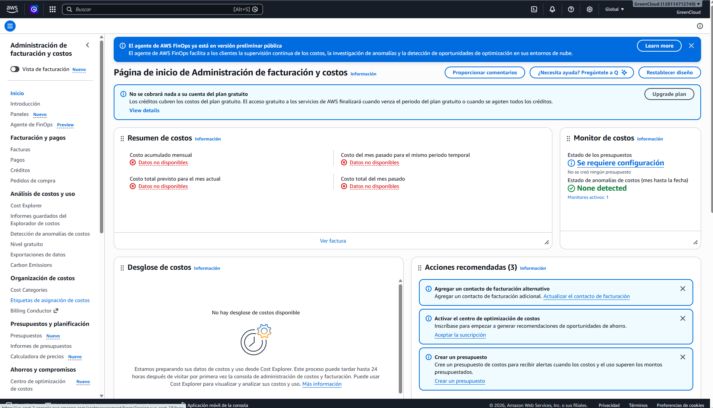

# ☁️ Cómo se factura la nube

> **La nube no te cobra por "usar un servicio": te cobra por unidades, y casi siempre por varias a la vez.**
>
> Entender cuáles son esas unidades es la diferencia entre **leer** una factura y **adivinarla**.

## El dolor: la factura no cuadra con lo que crees tener encendido

Levantaste **una** cosa. Cuando abres la factura hay **seis líneas**, con nombres que no reconoces y cantidades que no sabes de dónde salen. O peor, la versión más común: apagaste el servidor la semana pasada y este mes te siguen cobrando.

El problema no es la factura. Es el modelo mental con el que la lees:

❌ **Lo que crees:** "tengo un servidor, entonces pago el precio del servidor".
✅ **Lo que pasa:** ese servidor son cuatro cosas alquiladas por separado, y cada una tiene su propio contador.

Ya lo viste en B1: no alquilas una computadora, alquilas **cómputo, almacenamiento y red**, cada uno con su reloj. Apagar el cómputo detiene *un* reloj. Los otros siguen corriendo, porque nunca dependieron de que la máquina estuviera encendida.

> 🎯 **Idea clave:** la factura no está desglosada por *cosas que creaste*, sino por **unidades que consumiste**. Por eso una sola cosa produce varias líneas, y por eso apagar no siempre significa dejar de pagar.

## Las cuatro unidades de cobro

Casi todo lo que vas a pagar en la nube cae en una de estas cuatro. No importa el servicio ni el proveedor: cambia cuál te aplica, no la lista.

| Unidad | Se te cobra por | Cómo la reconoces en la factura | Ejemplo |
|--------|-----------------|--------------------------------|---------|
| **Tiempo encendido** | Cada segundo u hora que el recurso existe reservado para ti | Aparece como horas · sube sola con el calendario | Una máquina virtual, una base de datos gestionada |
| **Invocación / request** | Cada vez que algo se ejecuta o se pide | Un número gigante de eventos y un precio ridículo por evento | Una función serverless, una petición a la API de un servicio |
| **Almacenamiento (GB-mes)** | Cada GB guardado, por el tiempo que lo guardes | GB-mes · sube con lo acumulado, no con el uso | Un disco, un bucket de archivos, una copia de seguridad |
| **Transferencia de salida (GB)** | Cada GB que sale hacia internet | GB de *data transfer out* · sube con tus usuarios | Servir imágenes, descargar archivos, respuestas de tu API |

**La regla que ordena todo:** *tiempo* y *almacenamiento* te cobran **por existir**; *request* y *salida* te cobran **por usar**. Los dos primeros corren aunque nadie toque tu app. Los dos últimos son cero si nadie la usa.

> 🔑 **Matiz:** el almacenamiento suele cobrar también **por operación** — cada vez que subes o lees un archivo. Es una tarifa diminuta que solo importa cuando hay millones de operaciones, y ahí sorprende. Menciónalo mentalmente como "unidad y media", no como una quinta categoría.

Debes recordar que **la mayoría de los servicios combinan dos o tres** de estas unidades a la vez. Una base de datos gestionada te cobra tiempo encendido *y* almacenamiento *y* salida. Cuando veas tres líneas de un mismo servicio, no es un error de la factura: son sus tres relojes.

## Por qué la entrada es gratis y la salida se paga

Este es el detalle que rompe más estimaciones, porque es asimétrico y nada lo hace obvio.

> **Meter datos a la nube normalmente no cuesta nada. Sacarlos hacia internet sí.**
>
> Se le llama *egress* o **transferencia de salida**, y se cobra por GB.

Hay dos preguntas distintas aquí, y conviene separarlas: **por qué es asimétrico** y **por qué la salida es cara**. Tienen respuestas diferentes.

### Por qué es asimétrico: cómo paga el proveedor su propia conexión

Un proveedor de nube no paga internet por GB, como tú. Paga **contratos de conectividad** con operadores, y esos contratos se facturan sobre el **sentido dominante** del tráfico: se mide lo que entra y lo que sale, y se cobra **el mayor de los dos**.

Un datacenter que sirve contenido es abrumadoramente saliente — manda muchísimo más de lo que recibe. Piensa en la proporción real: una petición HTTP tuya pesa unos cientos de bytes, y la respuesta puede pesar megabytes.

```text
Tú → proveedor:   "dame este video"        ~500 bytes
Proveedor → tú:    el video                ~500 MB
```

Como el enlace ya está pagado por el lado de la salida, **lo que entra viaja por capacidad que ya está comprada**. Su costo adicional para el proveedor es prácticamente cero. Por eso puede regalarla sin perder dinero.

### Por qué la salida es cara: eso ya es decisión comercial

Lo anterior explica que una dirección sea gratis. **No explica que la otra cueste lo que cuesta.** El precio de salida está muy por encima del costo real de transportar esos datos — no es un margen pequeño, es de otro orden de magnitud.

Y el mecanismo concreto de por qué eso te importa: **el cargo de salida es proporcional a cuántos datos tengas acumulados**. Mudarte de proveedor significa sacarlos todos, una vez. Es decir, mientras más tiempo llevas ahí, más caro es irte.

> 💸 **Ponle número:** a una tarifa del orden de **0,09 USD por GB**, sacar 1 TB cuesta unos **90 dólares**; sacar 50 TB, unos **4.500**. Eso no es el costo de transportar datos — es el precio de la puerta de salida. ⚠️ *verificar la tarifa vigente y sus tramos por volumen.*

**Cómo sabemos que es comercial y no técnico** — dos hechos comprobables:

- Hay proveedores de almacenamiento que cobran **cero** por salida (Cloudflare R2, Backblaze B2). Si el costo fuera intrínseco, no podrían.
- En la Unión Europea, la regulación obligó a los proveedores a **eliminar el cargo de salida cuando el cliente se cambia** a otro proveedor. Un costo real no se elimina por decreto; un margen sí. ⚠️ *verificar el alcance y las fechas de esa norma.*

El resultado práctico para ti es doble: **tu costo crece con tus usuarios** —cada imagen servida, cada respuesta de tu API y cada descarga pasa por ese contador—, y **el costo de irte crece con tus datos**. Es lo que hace que la frase *"un servidor cuesta 7 dólares al mes"* sea incompleta: ese es el precio de tenerlo encendido, sin nadie usándolo.

> 🔑 **Matiz — no todo el tráfico es igual:** también hay tarifas por mover datos **entre zonas de disponibilidad** de la misma región, aunque nunca salga a internet. Es barato, pero deja de serlo cuando el tráfico es constante entre dos piezas de tu app que pusiste en zonas distintas. ⚠️ *verificar el detalle cuando llegues a **B7**; aquí basta con saber que existe.*

> ⚠️ *verificar:* AWS incluye una cantidad de salida gratuita al mes (del orden de **100 GB**) antes de empezar a cobrar. Confírmalo en la página de precios — el número importa porque para un proyecto personal puede significar que la salida te cueste exactamente cero.

## Lo que sigue cobrando aunque no lo estés usando

Aquí es donde vive la mayor parte del dinero perdido de los principiantes. Todos estos son casos de **"se cobra por existir"**, y ninguno se detiene solo:

| Qué queda vivo | Por qué sigue cobrando | Cómo se detiene |
|----------------|------------------------|-----------------|
| El **disco** de una máquina que apagaste | El disco es un recurso aparte; apagar la máquina no lo borra | Borrándolo explícitamente |
| El **disco** de una máquina que borraste | Puede sobrevivir a la máquina que lo creó | Igual: borrándolo |
| Una **dirección IP fija** que reservaste | Se cobra justamente por tenerla reservada sin usar | Liberándola |
| **Copias de seguridad** y snapshots viejos | Son almacenamiento, y se acumulan calladamente | Borrando las que ya no sirven |
| Un **balanceador de carga** sin tráfico | Cobra por tiempo encendido, no por peticiones | Eliminándolo |
| Una **base de datos** sin conexiones | Cobra por estar levantada, no por consultas | Apagándola o eliminándola |
| **Logs** acumulados durante meses | Almacenamiento otra vez, y crece solo | Poniéndoles caducidad |

Fíjate en el patrón, que es más útil que la lista: **lo que se cobra por existir no se apaga, se borra**. "Apagar" solo funciona con la unidad de tiempo de cómputo. Todo lo demás hay que eliminarlo o dejará una cola en la factura.

> 💡 **Tip:** el aviso mental correcto no es *"apagué todo"* sino **"¿qué quedó vivo de lo que creé?"**. Un recurso creado casi siempre arrastra otros que no pediste explícitamente — y esos son los que aparecen en la factura del mes siguiente.

## Dónde se lee la factura — el desglose por servicio

> ⚠️ **Cómo leer esto:** registra la **intención**, no los clics. La consola de facturación se rediseña seguido; lo que buscas no cambia.

**Antes de empezar:** aquí hay una trampa que detiene a todo el mundo la primera vez. Un usuario normal **no ve la facturación aunque tenga permisos de administrador**. Hay que activar explícitamente el acceso a la información de facturación, y eso solo se puede hacer desde la **cuenta root**, en la configuración de la cuenta.

> 🔑 **Por qué existe esa excepción:** la facturación no es un recurso técnico, es información del **dueño de la cuenta**. Por eso vive en un permiso aparte y no lo cubre una política de administrador. El tema de root, usuarios y permisos es **B3**; aquí solo necesitas saber que es un interruptor que se activa una vez.

**Dónde:** la consola se llama **Administración de facturación y costos**, y no te pide región — aparece como `Global`, igual que IAM o Route 53. Ya sabes por qué: la facturación es de la cuenta, no de una región.

Dentro hay cuatro zonas que conviene distinguir, porque responden preguntas distintas:

| Zona | Qué te da | La pregunta que responde |
|------|-----------|--------------------------|
| **Facturas** | El documento cerrado de cada mes | *¿Qué pagué?* |
| **Cost Explorer** *(y el desglose de costos)* | El gasto en curso, por servicio y por tipo de uso | *¿Por qué estoy gastando?* |
| **Nivel gratuito** | Cuánto llevas consumido de lo que no se cobra | *¿Cuánto me queda de gratis?* |
| **Presupuestos** | El tope que defines tú y su alerta | *¿Cómo me entero antes de que duela?* |



*Cuenta nueva, sin gasto: el resumen dice "Datos no disponibles", el desglose está vacío y el panel de presupuestos pide configuración. Arriba, el banner de créditos del plan gratuito; a la izquierda, las cuatro zonas de la tabla.*

La segunda es la que enseña de verdad. Y dentro de ella, la información útil **no está en la columna del servicio sino en la del tipo de uso** — ahí es donde se distingue si esos dólares fueron horas encendidas, GB guardados o GB de salida. Es decir: el desglose te dice **cuál de las cuatro unidades** te está cobrando. Ese es el puente entre la factura y todo lo que viste arriba.

**⚠️ Trampas:**

- **La primera visita arranca un reloj.** Cost Explorer no tiene tus datos preparados de entrada: tarda **hasta 24 horas** desde que entras por primera vez. Hasta entonces verás *"Datos no disponibles"* y *"No hay desglose de costos disponible"* aunque hayas gastado. No está roto, está preparándose — y por eso conviene entrar el primer día, aunque no tengas nada que ver.
- **El mes en curso es una estimación**, no una factura. Los cargos aparecen con retraso, así que "hoy va en cero" no significa que hoy no gastaste.
- **Sin el permiso activado no ves nada**, ni siquiera siendo administrador. Y el mensaje de error no te dice que el problema es ese.
- **Los impuestos van aparte** y pueden aparecer como una línea propia.
- **Si tienes créditos, el consumo puede quedar oculto.** La consola llega a decirte literalmente *"no se cobrará nada a su cuenta del plan gratuito"*, porque los créditos absorben el cargo. Puedes estar consumiendo de verdad y ver cero. Es cómodo y peligroso a la vez — lo retomamos en la Sección 2.

> 💡 **Lo que ya viene puesto sin que hagas nada:** la detección de anomalías de costos suele venir activa con un monitor por defecto — te avisa de un gasto *raro* comparado con tu propio historial. No confundirla con un presupuesto: la anomalía detecta lo **inesperado**, el presupuesto vigila un **tope que tú fijaste**. Son complementarias, y la segunda no viene puesta: al entrar, el panel de presupuestos dice *"se requiere configuración"*.

**✅ Sabes que salió bien si:** puedes responder, sin ayuda, *"¿cuánto llevo gastado este mes y qué servicio lidera?"*. Con la cuenta a cero, el equivalente es ubicar las cuatro zonas de la tabla, entrar una vez para que Cost Explorer empiece a preparar los datos, y saber dónde aparecerá el desglose cuando lo haya.

## 🎯 Lo que debiste llevarte

> **Si de esta sección solo retienes estas líneas, cumplió su función.**

- La factura no se desglosa por cosas que creaste, sino por unidades que consumiste — por eso una sola cosa genera varias líneas.
- Las cuatro unidades son tiempo encendido, invocación, almacenamiento por GB-mes y transferencia de salida; casi todo servicio combina dos o tres.
- Tiempo y almacenamiento te cobran por **existir**; request y salida te cobran por **usar**.
- Meter datos suele ser gratis y sacarlos se paga, así que ese costo crece con tus usuarios y no con tu infraestructura.
- Lo que se cobra por existir no se apaga: se borra. Apagar solo detiene el reloj del cómputo.
- El desglose útil no es por servicio sino por tipo de uso, porque ahí se ve cuál de las cuatro unidades te está cobrando.

---
[[00_indice|índice]] · [[02_free-tier|siguiente →]]
