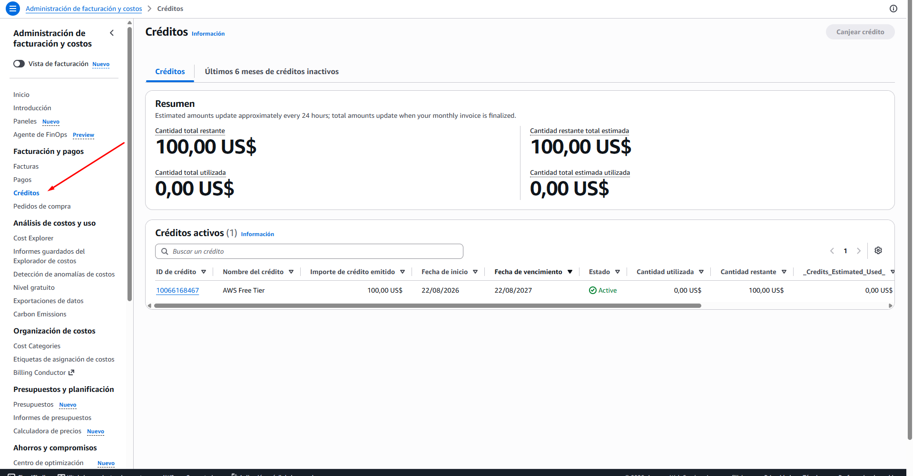
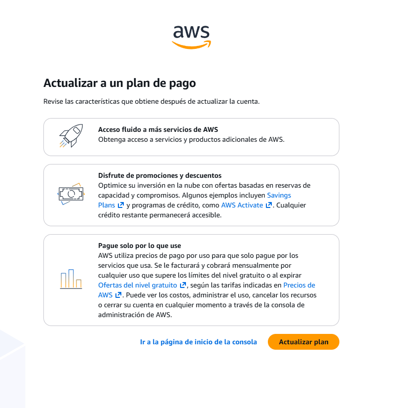

# ☁️ Free tier y sus trampas

> **La capa gratuita no es un descuento ni un tope de gasto: es un conjunto de límites por debajo de los cuales no se factura.**
>
> Y hay más de un tipo de gratuidad. Cada una cubre cosas distintas y **caduca de una forma distinta** — por fecha, por consumo, o nunca. Lo caro no es pasarse del límite: es no saber cuál te cubre ni hasta cuándo.

## Qué es la capa gratuita y qué NO es

Empecemos por lo que **no** es, porque cada uno de estos malentendidos ha producido una factura real:

| Lo que la gente asume | Lo que realmente pasa |
|-----------------------|----------------------|
| "Es un tope: cuando llegue al límite, se detiene" | **No frena nada.** Al cruzar el límite simplemente empieza a cobrarse, sin interrupción y sin preguntarte |
| "Cubre los servicios de AWS" | Cubre **algunos**, y de cada uno **algunas unidades**. Lo demás se cobra desde el primer byte |
| "Es igual para todos" | Depende de **cuándo se creó la cuenta**. Hay al menos dos modelos distintos conviviendo |

Ese último punto es el que te afecta directamente, así que vale la pena decirlo con todas las letras:

> ⚠️ **Importante — tu cuenta no tiene el free tier del que hablan los tutoriales.** Casi todo el material que vas a encontrar (incluido el curso, grabado en 2022) describe el modelo clásico: **cuotas mensuales por servicio durante 12 meses**. Las cuentas creadas recientemente usan un modelo distinto: **una bolsa de créditos en dólares con fecha de caducidad**.

Y esa diferencia no es cosmética, cambia cómo decides:

```text
MODELO CLÁSICO (cuotas por servicio)
├── 750 horas de máquina virtual al mes
├── 5 GB de almacenamiento de archivos
└── ...cada cuota es independiente
    → gastarte las horas NO te quita almacenamiento

MODELO DE CRÉDITOS (el de tu cuenta)
└── Una sola bolsa: 100 USD
    → todo compite por el mismo dinero
    → un recurso caro se come el presupuesto de todo lo demás
```

En términos simples: antes tenías **varios contadores separados**; ahora tienes **una billetera**. Con contadores, pasarte en uno no afecta a los otros. Con billetera, todo suma contra el mismo saldo — y una sola cosa cara te deja sin margen para el resto del temario.

## Los tipos de gratuidad — y cuál caduca

Antes de la tabla, hay que separar **tres cosas que se confunden todo el tiempo** porque las tres se llaman "gratis":

```text
1. OFERTAS DEL NIVEL GRATUITO   ← cuotas por servicio: "esto no se cobra"
   Sin fecha propia. Algunas son "siempre gratis".
   Uso dentro de la cuota → no genera cargo.

2. CRÉDITO                      ← dinero que absorbe los cargos que SÍ ocurren
   Tiene su propia fecha de caducidad.
   Se gasta con lo que queda FUERA de la cuota gratuita.

3. PLAN GRATUITO                ← el modo en que está tu cuenta
   Tiene su propia fecha. No es una bolsa ni una cuota:
   es tu permiso para operar sin que te cobren a la tarjeta.
```

La distinción que más cuesta es la tercera. **El plan no es una cantidad, es un estado de la cuenta.** Que caduque no significa que se acaben "los servicios gratuitos": significa que tu cuenta deja de estar en ese modo, y para seguir usando AWS tienes que pasarte a un plan de pago. Que las capas 1 y 2 sean independientes del plan se ve en que **ambas siguen existiendo en el plan de pago** — la página de AWS las lista como características de los dos.

Con eso claro, las formas de gratuidad que puedes encontrarte:

| Tipo | Cómo funciona | Cuándo se acaba | Qué pasa al final |
|------|---------------|----------|-------------------|
| **Créditos** | Una cantidad en dólares que absorbe cualquier cargo | Fecha límite **o** agotamiento, lo que llegue primero | Ver la subsección final — es la pregunta importante |
| **Siempre gratis** | Una cuota mensual que se renueva sola, ligada a un servicio concreto | No caduca | Nada: sigue ahí mientras la cuenta exista |
| **12 meses** *(modelo clásico)* | Cuotas mensuales durante el primer año de la cuenta | El aniversario de la cuenta | Empiezas a pagar por lo que antes era gratis |
| **Prueba de servicio** | Una cantidad **única**, no mensual, de un servicio específico | Se agota y no vuelve | Ese servicio pasa a costar desde cero |

**En tu cuenta** conviven dos de estos, y hay un detalle que se pasa por alto muy fácil: **el plan y el crédito caducan en fechas distintas.**



*La pantalla de Créditos, en Facturación y pagos. El crédito figura como un registro con su propio vencimiento — independiente del periodo del plan gratuito que anuncia el banner de la página de inicio.*

```text
PLAN GRATUITO ─────────────┐  vence el 21/02/2027   (≈ 6 meses)
                           │
CRÉDITO "AWS Free Tier" ───┴─  vence el 22/08/2027   (12 meses)
100 USD, emitido el 22/08/2026
```

Es decir: **el periodo gratuito se acaba medio año antes de que caduque el dinero**. No es un error de la consola, son dos cosas diferentes — una es *cuánto tiempo puedes usar AWS bajo el plan gratuito*, la otra es *hasta cuándo vale ese saldo*. Qué implica eso lo vemos en la última subsección, porque es justo la clave del final.

> 💡 **Los 100 que no aparecen todavía:** el crédito de bienvenida es de 100 USD, pero el programa ofrece **hasta 200**. Los otros 100 se ganan *"mientras exploras los principales servicios"* — es decir, haciendo cosas concretas en la consola. Conviene mirar qué actividades los otorgan antes de empezar a construir: es dinero por trabajo que ya vas a hacer de todas formas en los módulos siguientes. ⚠️ *verificar cuáles son esas actividades y si tienen plazo.*

> 📝 **Nota — el saldo se actualiza con retraso.** La propia pantalla lo advierte: *"las cantidades estimadas se actualizan aproximadamente cada 24 horas; los totales se actualizan cuando se finaliza la factura mensual"*. O sea que **el saldo que ves puede ser de ayer**. Con una bolsa de 100 dólares, eso importa: no sirve para reaccionar rápido, solo para revisar tendencia.

> 🔑 **Matiz importante:** lo que es *"siempre gratis"* normalmente **no consume crédito** — es gratis de verdad, no subsidiado. Eso significa que un proyecto pequeño puede vivir mucho tiempo sin tocar la bolsa. ⚠️ *verificar cómo conviven exactamente ambas cosas en el plan nuevo: es la diferencia entre gastar tu crédito o no gastarlo.*

## La trampa del límite por dimensión

Esta es la trampa que más dinero cuesta, y viene directamente de la Sección 1: **un recurso tiene varias unidades de cobro, y la gratuidad casi nunca las cubre todas**.

❌ **Mito:** "La máquina más pequeña está en la capa gratuita, así que tenerla encendida no cuesta nada."
✅ **Realidad:** Lo que está cubierto son las **horas de cómputo**. El **disco** que necesita esa máquina, la **dirección IP fija** si le pones una, y la **salida de datos** que genere son unidades distintas, con sus propios límites — o sin ninguno. La máquina es gratis; el conjunto no.

❌ **Mito:** "Si uso poquito de muchos servicios, no me paso de nada."
✅ **Realidad:** Eso era cierto con **cuotas por servicio**. Con **créditos** es falso: cada consumo, por pequeño que sea, sale de la misma bolsa. Diez cosas baratas vacían la billetera igual que una cara.

❌ **Mito:** "Me van a avisar antes de que me pase."
✅ **Realidad:** Existen avisos de uso de la capa gratuita, pero **el aviso llega cuando ya cruzaste el umbral**, no antes. Es un espejo retrovisor, no un freno. El único mecanismo que se anticipa es el presupuesto con alerta *prevista*, y eso es la Sección 3.

> 🎯 **Idea clave:** pregunta siempre *"¿gratis en qué unidad?"*. Nunca *"¿este servicio es gratis?"*. La capa gratuita cubre **unidades**, no servicios — igual que la factura cobra unidades, no cosas.

## Qué pasa el día que se acaba

Tu plan termina por una de dos vías, y no son intercambiables:

```text
                    ┌── se agotan los 100 USD  ──┐
   Plan gratuito ───┤                            ├──→ fin del acceso gratuito
                    └── llega el 21/02/2027   ───┘
```

Lo primero que hay que entender es que **el que probablemente llegue antes no es la fecha**. Un solo recurso olvidado de unos 20 dólares al mes se come los créditos en cinco meses — y aquí está lo perverso: **no verías ningún cargo mientras pasa**, porque los créditos lo absorben. La consola te diría *"no se cobrará nada a su cuenta del plan gratuito"* mientras tu saldo se vacía en silencio.

> 💸 **La interacción peligrosa:** créditos + recurso olvidado = quema invisible. En una cuenta normal, un gasto imprevisto te llega como cargo y te enteras. Aquí te enteras cuando ya no queda nada. Por eso el presupuesto de la Sección 3 no es opcional en tu situación — es lo único que convierte esa quema en algo visible.

Y aquí está la diferencia grande con el modelo clásico, que conviene tener clarísima:

❌ **Mito:** "Cuando se acabe lo gratis, me empiezan a cobrar a la tarjeta sin avisar."
✅ **Realidad (modelo clásico):** Eso es exactamente lo que pasaba. No se apagaba nada, simplemente empezabas a pagar en silencio. Es el escenario del que se queja todo el mundo en internet.
✅ **Realidad (plan gratuito nuevo):** No te cobran automáticamente — **se te acaba el acceso**. La página del programa es literal: *"no se le cobrará nada **a menos que elija el plan de pago**"*, y la consola avisa que *"para garantizar un acceso **ininterrumpido** a AWS, consulte actualizar el plan"*. El cobro requiere una decisión tuya; lo que no requiere decisión es quedarte sin acceso.

> 🎯 **Idea clave:** el riesgo cambió de sitio. En el modelo clásico el peligro era **pagar sin darte cuenta**; aquí el peligro es **quedarte fuera sin haberlo previsto**. El primero se arregla con dinero; el segundo, con tiempo — y solo si lo viste venir.

Lo que ofrece esa pantalla, cuando la abres, aclara el resto del cuadro:



*La pantalla de `Upgrade plan`. Solo mirarla no cambia nada; el cambio ocurre al pulsar "Actualizar plan".*

De ahí salen tres cosas que no estaban en ninguna otra pantalla:

| Lo que dice | Lo que significa para ti |
|-------------|--------------------------|
| *"Acceso fluido a **más** servicios de AWS"* | El plan gratuito **no te da acceso a todo el catálogo**. Hay servicios que sencillamente no puedes usar hasta que actualices |
| *"Cualquier crédito restante **permanecerá accesible**"* | Actualizar **no te quita el saldo**. Los dólares que no gastaste siguen ahí — y ese es el motivo de que el crédito venza medio año después que el plan |
| *"Se le facturará mensualmente por cualquier uso que supere los límites del nivel gratuito **o al expirar** las ofertas del nivel gratuito"* | Después de actualizar sí funciona como una cuenta normal: pago por uso, contra tu tarjeta, una vez agotado lo gratuito |

> 🎯 **Idea clave:** las dos fechas que viste arriba ahora tienen sentido. El **plan** es tu permiso para usar AWS gratis y dura 6 meses; el **crédito** es dinero tuyo y vale 12. Actualizar al plan de pago es lo que te deja seguir gastando el saldo que te sobró — con la diferencia de que, a partir de ahí, lo que exceda se cobra de verdad.

### Y con lo que tengas encendido, ¿qué pasa?

La respuesta está en la comparativa de planes de AWS, en una fila fácil de leer mal:


*La fila decisiva es la cuarta. Está redactada como una afirmación, pero es una capacidad: ¿pueden tus cargas de trabajo pasar del umbral de crédito?*

| Fila | Plan gratuito | Plan de pago |
|------|:---:|:---:|
| Hasta 200 USD en créditos | ✓ | ✓ |
| Uso gratuito de servicios selectos | ✓ | ✓ |
| No se incurre en cargos salvo que cambies de plan | ✓ | — |
| **Las cargas de trabajo superan los umbrales de crédito** | **✗** | **✓** |
| Acceso a todos los servicios y características | **✗** | ✓ |

Antes de interpretarla, dos términos que la fila da por sabidos:

- **Carga de trabajo** *(workload)* — lo que tienes funcionando: tu app, tu base de datos, tu función. En español llano, *"lo que tienes corriendo"*.
- **Umbral de crédito** — el punto donde se acaba tu saldo. En tu caso, los 100 USD.

Y la fila está traducida de forma engañosa: en el original se lee como *"las cargas de trabajo **pueden** superar los umbrales de crédito"*. Al perder el "pueden", parece una afirmación cuando en realidad es una **pregunta de característica**:

> *¿Lo que tengas corriendo puede seguir funcionando después de que se acabe tu saldo?*

```text
Saldo: 100 USD          Tu app consume 30 USD/mes

Mes 1  ─── quedan 70
Mes 2  ─── quedan 40
Mes 3  ─── quedan 10
Mes 4  ─── 0 USD ──┬─── PLAN GRATUITO (✗):  tu app se detiene aquí
                   └─── PLAN DE PAGO (✓):   tu app sigue, y te cobran la diferencia
```

Es decir: **en el plan gratuito, lo que tienes corriendo no puede pasar del crédito disponible.** Cuando el saldo se acabe, se detiene. En el plan de pago sí continúa — y esa continuación es exactamente lo que se te factura.

> 🎯 **Ahora el cuadro cierra:** no hay cobro silencioso **porque no hay continuación silenciosa**. Son las dos caras de lo mismo. El plan gratuito te protege la tarjeta a cambio de no garantizarte que lo tuyo siga vivo; el plan de pago te garantiza continuidad a cambio de cobrarte. No existe la opción "sigue funcionando y no me cobres".

Y confirma el otro ✗: **el plan gratuito no da acceso a todos los servicios**. Si en B5 o B9 te topas con que un servicio no está disponible, ya sabes que puede no ser un problema de región ni de permisos.

La conclusión operativa: **la fecha se decide antes, no el día.** Y mientras tanto, no dejes en esta cuenta nada cuya pérdida te importe.

## 🎯 Lo que debiste llevarte

> **Si de esta sección solo retienes estas líneas, cumplió su función.**

- La capa gratuita no frena nada: al cruzar el límite empiezas a pagar sin que nadie te detenga ni te pregunte.
- Tu cuenta funciona con **créditos**, no con cuotas por servicio, así que todo lo que consumas compite por la misma bolsa de 100 dólares.
- La gratuidad cubre **unidades**, no servicios: la máquina puede ser gratis mientras su disco, su IP y su salida de datos se cobran.
- Lo que es "siempre gratis" se renueva y no caduca; los créditos y las cuotas de 12 meses sí.
- Con créditos, un recurso olvidado quema saldo **sin generar ningún cargo visible** — te enteras cuando ya no queda.
- El plan y el crédito caducan en fechas distintas: el permiso para usar AWS gratis dura 6 meses, el saldo vale 12 — y actualizar al plan de pago es lo que te deja gastar lo que sobró.

---
[[01_como-se-factura|← anterior]] · [[00_indice|índice]] · [[03_gatillo-factura-sorpresa|siguiente →]]
