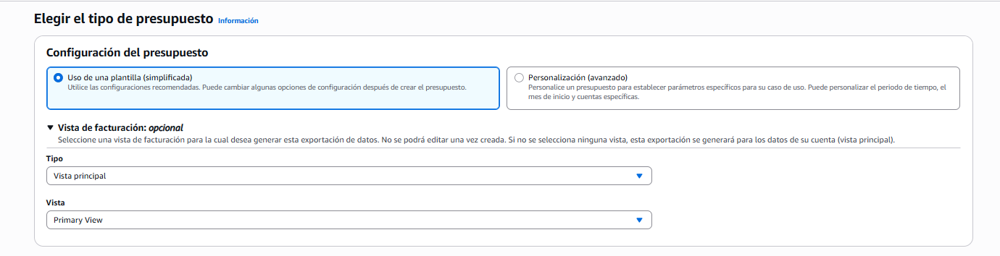
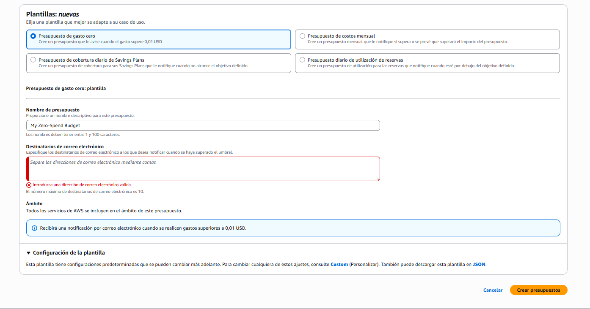
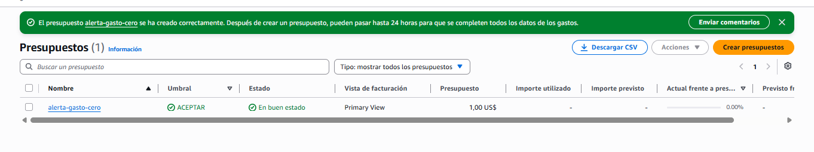

# ☁️ El gatillo de la factura sorpresa

> **La factura sorpresa casi nunca viene de lo que construiste. Viene de lo que dejaste, de lo que no sabías que se cobraba, y de lo que consumió alguien más.**
>
> Los tres comparten una propiedad incómoda: **no producen ningún error**. El sistema funciona perfectamente mientras te cuesta dinero.

## Los tres olvidos clásicos

Cuando alguien cuenta que le llegó una factura que no esperaba, la causa cae casi siempre en una de estas tres familias:

| Familia | Qué pasó | Por qué no lo viste |
|---------|----------|---------------------|
| **Lo que dejaste vivo** | Un recurso sigue encendido en una región, o en una cuenta, que ya no visitas | No aparece donde miras. La consola solo te enseña la región seleccionada |
| **Lo que no sabías que se cobraba** | El disco, la IP reservada, la salida de datos, las operaciones | Creías que pagabas "el servidor". Pagas cuatro unidades, y solo apagaste una |
| **Lo que consumió otro** | Un bot, un bucle, una clave filtrada, un scraper | El consumo es real y legítimo desde el punto de vista del proveedor |

Fíjate en la columna de la derecha, porque ahí está el patrón común: **ninguno de los tres genera una señal**. No hay excepción en los logs, no hay caída, no hay alerta automática. Un recurso olvidado funciona correctamente; una clave robada se usa con credenciales válidas; un bucle hace exactamente lo que le pediste. El sistema está sano — y ese es justo el problema.

> 🎯 **Idea clave:** el costo no es un fallo, es una consecuencia. Por eso no lo detecta ningún mecanismo de errores, y por eso hay que vigilarlo aparte y a propósito.

## El costo que NO es del proveedor de nube: los tokens

Este es el que más se olvida en una app con IA, y por una razón muy concreta: **no aparece en la factura de AWS**. Es otra factura, de otro proveedor, con otro ciclo de cobro. Tu "costo de nube" puede ser de 5 dólares mientras tu costo real es de 200.

**Qué se cobra:** por **token**, y con dos precios distintos — uno para lo que **entra** (tu prompt, el historial, los documentos que adjuntas) y otro para lo que **sale** (la respuesta del modelo). La salida cuesta aproximadamente **cinco veces más** que la entrada.

> 📝 **Un token** es la unidad en la que el modelo parte el texto: aproximadamente ¾ de palabra en inglés, y algo menos en español. Como regla de trabajo, **1 palabra ≈ 1,3 tokens** en español. No necesitas precisión aquí; necesitas el orden de magnitud.

| Modelo | Entrada (USD / millón de tokens) | Salida (USD / millón) |
|--------|:--------------------------------:|:---------------------:|
| Claude Haiku 4.5 | 1,00 | 5,00 |
| Claude Sonnet 5 | 3,00 | 15,00 |
| Claude Opus 5 | 5,00 | 25,00 |

⚠️ *verificar: precios vigentes a mediados de 2026. Cambian, y cada proveedor tiene los suyos — comprobar en la página de precios antes de estimar en serio.*

**Free tier:** no hay. Se cobra desde el primer token.

**💸 Los gatillos propios de un LLM** — estos cuatro no existen en ningún otro servicio:

1. **El contexto que crece.** Si mandas el historial completo en cada turno, el coste por mensaje **crece con la conversación**. Una charla de 20 turnos no cuesta 20 veces el primero: cuesta mucho más, porque cada turno reenvía todo lo anterior como entrada.
2. **El prompt de sistema largo.** Se envía en **cada** llamada. Mil tokens de instrucciones fijas, multiplicados por diez mil llamadas, son diez millones de tokens de entrada que nadie pidió.
3. **Los reintentos.** Un fallo que reintenta tres veces cuesta tres veces. Y los reintentos suelen estar configurados por defecto en las librerías, así que ocurren sin que los escribas.
4. **Los documentos adjuntos.** Cada archivo que pasas al modelo es entrada facturada. Adjuntar un PDF de 40 páginas a cada consulta multiplica la cuenta sin tocar una línea de tu código.

**Estimación concreta — un correo:** supongamos que clasificas y resumes un correo de unas 500 palabras.

```text
ENTRADA   prompt de sistema      300 tokens
          el correo (500 pal.)   650 tokens
          ─────────────────────────────────
                                 ~950 tokens

SALIDA    clasificación + resumen ~300 tokens
```

Con Sonnet 5: `950 × 3/1.000.000 = 0,00285` de entrada, más `300 × 15/1.000.000 = 0,0045` de salida. **Total: unos 0,0075 USD por correo** — tres cuartos de centavo.

Parece nada. En la Sección 4 lo multiplicamos por diez mil y deja de parecerlo.

**Cómo se reduce** *(sin entrar en detalle — es tema de B9)*: caché de prompt, para que lo que se repite en cada llamada no se cobre entero cada vez; procesamiento por lotes cuando no necesitas la respuesta al instante, que suele costar la mitad; y elegir el modelo por tarea, porque la diferencia entre el más barato y el más caro es de **cinco veces** para el mismo trabajo.

## Cuando el gasto no lo generas tú

Los dos casos anteriores dependen de decisiones tuyas. Este no, y por eso es el que más rápido escala:

- **Un endpoint público sin límite de peticiones.** Si tu API llama a un modelo por cada petición y cualquiera puede llamarla, el costo de tu producto lo decide un desconocido.
- **Un bucle.** El caso clásico: una función se dispara cuando aparece un archivo en un bucket, y esa función escribe un archivo en el mismo bucket. Se llama a sí misma, para siempre, a toda velocidad.
- **Una clave filtrada.** Ya lo viste en B1: para el proveedor, quien usa una credencial válida eres tú. El consumo del atacante es tu consumo.
- **Un scraper.** Alguien descarga tus archivos en masa. Tú pagas la **salida de datos** de cada descarga.

> ⚠️ **Importante — la alerta te avisa, no te frena.** Un bucle puede gastar en dos horas lo que una alerta diaria detecta al día siguiente. Contra este tipo de gasto, lo que sirve son **límites duros**: tope de concurrencia, límite de peticiones por cliente, tamaño máximo. La alerta es para enterarte; el límite es para que no ocurra.

Y aquí tu plan gratuito juega a tu favor por una vez: como las cargas de trabajo **no pueden pasar del crédito disponible**, un bucle en tu cuenta se detiene solo cuando se agota el saldo. Te quedas sin plataforma, que es malo — pero no te llega una factura de cuatro cifras, que es peor.

## La red de seguridad: presupuesto y alerta

> **Un presupuesto es una cifra de gasto que tú declaras para un periodo, con avisos que te llegan al acercarte a ella.**
>
> Es un objeto que creas en la consola: le pones un importe, un periodo y uno o más umbrales. A partir de ahí, el sistema compara lo que llevas gastado contra ese número y te manda un correo cuando lo cruzas.

El nombre engaña, así que conviene decir lo que **no** es antes de seguir:

- **No reserva dinero.** No hay ningún fondo apartado ni saldo que se descuente.
- **No limita nada.** Puedes gastar diez veces tu presupuesto y nadie te lo va a impedir.
- **No es un método de pago** ni tiene relación con tu tarjeta o tus créditos.

Es, literalmente, **un vigilante que mira un número y avisa**. Su valor no está en frenar el gasto — está en que te enteres mientras todavía puedes hacer algo. En tu caso, con 100 USD de crédito que se queman en silencio, es lo único que convierte esa quema en información.

> ⚠️ **Cómo leer esto:** intención, no clics. Los nombres de los campos pueden cambiar; las decisiones que hay detrás, no.

**Antes de empezar:** necesitas el acceso a facturación activado (Sección 1) y estar en la cuenta correcta.

**El recorrido completo, de principio a fin:**

```text
   CREAR                 RECIBIR AVISOS            RESPONDER CON ACCIONES
   el presupuesto   →    cuando cruzas       →     ejecutar algo automático
   (importe, avisos)     un umbral                 al cruzar el umbral
   ───────────────       ───────────────           ───────────────────────
   hoy                   hoy                       necesita un rol → B3
```

Los dos primeros pasos los haces ahora. El tercero —que el sistema *actúe* solo, y no solo avise— exige darle permisos a un servicio para tocar tus recursos, y eso es tema de **B3**.

**Dónde:** en *Administración de facturación y costos* → **Presupuestos** → crear presupuesto.

**La primera decisión: plantilla o personalizado.**



*El primer paso solo elige el camino. La plantilla te deja fuera algunos ajustes; la personalización los expone todos.*

| Camino | Qué te da | Cuándo |
|--------|-----------|--------|
| **Uso de una plantilla (simplificada)** | Configuraciones ya recomendadas. Pides pocos datos y listo | Para dejar algo puesto hoy, en dos minutos |
| **Personalización (avanzado)** | Todos los parámetros: periodo, mes de inicio, cuentas, umbrales, tipo de aviso | Cuando sabes qué quieres vigilar y con qué margen |

Debajo hay un apartado opcional de **vista de facturación**, que se deja en *Vista principal* — sirve para cuentas que separan sus datos de facturación en varias vistas, y no es tu caso.

**Las cuatro plantillas.** Si vas por el camino simplificado, eliges entre estas:



*Elegida la plantilla, la pantalla pide solo lo imprescindible. El ámbito no se elige: la plantilla lo fija a todos los servicios.*

| Plantilla | Qué hace | ¿Te sirve? |
|-----------|----------|-----------|
| **Presupuesto de gasto cero** | Te avisa cuando el gasto supere **0,01 USD** | ✅ Es el alambre-trampa: cualquier gasto, por mínimo que sea, te llega al correo |
| **Presupuesto de costos mensual** | Te notifica si **supera** o si **se prevé que superará** el importe que fijes | ✅ Cuando ya sepas cuánto esperas gastar al mes |
| **Cobertura diario de Savings Plans** | Vigila compromisos de gasto a largo plazo | ❌ Nivel 3, fuera del temario |
| **Utilización diaria de reservas** | Vigila capacidad reservada por adelantado | ❌ Nivel 3, fuera del temario |

> 💡 **Cuál poner primero:** el de **gasto cero**. Tu intención hoy es no gastar nada, así que un aviso al primer céntimo es exactamente la señal que quieres — no hay que estimar ningún importe ni acertar ningún umbral. Cuando en B4 empieces a levantar cosas a propósito, añades el mensual con un importe pensado.

**Qué te pide la plantilla de gasto cero:**

| Campo | Qué poner | Detalle |
|-------|-----------|---------|
| **Nombre de presupuesto** | Algo descriptivo | Entre 1 y 100 caracteres. Viene con uno por defecto |
| **Destinatarios de correo electrónico** | Tu correo | Separados por comas. **Máximo 10** |
| **Ámbito** | No se elige | La plantilla incluye **todos los servicios de AWS** |

Y confirma lo que va a hacer con una frase explícita: *"recibirá una notificación por correo electrónico cuando se realicen gastos superiores a 0,01 USD"*.

> 🔑 **Qué crea realmente esa plantilla:** un presupuesto de **1,00 USD** con el aviso puesto en 0,01 — es decir, un umbral del **1%**. No es un presupuesto "de cero": es el importe más pequeño que tiene sentido, con la alerta lo más abajo posible. Entender eso importa porque el mecanismo es siempre el mismo — un importe y un porcentaje — y aquí solo está llevado al extremo.

**Las alertas — y la única decisión con criterio de verdad:**

En la plantilla mensual, y en todo el camino de personalización, cada aviso tiene un **umbral** (un porcentaje del importe) y un **tipo**. Esa segunda parte es la que casi nadie entiende:

- **Real** — te avisa cuando **ya gastaste** ese porcentaje. Es exacto y llega tarde.
- **Prevista** — te avisa cuando la **proyección** dice que vas a llegar. Se anticipa, y a cambio puede equivocarse, sobre todo a principios de mes cuando hay pocos datos.

No es una elección entre las dos: **pon las dos**. Una prevista al 80% para enterarte de la tendencia, y una real al 50% para saber dónde estás de verdad. La primera te da tiempo de reaccionar; la segunda te dice la verdad. *(La plantilla mensual ya trae ambas: por eso su descripción dice "si supera **o se prevé que superará**".)*

> 🎯 **La decisión que nadie te va a explicar:** con créditos de por medio, un presupuesto puede medir el gasto **bruto** (lo que consumiste) o **neto** (lo que queda después de aplicar el crédito). Si mide el neto, mientras te quede saldo **siempre verás cero** — y el presupuesto no sirve para nada. Hay que configurarlo para que **cuente el consumo aunque el crédito lo cubra**. En tu situación, ese ajuste es la diferencia entre vigilar tu combustible y mirar un medidor roto. ⚠️ *verificar dónde vive esa opción: no aparece en las plantillas, así que está en el camino de personalización o en "Configuración de la plantilla" → Custom.*

**⚠️ Trampas:**

- **El presupuesto no frena nada.** No es un tope de gasto, es un vigilante que manda correos. Frenar es el tercer paso del diagrama, y necesita permisos — **B3**.
- **La plantilla te oculta decisiones.** No eliges umbral, periodo ni tipo de aviso: vienen fijados. Se cambian después desde *Configuración de la plantilla* → **Custom**, o entrando por el camino de personalización desde el principio.
- **La alerta llega con el retraso de la facturación.** Los datos se actualizan aproximadamente cada 24 horas, así que el aviso también.
- **Máximo 10 destinatarios**, y si el campo queda vacío no te deja continuar.
- **Un presupuesto por cuenta.** El de una cuenta no vigila la otra.

> 💡 **Detalle útil:** la plantilla se puede **descargar como JSON**. Sirve para recrear el mismo presupuesto en otra cuenta sin repetir la pantalla — y es la primera vez en el temario que te cruzas con la idea de declarar infraestructura en un archivo en vez de a mano.

**✅ Sabes que salió bien si:** el presupuesto aparece en la lista, en estado *En buen estado*, y el panel de la página de inicio deja de decir *"se requiere configuración"*.



*La lista distingue en columnas separadas el **importe utilizado** (lo real) y el **importe previsto** (la proyección) — las dos formas de aviso, ya visibles de un vistazo.*

Dos cosas que la propia pantalla te recuerda al crearlo: que **pueden pasar hasta 24 horas** hasta que los datos de gasto estén completos, y que el importe del presupuesto es 1,00 USD aunque lo llames "de gasto cero". Que el correo **llegue** solo se comprueba cruzando el umbral, y eso todavía no va a pasar.

## La lista de limpieza — qué apagar y en qué orden

El curso entrega una lista de más de treinta servicios para revisar. Copiarla aquí no serviría de nada: la mitad no los conoces todavía, y memorizar nombres sin significado no te va a salvar de nada. Lo que sí transfiere es **el patrón** — cuatro formas de quedarse encendido:

| Patrón | Qué buscar | Ejemplo |
|--------|------------|---------|
| **Sobrevive a quien lo creó** | Recursos que no se borran al borrar lo que los usaba | El disco de una máquina eliminada |
| **Cobra por estar reservado** | Cosas que apartaste "para ti" y no estás usando | Una dirección IP fija sin asignar |
| **Se acumula solo** | Cosas que crecen sin que hagas nada | Logs, copias de seguridad, imágenes viejas |
| **Corre aunque nadie lo use** | Piezas que cobran por tiempo, no por tráfico | Un balanceador, una base de datos levantada |

**El orden importa.** Se limpia de arriba abajo en la cadena de dependencias, y dentro de eso, primero lo que más rápido acumula:

```text
1. Lo que cobra por hora encendido      → detiene la hemorragia
2. Lo que está reservado sin usarse     → suele ser lo olvidado
3. Lo que quedó huérfano                → discos, interfaces, snapshots
4. Lo que se acumula                    → logs y copias viejas
```

> 💡 **El único método fiable de verificación no es tu memoria: es el desglose de facturación.** Tú recuerdas lo que creaste a propósito; la factura sabe lo que existe. Y revísalo **por región** — un recurso en una región que no visitas no aparece en ninguna lista que estés mirando.

*(La lista completa del curso queda en `_input/s32_lista_limpieza.md` como referencia, para cuando ya conozcas los servicios que menciona.)*

## 🎯 Lo que debiste llevarte

> **Si de esta sección solo retienes estas líneas, cumplió su función.**

- El gasto inesperado no genera errores: el sistema funciona perfectamente mientras te cuesta dinero, y por eso hay que vigilarlo a propósito.
- En una app con IA, el costo mayor suele ser el de los tokens — y no aparece en la factura de la nube porque es de otro proveedor.
- El costo de un LLM crece con el contexto que reenvías, con el prompt de sistema, con los reintentos y con los adjuntos: cuatro cosas que no se ven en el código.
- Contra el gasto que genera otro (un bucle, un bot, una clave filtrada) las alertas no sirven: hacen falta límites duros.
- Un presupuesto no frena el gasto, solo avisa; y conviene poner dos alertas, una prevista para anticipar y una real para saber la verdad.
- Con créditos, el presupuesto debe medir el consumo **bruto**: si mide lo que queda tras aplicar el crédito, verás cero hasta que sea tarde.
- Al limpiar, la factura sabe más que tu memoria — y hay que mirarla región por región.

---
[[02_free-tier|← anterior]] · [[00_indice|índice]] · [[04_estimar-antes|siguiente →]]
