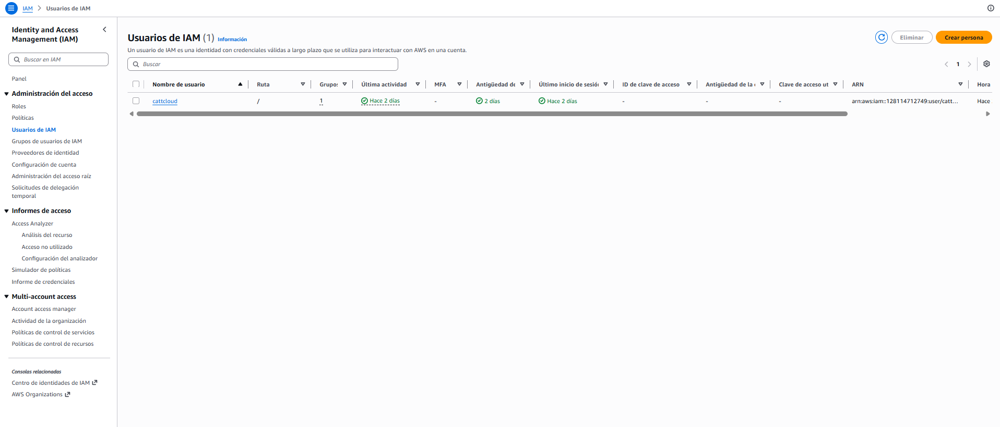
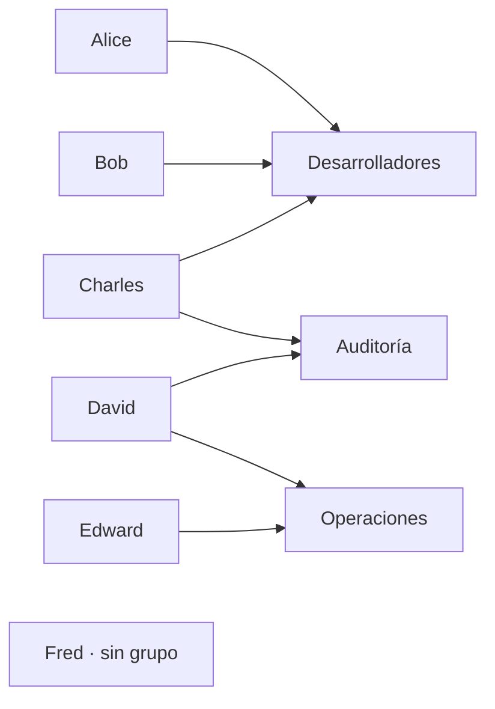
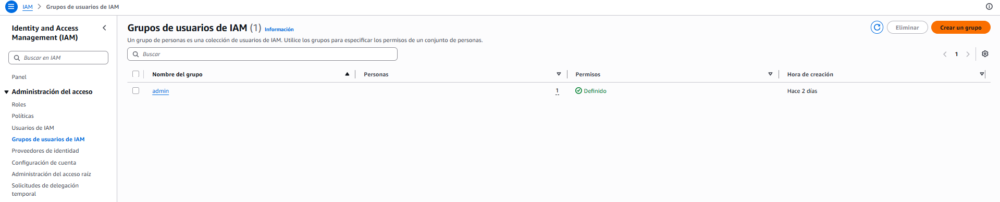
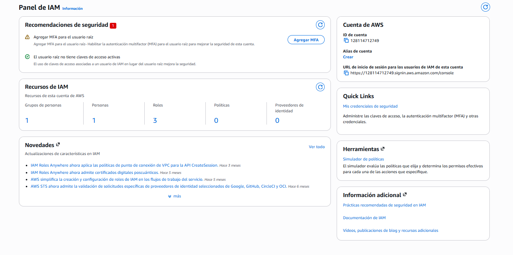
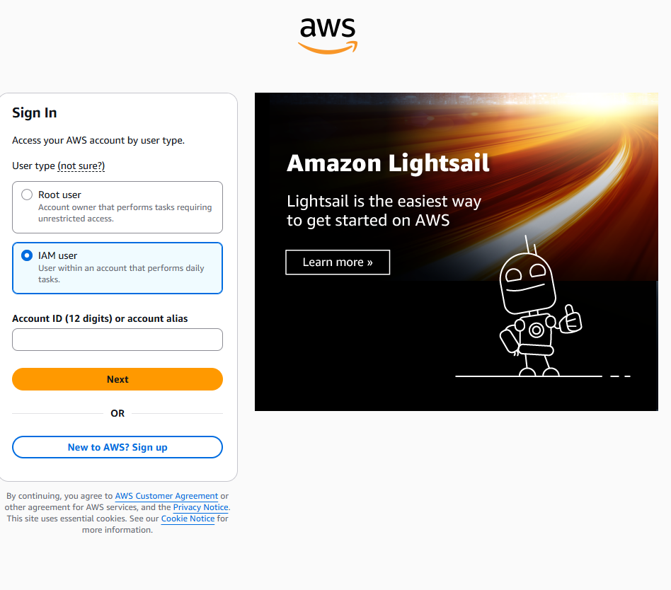
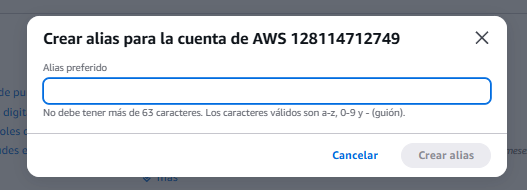
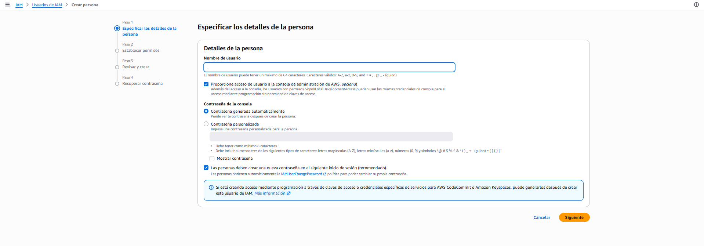
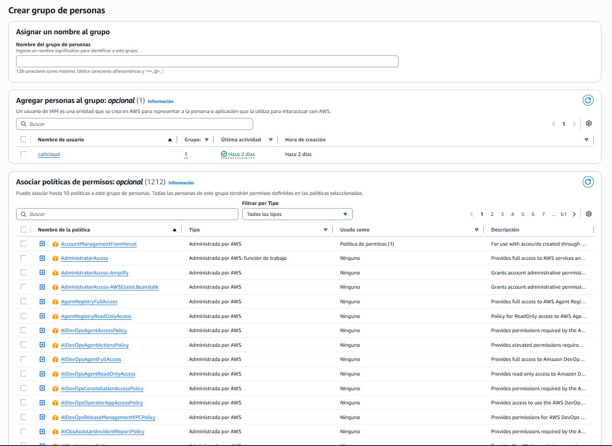
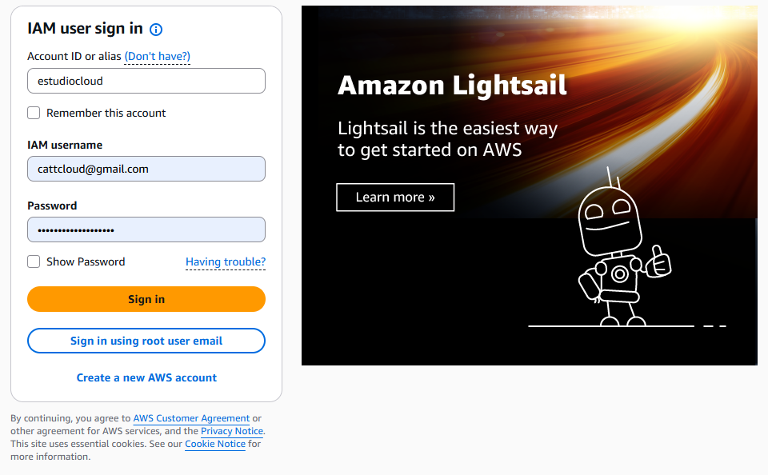

# ☁️ Usuarios y grupos — quién eres

> **IAM (Identity and Access Management) es el servicio que responde dos preguntas: quién eres y qué puedes hacer.**
>
> Es **global**: no pertenece a ninguna región, así que no hay que elegir una para usarlo. Y usarlo no cuesta nada — lo que cuesta caro es usarlo mal.

## El dolor: una sola llave que lo abre todo

Cuando creaste tu cuenta, AWS te dio **una sola identidad**: la cuenta **root**. Es el dueño de la cuenta, y su definición es incómoda de lo absoluta:

- Puede hacer **todo**, sin excepción.
- **No se le pueden quitar permisos.** No existe una política que limite a root.
- Puede cambiar el método de pago, ver la facturación y **cerrar la cuenta**.

Piénsalo como la llave maestra de un edificio: abre todas las puertas, incluida la del cuarto eléctrico. Nadie que trabaje ahí dentro necesita esa llave para hacer su trabajo — y sin embargo, si es la única que hay, es la que va a acabar en el bolsillo de todos.

De ahí salen tres problemas concretos:

| Problema | Por qué duele |
|----------|---------------|
| Si esa credencial se filtra, se acabó | No hay permisos que recortar. Quien la tenga puede vaciar y cerrar la cuenta |
| No sabes quién hizo qué | Si dos personas usan root, los registros dicen "root" en ambos casos. No hay rastro |
| No se la puedes dar a un programa | Un script que necesite acceso tendría el control total de todo |

> ⚠️ **Importante:** root no se elimina ni se desactiva — siempre existe. Lo que se hace es **dejar de usarlo**. Se reserva para configurar la cuenta y para las pocas tareas que solo él puede hacer. Ya te topaste con una en **B2**: activar el acceso a la información de facturación solo se puede desde root, ni siquiera siendo administrador.

Aquí es donde entra el resto de este módulo: **crear identidades más pequeñas**, con permisos recortados, para todo lo demás.

## Qué es un usuario IAM — y qué NO es

> **Un usuario IAM es una identidad permanente dentro de tu cuenta, con sus propias credenciales y sus propios permisos.**
>
> Representa a una persona —o a una aplicación, aunque para eso hay algo mejor que veremos en la Sección 5.

Cuatro precisiones que evitan los malentendidos habituales:

- **No es una cuenta de AWS aparte.** Vive *dentro* de la tuya. Lo que gaste, lo pagas tú, y aparece en tu misma factura.
- **Empieza sin poder hacer absolutamente nada.** Esto sorprende: crear el usuario y darle permisos son dos actos distintos. Un usuario recién creado **sí puede iniciar sesión** —la contraseña funciona— pero cada acción que intente dentro de la consola termina en un mensaje del tipo *"no está autorizado para realizar esta acción"*. Puede entrar; no puede hacer nada.
- **Un usuario = una persona.** Compartir un usuario entre dos personas rompe lo único que te da IAM que root no te daba: saber quién hizo qué.
- **Sus credenciales son dos, y son independientes:** una **contraseña** para entrar por la consola, y una **clave de acceso** para la CLI o el SDK (Sección 4). Puede tener una, la otra, las dos o ninguna.



*La lista de usuarios. Cada columna es una pregunta de seguridad: a qué grupos pertenece, si tiene MFA, qué antigüedad tienen sus credenciales y cuándo se usaron por última vez.*

> 📝 **Nota de vocabulario:** la consola actual habla de **"persona"** — el botón dice *Crear persona* y los grupos son *grupos de personas*. El objeto técnico sigue llamándose **usuario IAM**, y así aparece en la documentación, en las políticas y en el ARN. Es un cambio de etiqueta, no de concepto.

## Grupos: las cuatro reglas

> **Un grupo es un contenedor de usuarios que existe con un único fin: adjuntar permisos una vez en lugar de repetirlos persona por persona.**

Las reglas son pocas y conviene sabérselas, porque casi todas las confusiones vienen de asumir que un grupo es algo más de lo que es:

1. **Un grupo solo contiene usuarios.** No hay grupos dentro de grupos, no hay subgrupos, no hay jerarquía.
2. **Un usuario puede estar en varios grupos a la vez**, y acumula los permisos de todos.
3. **Un usuario puede no estar en ningún grupo** y tener sus políticas puestas directamente.
4. **Un grupo no es una identidad.** No tiene credenciales, no inicia sesión, no se le puede dar una clave de acceso. No es "alguien": es una etiqueta con permisos colgados.

La relación entre usuarios y grupos es de **muchos a muchos**, y ahí está el detalle que cuesta ver en una lista: Charles y David pertenecen cada uno a dos grupos, y acumulan los permisos de ambos.



Fred no está en ninguno, y aun así puede tener permisos: se le adjunta una política directamente. Estar en un grupo no es requisito para tener permisos — es la forma cómoda de administrarlos.

Así se ve un grupo ya creado en tu cuenta:



*La lista de grupos resume el concepto en dos columnas: cuántas personas contiene y si tiene permisos definidos. Un grupo sin ninguna de las dos cosas es perfectamente válido — y perfectamente inútil.*

Lo que ganas al usarlos es que **el permiso se administra por función, no por persona**. Cuando alguien cambia de puesto, lo mueves de grupo; no repasas sus doce políticas una por una. Y cuando entra alguien nuevo, no tienes que recordar qué permisos le diste al anterior.

> 🔑 **Un límite concreto:** un grupo admite hasta **10 políticas** asociadas. Si necesitas más, la señal no es "busca cómo saltarte el límite" — es que ese grupo está haciendo demasiadas cosas.

## El alias de cuenta y la URL de acceso

Tu cuenta tiene un **ID numérico de 12 dígitos**, y los usuarios IAM entran por una URL que lo contiene. Es funcional y es horrible de recordar:

```text
https://128114712749.signin.aws.amazon.com/console
                ↓  con alias
https://estudiocloud.signin.aws.amazon.com/console
```

El **alias** sustituye esos doce dígitos por un nombre legible. No cambia la seguridad ni los permisos: es una comodidad para que la puerta de tus usuarios tenga nombre.

**Dónde se ve y se configura:** en **IAM → Panel**, en el bloque **Cuenta de AWS** de la derecha. Ahí están las tres cosas juntas — el ID de cuenta, el alias (con un enlace *Crear* si todavía no tienes uno) y la URL de acceso ya formada, lista para copiar.



*El Panel de IAM es la pantalla que conviene mirar de vez en cuando: resume qué identidades existen en tu cuenta y qué falta por asegurar.*

**Y hay dos formas de entrar a la misma cuenta**, que la pantalla de acceso te hace elegir de entrada:



*La página de acceso empieza preguntando **qué tipo de identidad eres**, y según lo que elijas te pide una cosa u otra. Ahí se ve la diferencia entre las dos, sin teoría.*

| | **Root user** | **IAM user** |
|---|---|---|
| Cómo se describe | *"Propietario de la cuenta, para tareas que requieren acceso sin restricciones"* | *"Usuario dentro de una cuenta, para tareas del día a día"* |
| Qué te pide primero | Tu **correo electrónico** | El **ID de cuenta o el alias** |
| Luego | Contraseña | **Nombre de usuario** + contraseña |

Fíjate en que **root se identifica por correo y el usuario IAM por cuenta + nombre**. Es coherente con lo que ya sabes: root *es* la cuenta, mientras que un usuario IAM existe *dentro de* una cuenta y por eso hay que decir de cuál.

> 💡 **Para qué sirve entonces la URL con el alias:** te salta ese primer paso. Vas directo al formulario de usuario IAM con el campo de cuenta ya relleno. Es un atajo, no otra puerta.

### Crear el alias

Desde ese mismo bloque, el enlace *Crear* abre un diálogo de un solo campo:



*El diálogo dice sus reglas de formato, pero no la más importante: el alias es único en todo AWS, no solo en tu cuenta.*

**Las reglas de formato** están a la vista: máximo 63 caracteres, y solo **minúsculas**, números y guiones. Ni mayúsculas, ni puntos, ni guiones bajos.

**La regla que no está a la vista**, y que explica el rechazo más frecuente: **el alias tiene que ser único entre todas las cuentas de AWS del mundo**. Es un subdominio real, así que si alguien ya se llevó el nombre que quieres, no puedes tenerlo. Una palabra común suele estar tomada; añadir un sufijo lo resuelve.

Tres cosas que conviene saber antes de escribirlo:

| | |
|---|---|
| **Solo hay uno por cuenta** | No es una lista. Crear uno nuevo **reemplaza** al anterior |
| **Cambiarlo rompe la URL vieja** | Quien la tuviera guardada tendrá que actualizarla. Irrelevante con un usuario, molesto con un equipo |
| **El ID de 12 dígitos nunca deja de funcionar** | El alias no lo sustituye, se le suma. Conviene tener ese ID apuntado **fuera** de AWS: si el alias cambia o lo olvidas, esa URL te sigue dejando entrar |

> 💡 **Y elige pensando en que se lee.** Va en una URL que otras personas pueden ver, así que el nombre de un cliente, tu nombre completo o cualquier cosa que no quieras enseñar dentro de dos años es mala idea. Reconocible para ti, anodino para el resto.

> 🔑 **El alias no es un secreto, pero tampoco lo publiques.** No da acceso a nada por sí solo — sin usuario y contraseña no abre nada. Pero le dice a cualquiera que esa cuenta existe y dónde está su puerta, así que no va en un repositorio público.

> 💡 **De paso, ese mismo panel te dice tres cosas que valen más que el alias:** cuántas identidades tienes (personas, grupos, roles), qué recomendaciones de seguridad hay pendientes, y un enlace al **simulador de políticas** — una herramienta que evalúa qué permisos tiene realmente alguien antes de que lo compruebes a las malas. Las tres reaparecen en las secciones 3 y 6.

## Crear tu usuario, tu grupo, y entrar con él

> ⚠️ **Cómo leer esto:** intención, no clics. Los nombres de los campos cambian —de hecho ya cambiaron respecto al curso—; las decisiones que hay detrás, no.

**Antes de empezar:** hay que estar como **root**. Es la excepción legítima: crear la primera identidad es justo una de las tareas para las que root existe.

**Dónde:** el servicio IAM, en el menú **Administración del acceso**. No te pide región porque es global.

**Paso 1 — los detalles de la persona.** El asistente tiene cuatro pasos, y en el primero se deciden estas cosas:



*Los cuatro pasos del asistente aparecen a la izquierda. Fíjate en el aviso azul del final: las claves de acceso no se crean aquí.*

| Campo | Qué elegir | Por qué |
|-------|------------|---------|
| **Nombre de usuario** | El de la persona real, no un genérico | Máximo 64 caracteres. `admin` o `dev` no le dicen a nadie quién hizo qué |
| **Acceso a la consola** | Sí, si esa persona va a entrar por navegador | Es opcional: un usuario puede existir solo para acceso programático |
| **Contraseña** | Generada automáticamente | La personalizada exige mínimo 8 caracteres y tres de los cuatro tipos |
| **Cambio en el primer inicio** | Déjalo marcado | La contraseña inicial la viste tú. Mientras no la cambie, la credencial la conocen dos personas |

**Paso 2 — los permisos.** Tres caminos: meterlo en un grupo, copiar los permisos de otro usuario, o adjuntarle políticas directamente. **Elige el grupo**, aunque de momento seas tú solo — es el hábito que hace que esto escale.

Si aún no hay grupo, se crea aquí mismo:



*Crear el grupo pide tres cosas: cómo se llama, quién entra, y qué puede hacer. Las tres son opcionales salvo el nombre — un grupo puede existir vacío y sin permisos.*

**⚠️ Trampas:**

- **Un usuario nuevo no puede hacer nada.** Si entra bien pero cada pantalla le responde *"no está autorizado"*, no está roto ni mal creado: le faltan permisos. Iniciar sesión y tener permisos son cosas separadas.
- **La contraseña generada se muestra una sola vez.** Si cierras esa pantalla sin copiarla, toca restablecerla.
- **Las claves de acceso no se crean aquí.** La propia pantalla lo avisa: se generan después, desde el usuario ya creado. Es la Sección 4.
- **Hay más de mil políticas gestionadas** en el buscador. Ver una lista de 1.212 opciones empuja a elegir la primera que suene bien — que casi siempre es la más amplia. De eso trata la Sección 3.

**✅ Sabes que salió bien si:** puedes cerrar sesión y volver a entrar por la URL del alias, con el usuario nuevo:



*Entrando por la URL del alias, el campo de cuenta llega relleno y solo quedan usuario y contraseña. Abajo, el enlace para volver al acceso con correo de root.*

> ⚠️ **Cuidado con el autocompletado del navegador.** En ese formulario el campo pide el **nombre del usuario IAM**, no un correo. El gestor de contraseñas del navegador tiende a rellenarlo con tu email porque lo interpreta como un login cualquiera — y entonces el acceso falla sin decirte por qué. Si tu usuario se llama `cattcloud`, ahí va `cattcloud`.

Y el criterio final: ver arriba a la derecha **`usuario@alias`** en lugar de tu identidad de root. A partir de ese momento, root se queda guardado.

## 🎯 Lo que debiste llevarte

> **Si de esta sección solo retienes estas líneas, cumplió su función.**

- La cuenta root puede todo y no se le pueden quitar permisos, así que no se usa: se guarda para configurar la cuenta y para lo que solo ella puede hacer.
- Un usuario IAM vive dentro de tu cuenta, no es una cuenta aparte, y **nace sin poder hacer nada** — crear la identidad y darle permisos son dos actos distintos.
- Un usuario debe corresponder a una persona real, porque saber quién hizo qué es justo lo que root no te daba.
- Un grupo solo contiene usuarios, no anida, y no es una identidad: no tiene credenciales ni inicia sesión.
- Los permisos se administran por grupo y no por persona, para que un cambio de puesto sea un cambio de grupo y no una revisión de doce políticas.
- El alias de cuenta reemplaza los doce dígitos en la URL de acceso de tus usuarios; root entra por otra puerta, con su correo.

---
[[00_indice|índice]] · [[02_politicas|siguiente →]]
