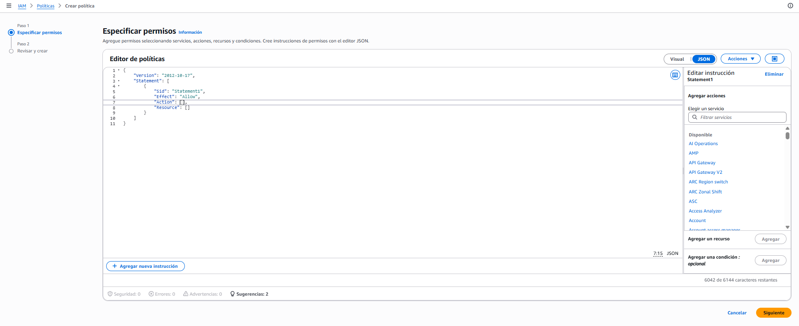
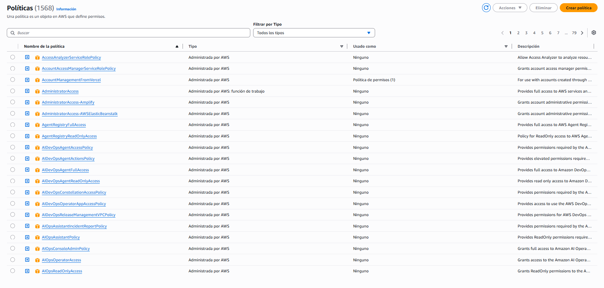

# ☁️ Políticas — qué puedes hacer

> **Una política es un documento JSON que responde una sola pregunta: quién puede hacer qué, sobre qué recurso, y bajo qué condición.**
>
> No es programación y no se ejecuta. Es una declaración que AWS lee **cada vez** que alguien intenta algo.

## Qué es una política

Si la Sección 1 fue *quién eres*, esta es *qué puedes hacer*. Y son cosas separadas a propósito: la identidad y sus permisos se administran por caminos distintos, que es lo que permite quitarle capacidades a alguien sin borrarlo, o dárselas a diez personas de una vez.

Una política declara cuatro cosas, y solo cuatro:

| Elemento | La pregunta que responde | Ejemplo |
|----------|--------------------------|---------|
| **Efecto** | ¿Permitir o denegar? | `Allow` |
| **Acción** | ¿Qué operación exactamente? | `s3:GetObject` — leer un archivo |
| **Recurso** | ¿Sobre qué cosa concreta? | Un bucket en particular, no todos |
| **Condición** *(opcional)* | ¿Bajo qué circunstancia? | Solo desde cierta red, solo con MFA |

Dos precisiones que cambian cómo se piensa el resto de la sección:

- **Se evalúa en cada petición, no al iniciar sesión.** No hay "sesión con permisos cargados". Cada vez que pulsas algo, AWS vuelve a leer las políticas que te aplican. Por eso un cambio de permisos surte efecto **al instante**, sin cerrar sesión — lo vas a comprobar al final de esta sección.
- **Una política sola no hace nada.** Es un documento suelto hasta que se **adjunta** a una identidad o a un recurso. Crear la política y aplicarla son dos actos, igual que crear el usuario y darle permisos.

## Anatomía del documento

El formato es siempre el mismo, y la propia consola te da el esqueleto vacío cuando creas una:



*El editor tiene dos vistas —**Visual** y **JSON**— que son el mismo documento. Abajo hay un validador permanente: seguridad, errores, advertencias y sugerencias, contados en vivo.*

**Sintaxis:**

```json
{
  "Version": "2012-10-17",
  "Statement": [
    {
      "Sid": "[identificador opcional]",
      "Effect": "Allow | Deny",
      "Action": "[servicio:Operación]",
      "Resource": "[ARN del recurso]"
    }
  ]
}
```

**Ejemplo** — permitir leer archivos de un bucket concreto, y nada más:

```json
{
  "Version": "2012-10-17",
  "Statement": [
    {
      "Sid": "LeerAdjuntosDeClientes",
      "Effect": "Allow",
      "Action": ["s3:GetObject", "s3:ListBucket"],
      "Resource": [
        "arn:aws:s3:::adjuntos-clientes",
        "arn:aws:s3:::adjuntos-clientes/*"
      ]
    }
  ]
}
```

Los campos, uno por uno:

| Campo | Obligatorio | Qué es |
|-------|:-----------:|--------|
| **Version** | Sí | La versión **del lenguaje de políticas**, no de tu documento. Es `2012-10-17` siempre; no la cambies |
| **Id** | No | Un identificador para la política entera |
| **Statement** | **Sí** | La declaración. Una o varias: es una lista |
| **Sid** | No | Nombre de *esa* declaración. Sirve para saber cuál falló cuando hay varias |
| **Effect** | **Sí** | `Allow` o `Deny` |
| **Action** | Sí | Qué operaciones. Formato `servicio:Operación`. Admite comodín: `s3:Get*` |
| **Resource** | Sí | Sobre qué. Se escribe con el **ARN**, el identificador único de un recurso en AWS |
| **Condition** | No | Cuándo aplica esta declaración |

> 📝 **ARN** *(Amazon Resource Name)* es la dirección única de cualquier cosa dentro de AWS. Aparece por todas partes sin anunciarse: en la lista de usuarios, cada identidad se muestra como `arn:aws:iam::128114712749:user/cattcloud`. Se lee por partes — servicio, cuenta, tipo de recurso y nombre.

> 🔑 **Un campo que confunde: `Principal`.** En muchos ejemplos verás un campo `Principal` que dice a quién se aplica la política. **No aparece cuando la política se adjunta a un usuario, grupo o rol** — ahí el "quién" es justamente la identidad a la que la pegaste, y ponerlo sería redundante. Solo aparece en las políticas que se pegan **al recurso** (por ejemplo, a un bucket), donde hay que decir explícitamente quién entra. La diferencia es la subsección siguiente.

> ⚠️ **Un límite concreto:** una política tiene un máximo de **6.144 caracteres**. La consola te lo va descontando en la esquina. Si te acercas, casi nunca es que necesites más espacio — es que estás metiendo demasiadas cosas en un solo documento.

## Dónde se adjunta: usuario, grupo o rol

Hay dos familias de políticas, y se distinguen por **dónde las pegas**:

| Familia | Se adjunta a | Responde a | ¿Lleva `Principal`? |
|---------|--------------|-----------|:-------------------:|
| **Basada en identidad** | Un usuario, un grupo o un rol | *"¿Qué puede hacer este?"* | No |
| **Basada en recurso** | Un recurso concreto (un bucket, una cola) | *"¿Quién puede tocar esto?"* | **Sí** |

En este módulo trabajas casi siempre con las primeras. Las segundas aparecen de verdad en **B6**, cuando tengas un bucket que compartir.

Y lo que de verdad importa saber: **tus permisos son la suma de todas las políticas que te aplican**. Si estás en tres grupos y además tienes una política directa, puedes hacer la unión de las cuatro. No hay prioridad por cercanía ni por orden — con una excepción, que es la subsección de más abajo.

## Gestionadas vs propias

Cuando abres la lista de políticas te encuentras con más de mil quinientas. Casi ninguna es tuya:



*La columna **Tipo** dice quién la mantiene, y la columna **Usado como** dice si algo la está usando ahora mismo. Esa segunda columna es la que conviene mirar cuando revisas una cuenta ajena — o la tuya después de unos meses.*

| Tipo | Quién la mantiene | Se puede editar | Para qué sirve |
|------|-------------------|:---------------:|----------------|
| **Administrada por AWS** | AWS | No | Casos comunes, ya resueltos. Existen igual en todas las cuentas |
| **Administrada por AWS: función de trabajo** | AWS | No | Perfiles amplios pensados por puesto: `AdministratorAccess`, `ReadOnlyAccess` |
| **Administrada por el cliente** | Tú | Sí | Lo que tu caso necesita y ninguna de las anteriores cubre |
| **En línea** *(inline)* | Tú | Sí | Pegada a **una sola** identidad, sin existencia propia. Se borra con ella |

### El patrón de nombres

Mil quinientas políticas son inmanejables hasta que descubres que casi todas se llaman igual. El nombre no es decorativo: **es la política resumida**, y leerlo te ahorra abrir el documento.

**Sintaxis:**

```text
<Servicio><Nivel>Access
```

**Ejemplo:**

```text
AmazonS3ReadOnlyAccess      → S3 · solo mirar
AmazonS3FullAccess          → S3 · todo, incluido borrar
AmazonRDSReadOnlyAccess     → bases de datos RDS · solo mirar
AmazonDynamoDBFullAccess    → DynamoDB · todo
```

Ahora bien, **hay dos familias de nombres y conviene no mezclarlas**, porque una es una fórmula y la otra es una lista de nombres completos.

**a) Por servicio — el nivel se combina con un servicio**

Son las que siguen la fórmula de arriba. El alcance es **ese servicio y ninguno más**.

| Nivel | Qué permite | Ejemplo real |
|-------|-------------|--------------|
| **ReadOnly** | Mirar y listar. Nunca crea, modifica ni borra | `AmazonS3ReadOnlyAccess` — leer archivos de S3, sin poder subir ni borrar |
| **Full** | Todo sobre ese servicio, **incluido borrar** | `AmazonS3FullAccess` — crear buckets, subir, borrar, cambiar permisos |

**b) De función de trabajo — no llevan servicio dentro**

Estas **no** son la fórmula: son nombres completos, pensados por **puesto** en lugar de por servicio, y su alcance es **la cuenta entera**. En la lista de políticas aparecen marcadas como *"Administrada por AWS: función de trabajo"*.

| Política | Qué permite | Cuándo la eliges |
|----------|-------------|------------------|
| `AdministratorAccess` | Todo, sin excepción | Tú, administrando tu propia cuenta |
| `PowerUserAccess` | Todo **menos** gestionar identidades y la cuenta | Un desarrollador que construye pero no reparte permisos |
| `ReadOnlyAccess` | Mirar **todos** los servicios, sin modificar nada | Auditar, revisar, dar acceso de consulta |

> 🔑 **Compara estas dos, porque se parecen y no son lo mismo:**
>
> `AmazonS3ReadOnlyAccess` → puede mirar **S3**.
> `ReadOnlyAccess` → puede mirar **toda tu cuenta**.
>
> La misma palabra `ReadOnly`, alcance completamente distinto. Lo que cambia el alcance no es el nivel: es **si hay un servicio en el nombre o no**.

> 🔑 **Y sobre `<Servicio>`, deliberadamente no hay lista aquí.** Son cientos, y cada uno se estudia en su módulo — reconocer `AmazonRDS` en un nombre no te sirve de nada hasta que sepas qué es RDS. Lo que sí transfiere es el reflejo: **cuando veas una política, lee primero el nivel**. El servicio ya lo reconocerás cuando te lo cruces.

> ⚠️ **Cuidado con las excepciones.** El patrón cubre la mayoría, no todas. Las de **función de trabajo** no lo siguen (`AdministratorAccess`, `PowerUserAccess`), y las que existen para que un servicio funcione por dentro suelen terminar en `ServiceRolePolicy` — esas no son para ti, son para AWS. Si un nombre no encaja en el patrón, ábrelo antes de usarlo.

## Cómo se resuelve un permiso — y por qué "deny" siempre gana

Esto no lo explica casi ningún curso, y es lo que resuelve el caso más desconcertante: **tener una política que permite una acción y que AWS te la deniegue igual**. Para entenderlo hay que saber cómo se decide cada petición, y son tres reglas en este orden:

```text
¿Hay algún Deny explícito que aplique?
├── SÍ → DENEGADO. Fin. No hay nada que lo revierta
└── NO
    │
    ¿Hay algún Allow explícito que aplique?
    ├── SÍ → PERMITIDO
    └── NO → DENEGADO (denegación por defecto)
```

Tres consecuencias prácticas:

1. **Todo está denegado hasta que algo lo permita.** Por eso un usuario recién creado no puede hacer nada: no es que tenga una prohibición, es que no tiene ningún permiso.
2. **Un `Deny` explícito no se puede compensar.** Si una política te deniega algo, añadir otra que lo permita **no sirve de nada**. El deny gana siempre, venga de donde venga.
3. **Por eso el `Deny` es la herramienta de las barreras.** Se usa poco y para cosas serias: *"nadie puede borrar este bucket, sin importar qué otros permisos tenga"*.

> 💡 **Cómo depurar un permiso que no funciona:** si algo te falla, la pregunta no es *"¿tengo el permiso?"* sino **"¿tengo el permiso Y no tengo un deny?"**. Y para no adivinar, el **simulador de políticas** que viste en el panel de IAM hace exactamente esa evaluación sin que tengas que provocar el error.


## 🎯 Lo que debiste llevarte

> **Si de esta sección solo retienes estas líneas, cumplió su función.**

- Una política declara efecto, acción, recurso y condición — y nada más; todo lo demás es sintaxis alrededor de eso.
- Las políticas se evalúan en cada petición, no al iniciar sesión, y por eso un cambio de permisos surte efecto al instante.
- `Version` es la versión del lenguaje, no la de tu documento: es `2012-10-17` siempre.
- `Principal` solo aparece en las políticas que se pegan a un recurso; cuando la política va sobre una identidad, el "quién" es esa identidad.
- Tus permisos son la suma de todas las políticas que te aplican, con una excepción: **un `Deny` explícito gana sobre cualquier `Allow`** y no se puede compensar.
- Todo está denegado por defecto, así que la ausencia de permiso y la prohibición se ven igual desde fuera pero no son lo mismo.
- Casi todas las políticas gestionadas se llaman `<Servicio><Nivel>Access`, y leer el nombre descarta el 90% sin abrir el documento.

---
[[01_usuarios-y-grupos|← anterior]] · [[00_indice|índice]] · [[03_menor-privilegio|siguiente →]]
