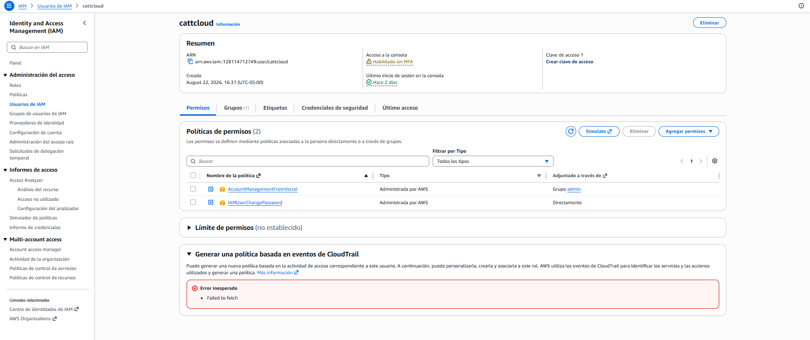
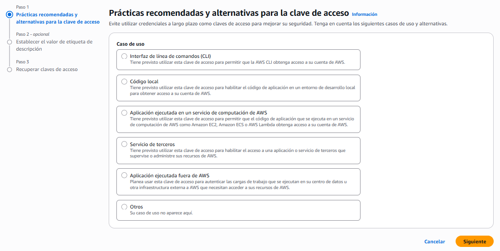
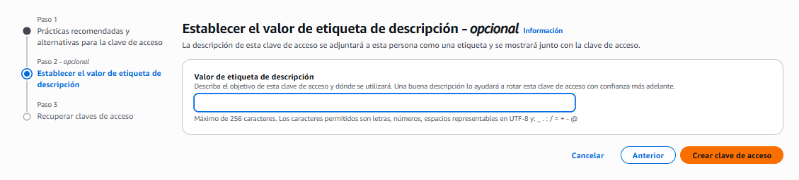

# ☁️ Las tres formas de entrar a tu cuenta

> **A una cuenta de AWS se entra por tres caminos distintos, y no todos usan la misma credencial.**
>
> Dos de ellos se autentican con algo que acaba siendo **un archivo de texto en un disco**. Ahí es donde una credencial deja de ser una idea y empieza a tener consecuencias físicas.

## Las tres puertas de entrada

Los tres caminos hacen exactamente lo mismo por debajo: **llaman a las APIs de AWS**. Ninguno tiene un poder especial sobre los otros; cambian la forma de dar las órdenes y la credencial que las acompaña.

| Puerta | Qué es | Con qué se autentica | Quién la usa |
|--------|--------|----------------------|--------------|
| **Consola** | La interfaz web de AWS, la que se abre en el navegador | Usuario y contraseña, más MFA si está activo | Una persona |
| **CLI** | Un programa que se instala en el equipo y traduce comandos de terminal en llamadas a AWS | **Clave de acceso** | Una persona, o un script |
| **SDK** | Librerías que se importan dentro del código de una aplicación | **Clave de acceso** | Una aplicación |

> 📝 **CLI** *(Command Line Interface)* es la herramienta oficial de AWS para la terminal. Se escribe `aws` seguido del servicio y la operación — `aws s3 ls`, `aws iam list-users` — y hace exactamente lo mismo que harías pulsando en la consola web, pero escribiéndolo.
>
> **SDK** *(Software Development Kit)* es la misma idea metida en el código: un conjunto de librerías por lenguaje —JavaScript, Python, Java, Go, .NET, Ruby, PHP y más— para que una aplicación hable con AWS sin pasar por ninguna interfaz.

> 🎯 **Y aquí está el detalle que decide el resto del módulo:** la consola se protege con **dos factores** —contraseña y MFA—, mientras que una clave de acceso es **un solo factor**. Quien la tiene, entra. No hay segundo paso, ni código en el móvil, ni nada más.

Como la CLI y el SDK usan la misma credencial, **todo lo que sigue aplica a los dos por igual**.

## Qué es una clave de acceso

> **Una clave de acceso son dos cadenas de texto que juntas equivalen a un usuario y una contraseña, pero para máquinas.**
>
> Es la credencial del **acceso programático** — el que no pasa por un navegador. La usan sus dos consumidores por igual: la CLI cuando la maneja una persona, y el SDK cuando la maneja código.

```text
Access Key ID       AKIA................     ← el "usuario"    · se puede ver
Secret Access Key   wJalrXUt................ ← la "contraseña" · se ve UNA vez
```

Tres cosas que la hacen peligrosa y que conviene interiorizar antes de crear una:

- **El secreto se muestra una sola vez.** En el momento de crearla. Si no la copias entonces, no hay forma de recuperarla: se genera otra y se borra la anterior.
- **No caduca sola.** Una clave creada hoy sigue funcionando dentro de tres años si nadie la desactiva.
- **No lleva MFA.** Es un factor único. La protección que la contraseña y el segundo factor le dan a la consola **no existe aquí**.

Dónde se crean: en el usuario, pestaña **Credenciales de seguridad**. El resumen del usuario ya te dice si tiene alguna:



*El resumen del usuario responde de un vistazo las tres preguntas de seguridad: si tiene MFA, si tiene claves de acceso, y de dónde le vienen sus permisos — la columna **Adjuntado a través de** distingue lo que llega por grupo de lo que está puesto directamente.*

> 🔑 **Un usuario admite un máximo de dos claves de acceso a la vez.** No es un capricho: es lo que permite **rotarlas sin cortar el servicio** — creas la segunda, actualizas donde se use, y desactivas la primera. ⚠️ *verificar el número exacto en la documentación.*

## Crear una clave de acceso

Lo primero que llama la atención del asistente es que **empieza intentando disuadirte**. El paso uno no se llama "elige un nombre": se llama *Prácticas recomendadas y **alternativas** para la clave de acceso*, y arranca con una advertencia:

> *"Evite utilizar credenciales a largo plazo como claves de acceso para mejorar su seguridad."*



*El asistente no te pide un nombre: te pide que declares **para qué** la vas a usar. Y en varios de esos casos, la respuesta correcta no es una clave.*

Ahí aparece un término que conviene fijar, porque es la bisagra de todo lo que viene después:

> **Una credencial a largo plazo es la que no caduca sola.** Una clave de acceso creada hoy sigue siendo válida indefinidamente, hasta que alguien la desactive a mano. Su opuesto son las **credenciales temporales**, que expiran por sí solas en cuestión de horas — y de dónde salen es el tema de la Sección 5.

**Los seis casos de uso, y qué hacer con cada uno:**

| Caso de uso | ¿Necesitas una clave? |
|-------------|----------------------|
| **Interfaz de línea de comandos (CLI)** | Sí. Es el caso de esta sección |
| **Código local** | Sí, mientras el código corra en tu equipo |
| **Aplicación en un servicio de computación de AWS** *(EC2, ECS, Lambda)* | **No.** Aquí va un rol → Sección 5 |
| **Servicio de terceros** | Casi nunca. Hay formas mejores de dar acceso a un tercero |
| **Aplicación fuera de AWS** | Depende. Existe una alternativa con credenciales temporales |
| **Otros** | Si no encaja en ninguno, merece una segunda pensada |

> 🎯 **Esa tabla es el resumen de todo el módulo, escrito por AWS.** Las claves de acceso son para **una persona trabajando desde su propio equipo**. En cuanto la credencial tiene que vivir en un servidor, en una función o en manos de otro, la respuesta deja de ser una clave.

**El segundo paso pide una descripción**, y es opcional solo en apariencia:



*La pista está en el propio texto: "una buena descripción lo ayudará a rotar esta clave de acceso con confianza más adelante".*

Ese "más adelante" es el momento real: dentro de seis meses, viendo dos claves activas y sin saber cuál usa qué. **Sin descripción, la pregunta "¿puedo desactivar esta?" no tiene respuesta** y la clave se queda ahí para siempre por si acaso. Una frase basta: *"CLI de mi portátil de trabajo"*.

## Dónde acaba viviendo la credencial

Configurar la CLI es un comando —`aws configure`— que hace cuatro preguntas: el ID de la clave, el secreto, la región por defecto y el formato de salida. El procedimiento completo, para los tres sistemas operativos, está en la guía de referencia: [[guia_cli-instalacion-configuracion|Instalación y configuración de la AWS CLI]].

Lo que importa aquí es **qué pasa cuando ese comando termina**:

> ⚠️ **`aws configure` no guarda nada en AWS.** Escribe dos archivos de **texto plano** en el equipo:

```text
Windows       C:\Users\<usuario>\.aws\credentials   ← el ID y el secreto, en claro
              C:\Users\<usuario>\.aws\config        ← la región y el formato

macOS/Linux   ~/.aws/credentials
              ~/.aws/config
```

Sin cifrar. Sin contraseña que los proteja. **Cualquiera con acceso a ese equipo tiene acceso a esa cuenta de AWS**, con todos los permisos que tenga el usuario dueño de la clave.

Ahí termina el recorrido de la credencial: empezó siendo un concepto en la Sección 1, se convirtió en dos cadenas de texto al crearla, y acaba como un archivo en un disco que alguien puede copiar.

**Y un comando que conviene conocer desde el principio:**

```bash
aws sts get-caller-identity
```

Devuelve el ARN de la identidad con la que la CLI está actuando. Es el comando de *"¿quién soy?"*, funciona prácticamente sin permisos, y es lo primero que hay que ejecutar cuando algo se comporta de forma extraña — porque buena parte de esos casos son estar actuando con otra identidad de la que se cree.

## El experimento: quitar el permiso y ver el comando fallar

Este es el mismo experimento de la Sección 2, pero desde la terminal. Vale la pena repetirlo aquí porque demuestra algo que la consola no deja ver tan claro:

1. Con la CLI configurada, ejecuta algo que tu usuario pueda hacer. Funciona.
2. **Desde la consola**, saca a ese usuario del grupo que le da el permiso.
3. Repite **exactamente el mismo comando**. Ahora falla con un error de acceso denegado.
4. Devuelve el usuario a su grupo. El comando vuelve a funcionar.

**Qué demuestra, que es más de lo que parece:**

- **La clave de acceso no cambió.** Sigue siendo la misma, en el mismo archivo. Lo que cambió fueron los permisos de la identidad detrás de ella.
- **Autenticación y autorización son cosas distintas**, otra vez. La clave te identifica correctamente; simplemente esa identidad ya no puede hacer eso.
- **El error nombra la acción que faltó**, igual que en la consola. Es la herramienta de descubrimiento de la Sección 3, en su formato más cómodo: en la terminal lo lees entero, sin buscarlo en una pantalla.

## Por qué esta es la credencial que más se filtra

Ninguna otra credencial de AWS se filtra tanto, y las razones son mecánicas:

- **Es texto plano.** Se copia, se pega, viaja por chat, aparece en una captura de pantalla.
- **Vive donde vive el código.** En un `.env`, en un archivo de configuración, o directamente escrita en el código "solo para probar".
- **Sobrevive en el historial de Git.** Borrarla de un archivo y hacer commit **no la borra**: sigue en el historial, y quien clone el repositorio la tiene.
- **Hay bots buscándola.** Los repositorios públicos se escanean constantemente. Una clave subida por error se usa en minutos, no en días.

❌ **Mito:** "La borré del archivo y subí el arreglo, ya está."
✅ **Realidad:** Sigue en el historial del repositorio. La única reacción válida es **desactivar la clave en AWS**. Mientras esté activa, sigue abriendo la puerta.

❌ **Mito:** "Mi repositorio es privado, no pasa nada."
✅ **Realidad:** Los repositorios cambian de visibilidad, se forkean y se clonan en portátiles ajenos. Y el riesgo de tu propio equipo perdido o comprometido no depende de GitHub.

❌ **Mito:** "Es una clave de pruebas, no tiene nada importante."
✅ **Realidad:** Tiene los permisos que le diste. Si le diste acceso completo "porque era una prueba", esa clave puede levantar recursos caros — el escenario de la factura sorpresa de **B2**, con alguien más al mando.

> 🎯 **La regla operativa, que es corta:** una clave de acceso vive en tu máquina y en ningún otro sitio. Si la necesitas en un servidor, en una función o en un contenedor, **no es una clave lo que necesitas** — es lo que viene en la Sección 5.

> 💡 **Y si una se filtra, el orden importa:** primero **desactivarla** (deja de funcionar al instante, y se puede reactivar si te equivocaste), después investigar qué se hizo con ella, y solo al final borrarla. Desactivar es reversible; borrar no.

## 🎯 Lo que debiste llevarte

> **Si de esta sección solo retienes estas líneas, cumplió su función.**

- Consola, CLI y SDK llaman a las mismas APIs: la consola no tiene ningún poder especial, solo una interfaz distinta.
- La consola se protege con dos factores; una clave de acceso es **un solo factor** y no lleva MFA — quien la tiene, entra.
- El secreto de una clave se muestra **una sola vez** y la clave no caduca sola: sigue viva hasta que alguien la desactive.
- `aws configure` no guarda nada en AWS: escribe tu clave **en texto plano** en un archivo de tu disco.
- `aws sts get-caller-identity` responde "¿quién soy?" y es lo primero que hay que ejecutar cuando algo se comporta raro.
- Quitar un permiso rompe el comando al instante sin tocar la clave: la credencial identifica, la política autoriza.
- Borrar una clave filtrada de un archivo no la desactiva — sigue en el historial de Git y sigue funcionando hasta que la desactives en AWS.

---
[[03_menor-privilegio|← anterior]] · [[00_indice|índice]] · [[05_roles|siguiente →]]
