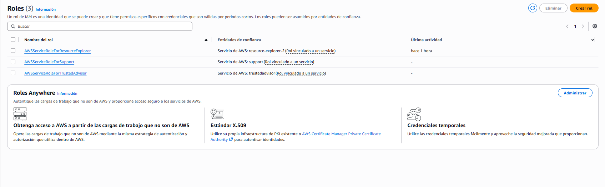
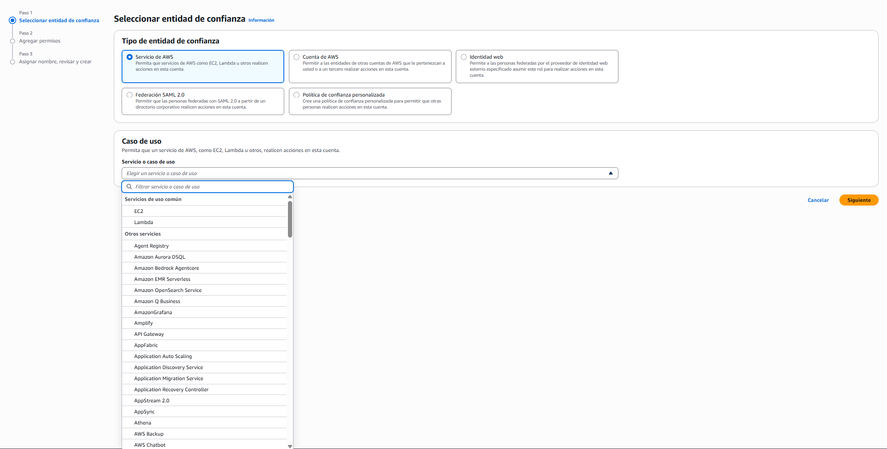

# ☁️ Rol vs usuario — la identidad sin contraseña

> **Un rol es una identidad que nadie posee: se asume temporalmente, y quien la asume recibe credenciales que caducan solas.**
>
> No tiene contraseña, no tiene clave de acceso y no hay nada que guardar en ningún sitio. Esa ausencia es todo el punto.

## El dolor: una clave de acceso guardada en un servidor

Una aplicación desplegada necesita permisos: leer un archivo, escribir en una base de datos, mandar un correo. La solución que se le ocurre a todo el mundo es la que ya se sabe hacer — crear un usuario, generarle una clave de acceso, y ponerla en el servidor donde corre la aplicación.

Conviene detenerse en **cómo usa esa clave una aplicación**, porque no hay ninguna terminal de por medio. Una clave de acceso no es "la credencial de la CLI": es la credencial del **acceso programático**, y su otro consumidor es el **SDK**, es decir, tu propio código.

```text
La clave se pone en una variable de entorno o un archivo de configuración
        ↓
El SDK la lee cuando la aplicación arranca
        ↓
Cada llamada que el código hace a AWS va firmada con ella
```

Nadie escribe comandos. La aplicación hace por su cuenta lo que una persona haría a mano con la CLI, y para eso necesita la misma credencial. Por eso acaba en el servidor.

Funciona. Y crea cuatro problemas que no se ven el primer día:

| Problema | Por qué |
|----------|---------|
| **La credencial es permanente** | No caduca. Sigue siendo válida dentro de dos años, cuando ya nadie recuerde que existe |
| **Está en texto plano** | En un archivo de configuración, en una variable de entorno, en la imagen de un contenedor |
| **Se multiplica sola** | Copias del servidor, backups, la máquina de un compañero, el historial de un repositorio |
| **Rotarla es un evento** | Cambiarla obliga a tocar todos los sitios donde se copió — y hay que saber cuáles son |

Y el problema de fondo, del que salen los otros cuatro:

> 🎯 **Le has dado a una máquina una identidad diseñada para una persona.** Un usuario IAM existe para que alguien inicie sesión, escriba una contraseña y responda a un segundo factor. Nada de eso tiene sentido para un servidor — y sin embargo hereda la parte peor: una credencial permanente que hay que custodiar.

## Qué es un rol y qué es una entidad de confianza

La definición está en la propia consola, y es sorprendentemente completa:

> *"Un rol de IAM es una identidad que se puede crear y que tiene permisos específicos con credenciales que son válidas por **periodos cortos**. Los roles pueden ser **asumidos** por entidades de confianza."*

Tres palabras hacen todo el trabajo:

- **Identidad** — igual que un usuario, tiene permisos y aparece en los registros.
- **Periodos cortos** — las credenciales que entrega caducan solas, en cuestión de horas.
- **Asumidos** — nadie *tiene* un rol. Se toma prestado, se usa, y se suelta.

Ese verbo es la clave: **un rol no se posee, se asume**. Y cuando alguien lo asume, AWS le entrega credenciales temporales generadas en ese momento, distintas de las de la vez anterior.

> 💡 **La forma más útil de pensarlo: un rol es un puesto, no una persona.** *"El de guardia esta noche"* tiene permisos que no dependen de quién sea; quien entra al turno los recibe mientras dura, y al salir los pierde. El puesto sigue existiendo, vacío, hasta el siguiente turno.
>
> **Dónde deja de funcionar la analogía:** un turno lo ocupa una persona a la vez. Un rol pueden asumirlo muchas entidades simultáneamente, cada una con sus propias credenciales temporales.

### Un rol lleva dos políticas, no una

Esta es la diferencia estructural con un usuario, y explica por qué existe el campo `Principal` que quedó pendiente en la Sección 2:

| Política | Responde a | Dónde vive |
|----------|-----------|------------|
| **De confianza** *(trust policy)* | **¿Quién puede asumir este rol?** | Pegada al rol. Aquí sí aparece `Principal` |
| **De permisos** | **¿Qué puede hacer quien lo asuma?** | Pegada al rol, como en un usuario |

Un usuario solo tiene la segunda: el "quién" ya es él. Un rol necesita las dos porque **el quién está vacío hasta que alguien lo asuma** — y hay que declarar de antemano quién tiene derecho a hacerlo.

Antes de seguir, conviene fijar una palabra que aparece por todas partes:

> **Una entidad es cualquier cosa capaz de hacer una llamada a AWS y de tener permisos.** No es sinónimo de usuario.
>
> Puede ser una persona (un usuario IAM), **un servicio ejecutándose** (una función, una máquina virtual), una cuenta de AWS entera, o un sistema externo autenticado por un proveedor de identidad. Lo que las une no es ser personas: es que **AWS puede comprobar sus permisos cuando piden algo**.

La **entidad de confianza** de un rol es, entonces, quién está autorizado a ponerse ese rol. Al crearlo, AWS ofrece cinco tipos:

| Entidad de confianza | Quién asume el rol |
|----------------------|--------------------|
| **Servicio de AWS** | Un servicio como EC2 o Lambda, actuando en tu nombre |
| **Cuenta de AWS** | Entidades de otra cuenta — tuya o de un tercero |
| **Identidad web** | Personas autenticadas por un proveedor externo |
| **Federación SAML 2.0** | Personas de un directorio corporativo |
| **Política de confianza personalizada** | Cualquier otro caso, escrito a mano |

En este módulo solo importa la primera. Las demás aparecen cuando hay varias cuentas o una organización detrás.

## Roles para servicios: cuando un servicio actúa en tu nombre

El caso más común y el único que necesitas ahora: **un servicio de AWS necesita hacer algo por ti**. Una máquina virtual que lee archivos de un bucket, una función que escribe en una base de datos, un servicio de despliegue que crea recursos.

Y aquí hay un obstáculo conceptual que conviene desmontar, porque frena a mucha gente: *¿cómo le doy permisos a un servicio, si un servicio no es nadie?*

La respuesta es que **detrás de una acción no siempre hay una persona**. Llega un correo a las tres de la madrugada, eso dispara una función, la función lee el adjunto y lo guarda. No hay ninguna sesión abierta y nadie ha iniciado sesión — y aun así AWS tiene que responder la pregunta que hace en cada llamada: *¿quién pide esto y puede hacerlo?* La respuesta, en ese momento, es **la función**.

> 💡 **Y esto ya se hace en cualquier proyecto, con otro nombre.** Cuando una aplicación se conecta a Postgres no usa el usuario personal del desarrollador: usa el suyo —algo como `app_user`— con su propia contraseña y permisos sobre unas tablas concretas. A nadie le resulta extraño decir *"la app tiene permiso de escritura en esa tabla"*, aunque la app no sea nadie.
>
> Un rol es esa misma idea aplicada a AWS. La diferencia está en la credencial: a `app_user` se le da una contraseña permanente; un rol entrega credenciales frescas cada vez y no hay nada que guardar.

Cómo se lee correctamente, entonces:

```text
❌  "Le doy permisos al servicio EC2"
✅  "Esta máquina, mientras esté encendida, actúa como esta identidad —
     y esta identidad puede leer ese bucket"
```

El servicio no *posee* el rol: mientras se ejecuta, **es** esa identidad. La pregunta que responde un rol de servicio es **¿como quién se ejecuta esto?**

En la práctica, en lugar de darle una clave, se le **adjunta un rol**. A partir de ahí el servicio obtiene credenciales temporales por su cuenta, sin que nadie las escriba en ninguna parte.

Y probablemente ya tengas roles sin haberlos creado:



*Una cuenta nueva ya trae roles. Los que empiezan por `AWSServiceRoleFor` son **roles vinculados a un servicio**: los crea AWS para que un servicio suyo funcione, y su entidad de confianza es ese servicio concreto.*

> 📝 **Rol vinculado a un servicio** *(service-linked role)* es un rol que crea y administra AWS, atado a un único servicio. No se editan como los demás y en general no se borran a mano. Son la prueba visible de que **hay identidades en tu cuenta que no son personas** — y de que llevan trabajando desde antes de que supieras que existían: fíjate en la columna de última actividad.

## Por qué el rol gana: nada que rotar, nada que filtrar

Comparados de frente, contra los cuatro problemas del principio:

| | Clave de acceso en un servidor | Rol |
|---|---|---|
| **Duración** | Permanente | Caduca sola en horas |
| **Dónde se guarda** | Un archivo, en texto plano | **En ningún sitio.** Se entrega en el momento |
| **Si se filtra** | Sirve hasta que alguien la desactive | Sirve hasta que caduque, y ya caducó |
| **Rotación** | Manual, tocando cada copia | Automática. No hay nada que rotar |
| **Quién puede usarla** | Quien tenga el archivo | Solo lo que declare la política de confianza |

> 🎯 **La frase que resume la sección:** una credencial que no existe no se puede filtrar. El rol no es "una clave más segura" — es **la ausencia de clave**, sustituida por un permiso para pedir credenciales temporales cuando hagan falta.

Y hay un beneficio operativo que no es de seguridad y se agradece igual: **el código no cambia**. Las librerías de AWS buscan credenciales en varios sitios por orden, y las temporales de un rol están entre ellos. La misma aplicación que en tu equipo usa el archivo `.aws` funciona en un servidor con rol **sin tocar una línea**. Cómo encuentra esas credenciales exactamente es tema de **B3b**.

> ⚠️ **Cuándo un rol no te sirve:** cuando el que necesita acceso **no está en AWS ni puede asumir nada** — tu portátil, por ejemplo. Ahí sigue haciendo falta una clave de acceso, y por eso la Sección 4 no sobra. La regla práctica: **dentro de AWS, rol; fuera de AWS y en tu propia máquina, clave.**

## Crear un rol para un servicio

> ⚠️ **Cómo leer esto:** intención, no clics.

**Antes de empezar:** saber dos cosas — **qué servicio** va a asumir el rol, y **qué tiene que poder hacer**. Son exactamente las dos políticas.

**El asistente son tres pasos**, y cada uno responde una de las preguntas del rol:



*El primer paso decide **quién puede asumirlo**. Al elegir "Servicio de AWS" aparece la lista de servicios, con EC2 y Lambda destacados como los más habituales.*

| Paso | Qué decides | Qué política estás escribiendo |
|------|-------------|--------------------------------|
| **1. Entidad de confianza** | Qué servicio va a asumir el rol | La **de confianza** |
| **2. Permisos** | Qué podrá hacer mientras lo tenga | La **de permisos** |
| **3. Nombre y revisión** | Cómo se llama | — |

**⚠️ Trampas:**

- **Crear el rol no lo pone en funcionamiento.** Queda creado y sin usar hasta que se lo asignas al recurso concreto — la máquina virtual, la función. Son dos actos, igual que crear un usuario y darle permisos.
- **El rol no lleva credenciales que puedas ver.** No hay nada que copiar ni que guardar. Si buscas "la clave del rol", no existe: ese es el punto.
- **El menor privilegio aplica igual.** Un rol con acceso completo tiene el mismo problema que una clave con acceso completo, solo que caduca. Lo temporal reduce la ventana, no el alcance.

**✅ Sabes que salió bien si:** el rol aparece en la lista con la entidad de confianza correcta, y el servicio al que se lo asignaste puede hacer algo que antes le fallaba — **sin que hayas escrito ninguna credencial en ninguna parte**.

## 🎯 Lo que debiste llevarte

> **Si de esta sección solo retienes estas líneas, cumplió su función.**

- Un rol es una identidad que nadie posee: se **asume** temporalmente y entrega credenciales que caducan solas en horas.
- Poner una clave de acceso en un servidor es darle a una máquina una identidad diseñada para una persona, con lo peor de ella: una credencial permanente que hay que custodiar.
- Un rol lleva **dos políticas**: la de confianza dice **quién puede asumirlo**, la de permisos dice **qué podrá hacer**. Un usuario solo necesita la segunda porque el "quién" ya es él.
- Una credencial que no existe no se puede filtrar: el rol no es una clave más segura, es la ausencia de clave.
- Dentro de AWS se usa un rol; fuera de AWS o en tu propia máquina, sigue haciendo falta una clave de acceso.
- Los roles que empiezan por `AWSServiceRoleFor` los crea AWS solo, y son la prueba de que hay identidades en tu cuenta que no son personas.
- El menor privilegio aplica también a los roles: ser temporal reduce la ventana de exposición, no el alcance del daño.

---
[[04_formas-de-entrar|← anterior]] · [[00_indice|índice]] · [[06_proteger-la-cuenta|siguiente →]]
