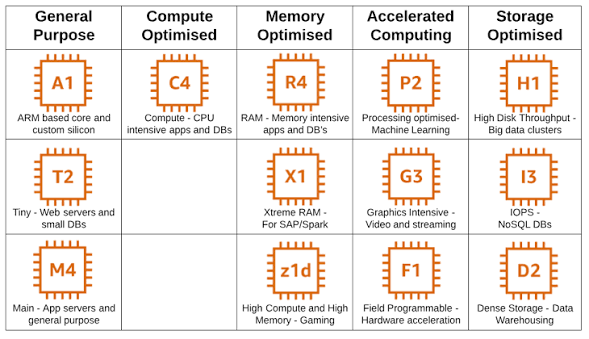

# ☁️ Elegir el tamaño: tipos de instancia

> **Un tipo de instancia es una combinación fija de procesador, memoria, disco y red con un nombre y un precio por hora. No configuras la máquina pieza a pieza: eliges una de la lista.**
>
> El nombre parece un código de producto, pero se lee. Y una vez que lo lees, sabes en dos segundos si estás mirando algo pequeño y barato o algo que vacía la cuenta en una semana.

Cuando alquilas una máquina virtual no eliges "3 núcleos y 5 GB de memoria". AWS empaqueta el hardware en **combinaciones cerradas**, cada una con su nombre, y tú eliges una. Hay cientos. La buena noticia es que **no hace falta conocerlas**: basta con saber leer el nombre y saber que existen familias con propósitos distintos.

## Cómo se lee un nombre: clase, generación, tamaño

> **El nombre de un tipo de instancia tiene tres partes: una letra que dice la familia, un número que dice la generación, y una talla después del punto.**

Tomemos el ejemplo que aparece en todas partes:

**Sintaxis:**

```text
[familia][generación][atributos opcionales].[tamaño]
```

**Ejemplo:**

```text
m5.2xlarge
│││ └────── tamaño:      2xlarge  → 8 vCPU, 32 GiB de RAM
││└──────── (sin atributos extra)
│└───────── generación:  5        → quinta versión del hardware de esta familia
└────────── familia:     m        → propósito general, equilibrio entre CPU y memoria
```

Las tres partes, una por una:

| Parte | Qué indica | Cómo se lee |
|-------|------------|-------------|
| **Familia** *(la letra)* | Para qué está pensada la máquina: la proporción entre procesador, memoria y disco | `t` y `m` equilibradas · `c` más procesador · `r` más memoria · `i` y `d` más disco |
| **Generación** *(el número)* | Qué versión del hardware es. Cada generación nueva suele ser **más rápida y más barata** que la anterior, así que el número alto es el bueno | `m5` es anterior a `m7`. Ante dos opciones iguales, la de número mayor |
| **Tamaño** *(tras el punto)* | Cuánto hardware dentro de esa familia. Son **tallas**, como la ropa, y cada talla **duplica** a la anterior en procesador y memoria | `nano` · `micro` · `small` · `medium` · `large` · `xlarge` · `2xlarge` · `4xlarge` … |

> 🔑 **Matiz sobre las unidades:** la consola mide la memoria en **GiB** *(gibibyte)*, no en GB. La diferencia es de un 7 % y a este nivel no cambia ninguna decisión: léelo como "gigas".

Entre la generación y el punto pueden aparecer **letras extra** que describen el hardware. Las que vas a ver de verdad son pocas:

| Letra | Qué significa | Cuándo importa |
|-------|---------------|----------------|
| `g` | Procesador **Graviton**, diseñado por AWS con arquitectura **ARM** en vez de la x86 tradicional | Más barato por el mismo rendimiento, pero tu software tiene que estar compilado para ARM. Node y casi todo lo moderno sí lo está |
| `a` | Procesador **AMD** | Algo más barato que Intel, sin cambio de arquitectura |
| `d` | Trae un **disco local** físico en el mismo servidor, además del disco normal | Solo para cargas que leen y escriben mucho. No es tu caso |
| `n` | **Red** de mayor velocidad | Solo para cargas que mueven muchos datos entre máquinas |

Es decir, `c7g.large` se lee así: familia `c` (más procesador), séptima generación, procesador Graviton, talla `large`. Sin buscarlo en ningún sitio ya sabes que es una máquina orientada a cálculo, moderna, de arquitectura ARM y pequeña.

### Las tallas se duplican, y son relativas a la familia

> **Cada talla dobla a la anterior en hardware y en precio. Pero cuánto procesador y cuánta memoria hay dentro de una talla lo fija la familia.**

Debes recordar las dos cosas a la vez. La primera: subir un escalón (`large` → `xlarge` → `2xlarge`) **duplica** vCPU, memoria y precio por hora, así que dos escalones son cuatro veces, y tres escalones ocho. La segunda: la talla es **relativa a la familia**: un `large` de la familia `m` y un `large` de la familia `r` tienen el mismo procesador pero **no la misma memoria**, porque la familia fija la proporción.

La tabla muestra solo las cuatro familias que puedes llegar a ver y las tallas hasta `2xlarge`; por encima siguen doblando (`4xlarge`, `8xlarge`…) y no cambian nada de lo que decides aquí.

| Talla | `t3` · equilibrada, ampliable | `m5` · equilibrada | `c5` · procesador | `r5` · memoria |
|-------|:-----------------------------:|:------------------:|:-----------------:|:--------------:|
| `nano` | 2 vCPU · 0.5 GiB | — | — | — |
| `micro` | **2 vCPU · 1 GiB** | — | — | — |
| `small` | 2 vCPU · 2 GiB | — | — | — |
| `medium` | 2 vCPU · 4 GiB | — | — | — |
| `large` | 2 vCPU · 8 GiB | 2 vCPU · 8 GiB | 2 vCPU · 4 GiB | 2 vCPU · 16 GiB |
| `xlarge` | 4 vCPU · 16 GiB | 4 vCPU · 16 GiB | 4 vCPU · 8 GiB | 4 vCPU · 32 GiB |
| `2xlarge` | 8 vCPU · 32 GiB | 8 vCPU · 32 GiB | 8 vCPU · 16 GiB | 8 vCPU · 64 GiB |

Cuatro cosas se leen de la tabla sin memorizarla:

- **Cada fila dobla a la de arriba.** Baja una fila en cualquier columna y verás el doble de vCPU y el doble de memoria: `m5.large` 2 y 8, `m5.xlarge` 4 y 16, `m5.2xlarge` 8 y 32. Al final de la sección verás que el precio sigue la misma escalera.
- **La proporción es la firma de la familia.** En la misma fila, `c5` tiene la mitad de memoria que `m5` y `r5` el doble. Esa proporción se mantiene en todas las tallas: `m` da 4 GiB por vCPU, `c` da 2, `r` da 8.
- **Solo la familia `t` baja de `large`.** Las tallas `nano` a `medium` existen porque `t` está pensada para máquinas pequeñas; `m`, `c` y `r` empiezan directamente en `large`.
- **En `t3`, de `nano` a `large` lo que dobla es la memoria, no el procesador.** Las cinco tallas pequeñas tienen los mismos 2 vCPU ampliables. Por eso, si una `t3.micro` se queda corta de memoria, subir a `small` o `medium` resuelve el problema sin pagar por procesador que no usas.

## Las cuatro familias y para qué sirve cada una

> **Las familias existen porque no todas las cargas de trabajo aprietan por el mismo lado: unas necesitan procesador, otras memoria, otras disco. Pagar por lo que no aprieta es tirar dinero.**

Un servidor web sirve páginas y espera: apenas usa nada. Una base de datos quiere tener todo en memoria. Un programa que convierte video quiere procesador y nada más. Si solo existiera una proporción de hardware, todos pagarían por el componente que no usan. Por eso hay familias.

| Familia | Letras | Para qué está pensada | Casos típicos | ¿La necesitas? |
|---------|--------|-----------------------|---------------|:--------------:|
| 🔵 **Propósito general** | `t`, `m` | Equilibrio entre procesador, memoria y red. Sirve para casi todo lo que no tiene un cuello de botella claro | Servidores web y de API, entornos de desarrollo, aplicaciones pequeñas y medianas | ✅ **Sí. Es la tuya** |
| 🔴 **Optimizadas para cómputo** | `c` | Mucho procesador por cada GiB de memoria | Procesamiento por lotes, conversión de video, servidores de juegos, cálculo científico | No |
| 🟡 **Optimizadas para memoria** | `r`, `x` | Mucha memoria por cada vCPU | Bases de datos grandes, cachés en memoria, análisis de datos que no caben en disco a tiempo | No |
| 🟢 **Optimizadas para almacenamiento** | `i`, `d` | Disco local muy rápido y acceso masivo de lectura y escritura | Bases de datos de alta frecuencia, sistemas de archivos distribuidos, almacenes de datos | No |

🔵 = equilibrio · 🔴 = procesador · 🟡 = memoria · 🟢 = disco

> 📝 **Nota, solo como información:** existe una quinta familia, la de **cómputo acelerado** (`p`, `g`), que lleva tarjetas gráficas (**GPU**) físicas dentro de la máquina virtual. Es donde se corre un **modelo de IA propio**: instalas un servidor de modelos como Ollama o vLLM y sirves un modelo abierto igual que en un PC con tarjeta gráfica, pero alquilado por hora.
>
> - **`g`** lleva GPUs de gráficos e inferencia: sirve para **ejecutar** un modelo ya entrenado. Una `g5.xlarge` (1 GPU con 24 GB de memoria de video) corre bien un modelo de 7 a 13 mil millones de parámetros a **~1 USD por hora**: con 100 USD de crédito, unos cuatro días encendida *(⚠️ verificar precio)*.
> - **`p`** lleva GPUs de cálculo puro, las más potentes: sirve para **entrenar**. Una `p4d.24xlarge` (8 GPUs A100) cuesta **~32 USD por hora**, unas tres horas de crédito *(⚠️ verificar precio)*.
>
> Conviene saber que existe y descartarla a conciencia: una aplicación que **llama a la API de un modelo** no necesita GPU, porque la GPU la paga quien **ejecuta el modelo**, y ese es el proveedor. Servir uno propio compensa solo con volumen enorme, con datos que no pueden salir, o con un modelo que nadie ofrece por API. Además, las cuentas en plan gratuito suelen no poder lanzar tipos con GPU *(⚠️ verificar)*.



*Las cinco familias con tipos de ejemplo. Lo que hay que llevarse de la imagen es la primera columna y la idea de que cada columna aprieta por un lado distinto. Las letras concretas de las otras cuatro no hace falta memorizarlas: se leen con la regla de la subsección anterior cuando aparezcan. Las generaciones que muestra (`T2`, `M4`, `C4`) son antiguas; la consola actual propone `t3`, `m7`, `c7`.*

### La familia `t` tiene una regla propia

La familia `t` es la que vas a usar, y es la única con un comportamiento que conviene entender antes de leer sus números.

> **Las instancias `t` son de rendimiento ampliable (*burstable*): no tienen el procesador completo garantizado todo el tiempo. Tienen un nivel base bajo, acumulan crédito mientras están ociosas y lo gastan cuando hay un pico.**

Es decir, cuando la consola dice que `t3.micro` tiene **2 vCPU**, lo que tienes son dos núcleos que puedes usar a fondo **durante un rato**, no de forma sostenida. Para un servidor que atiende peticiones y espera, eso es perfecto: está ocioso el 95 % del tiempo y acumula crédito para los picos. Para un proceso que mantenga el procesador al 100 % durante horas, la `t` se queda sin crédito y se frena.

Por eso la familia `t` es la más barata dentro de propósito general: **pagas por un promedio, no por un máximo**. Las `m` sí tienen el procesador completo siempre, y por eso cuestan más.

## Cuál eliges hoy, y por qué

> **Hoy eliges `t3.micro`: 2 vCPU, 1 GiB de memoria, la opción que la consola marca como apta para la capa gratuita. Y la eliges sin calcular nada.**

El asistente de lanzamiento de la consola muestra el selector de tipo de instancia con `t3.micro` propuesto por defecto, y a su lado las cifras que importan: familia, vCPU, memoria, y el precio por hora para cada sistema operativo. El curso trabaja con `t2.micro`, que es la generación anterior de la misma familia. **La consola actual propone `t3.micro`**, más nueva y más barata, y esa es la que se usa en este módulo.

> 💡 **Tip:** al lado del selector hay un conmutador llamado **Todas las generaciones**. Viene apagado, y por eso la lista solo muestra hardware actual. Déjalo así: la única razón para encenderlo sería reproducir algo antiguo, y no es el caso.

Elegirla sin calcular no es descuido, es el método. Hay tres razones:

- **Es suficiente para aprender y para una aplicación pequeña.** Un servidor de Node que atiende una API, un worker que llama a la API de un modelo y espera la respuesta, una página estática. Todo eso vive holgado en 1 GiB.
- **El tipo se cambia después, sin volver a crear nada.** Con la instancia detenida, la consola permite cambiar el tipo en *Acciones → Configuración de la instancia → Cambiar tipo de instancia*, y al arrancarla tiene el hardware nuevo con el mismo disco y el mismo contenido. Equivocarse hacia abajo cuesta un reinicio.
- **Equivocarse hacia arriba sí cuesta.** Una instancia el doble de grande "por si acaso" cuesta el doble cada hora, y nadie vuelve a bajarla después. El tamaño se decide **cuando la máquina te lo pide**, no antes.

### Las señales para subir de talla

La máquina te avisa cuando se queda corta, y cada componente avisa de forma distinta:

| Síntoma | Qué se quedó corto | Qué cambiar |
|---------|--------------------|-------------|
| El proceso de Node **muere solo** con un error de memoria, o el sistema lo mata sin mensaje | La **RAM** | Subir una talla dentro de `t3` (`small` tiene 2 GiB, `medium` 4 GiB) |
| La aplicación responde pero **cada vez más lento** bajo carga, y la gráfica de CPU está clavada arriba | El **procesador**, o la `t` gastó su crédito | Subir talla, o pasar a `m` si la carga es sostenida |
| Errores de *no space left on device* al instalar o escribir | El **disco** | No es el tipo de instancia: se agranda el volumen (→ **B6 · Datos**) |

> ⚠️ **Cuidado con la construcción de proyectos grandes.** Compilar un proyecto de Next.js con `npm run build` **dentro** de una `t3.micro` suele agotar el GiB de memoria y morir, aunque la aplicación ya construida corra bien en esa misma máquina. La salida no es una instancia más grande: es construir en tu portátil o en otro sitio y subir a la máquina solo el resultado. Ese problema es una de las razones por las que existen los contenedores (→ **B4b · Contenedores y Docker**).

## El precio como criterio de elección

> **El tipo de instancia es la decisión que más pesa en lo que paga EC2: fija el precio por hora, y ese precio se multiplica por cada hora que la máquina está en ejecución.**

**Qué se cobra.** EC2 bajo demanda cobra **por tiempo de ejecución**: el precio por hora del tipo de instancia, prorrateado por segundo con un mínimo de un minuto por arranque *(⚠️ verificar el detalle del mínimo)*. *Bajo demanda* significa exactamente eso: pagas lo que usas, cuando lo usas, sin compromiso previo. Hay otras formas de comprar cómputo con descuento, a cambio de comprometerte por años o de aceptar que te lo quiten; están fuera del temario porque a este nivel no cambian ninguna decisión.

El precio por hora depende de tres cosas, y solo una de ellas está en tu mano:

| Factor | Cómo influye | Ejemplo en la consola *(us-east-1, Linux)* |
|--------|--------------|--------------------------------------------|
| **El tipo de instancia** | Cada talla **dobla** el precio de la anterior dentro de la familia | `t3.micro` 0.0104 USD/h · `t3.small` 0.0208 · `m5.large` 0.096 · `m5.2xlarge` 0.384 *(⚠️ verificar las tres últimas)* |
| **El sistema operativo** | Linux gratuito es el precio base. Windows y Red Hat añaden el costo de su **licencia** a la misma máquina | Mismo `t3.micro`: Linux 0.0104 · Windows 0.0196 · Red Hat 0.0392 |
| **La región** | Cada región tiene su lista de precios. `us-east-1` está entre las más baratas | Fuera de tu control una vez elegida la región de trabajo |

> 📝 **Nota:** la consola muestra estos precios en la misma tarjeta donde eliges el tipo, junto al aviso *"Se aplican costos adicionales a las AMI con software preinstalado"*. Ese aviso es la fila del sistema operativo: una imagen de partida con Windows o con software comercial cuesta más por hora que la misma máquina con Linux.

**Free tier.** La consola marca `t3.micro` como *"Apto para la capa gratuita"*. Esa etiqueta viene del plan gratuito clásico, donde ese tipo tenía 750 horas al mes sin costo durante el primer año. **La cuenta de este módulo está en el plan gratuito nuevo, que funciona por crédito**: las horas de `t3.micro` se cobran al precio de la tabla y se descuentan del crédito de 100 USD *(⚠️ verificar si en el plan por crédito la etiqueta implica alguna hora sin costo)*.

**💸 El gatillo.** El precio por hora de una máquina pequeña es tan bajo que **no parece dinero**, y esa es la trampa. Lo que produce la factura no es el precio: es el precio multiplicado por las horas que olvidaste. Y una máquina grande "para probar una cosa" multiplica las dos.

**Estimación concreta.** Un mes tiene unas 730 horas. Con los precios de la consola:

```text
t3.micro encendida todo el mes       0.0104 USD/h × 730 h  ≈    7.6 USD
t3.micro encendida 2 h al día        0.0104 USD/h ×  60 h  ≈    0.6 USD
m5.2xlarge olvidada todo el mes      0.384  USD/h × 730 h  ≈  280   USD
```

Con 100 USD de crédito, una `t3.micro` encendida sin parar dura más de un año. Una `m5.2xlarge` olvidada lo consume en **once días**. La diferencia entre las dos no es el precio por hora, que en ambos casos cabe en un café: es que **una de las dos no la ibas a apagar**.

> 🎯 **Idea clave:** el precio como criterio de elección se reduce a una regla: **la talla más pequeña que funciona, y subir solo cuando la máquina lo pide**. Bajar de talla es un reinicio; subir "por si acaso" es pagar el doble cada hora hasta que alguien se acuerde.

## 🎯 Lo que debiste llevarte

> **Si de esta sección solo retienes estas líneas, cumplió su función.**

- Un nombre como `m5.2xlarge` se lee en tres partes: la letra dice la **familia** (para qué está pensada), el número la **generación** (más alto, más nuevo y más barato), y lo que sigue al punto la **talla**, que dobla hardware y precio en cada escalón.
- Las familias existen porque las cargas aprietan por lados distintos: `t` y `m` equilibradas, `c` procesador, `r` memoria, `i` disco. Para una aplicación web o un worker que llama a una API, la familia es siempre **propósito general**.
- La familia `t` no garantiza el procesador completo: acumula crédito en reposo y lo gasta en picos. Por eso es la más barata y por eso sirve para servidores que esperan, no para cálculo sostenido.
- Hoy se elige `t3.micro` sin calcular, porque **el tipo se cambia después con la instancia detenida** y equivocarse hacia abajo cuesta un reinicio, mientras que hacia arriba cuesta el doble cada hora.
- Lo que factura EC2 no es el precio por hora sino **precio × horas olvidadas**: una `t3.micro` todo el mes son unos 8 USD; una `m5.2xlarge` olvidada vacía 100 USD de crédito en once días.

---
[[01_que-es-una-instancia|← anterior]] · [[00_indice|índice]] · [[03_lanzar-una-instancia|siguiente →]]
