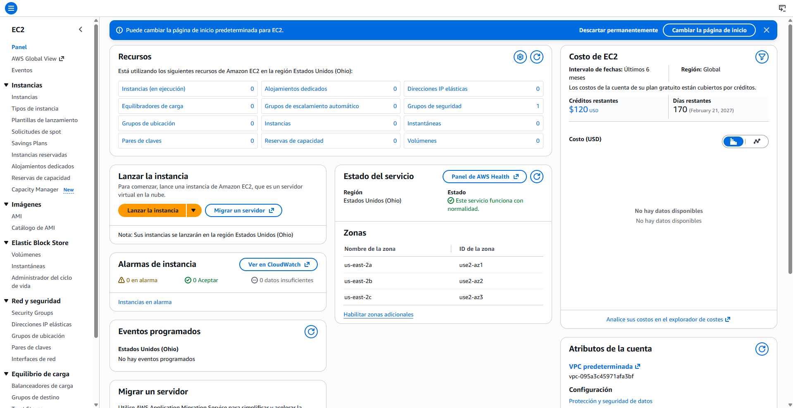
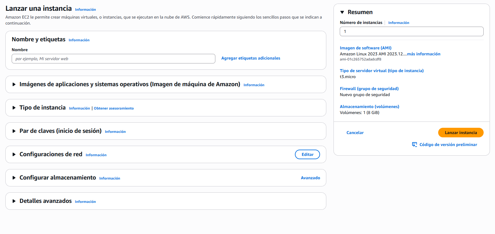
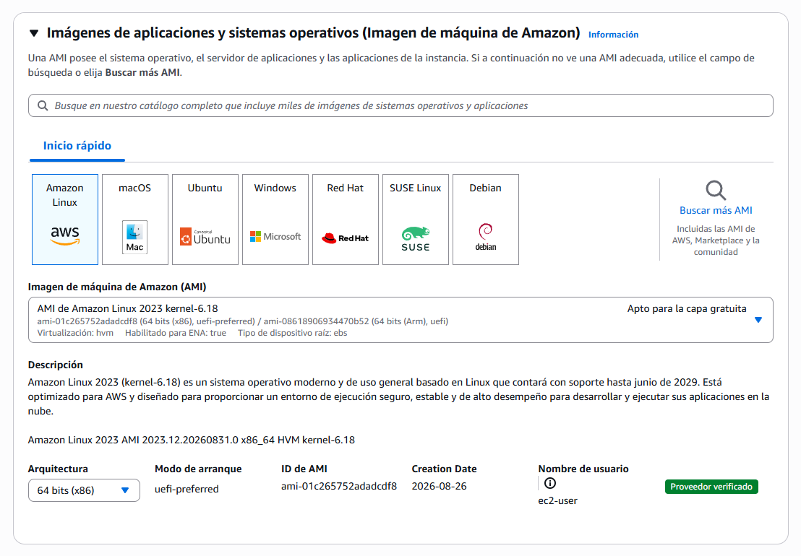
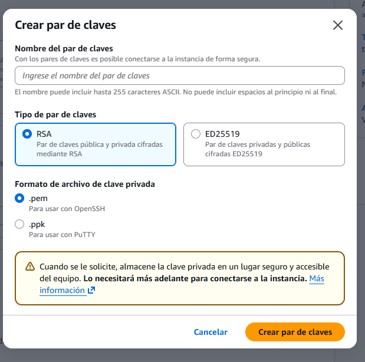

# ☁️ Lanzar una instancia

> **Lanzar una instancia es recorrer un formulario de una sola página donde respondes las cinco decisiones de toda máquina virtual: imagen de partida, tipo de instancia, par de claves, red y disco, y al final el script de arranque.**
>
> El objetivo de esta sección es levantar una máquina que sirva una página web **sin conectarte a ella nunca**: llega configurada porque el script de arranque hizo el trabajo.

**Antes de empezar**, tienen que existir tres cosas:

- **Permisos para crear recursos de EC2.** Un usuario que solo tiene permisos sobre identidad (crear usuarios, cambiar su contraseña) no puede lanzar una instancia: AWS deniega la acción y responde *"no está autorizado"*. Hace falta una política que permita EC2, y para aprender la más simple es `AdministratorAccess`.
- **La región correcta seleccionada.** Las instancias viven en una región concreta y la lista de instancias solo muestra las de la región activa. El panel de EC2 lo recuerda con la nota *"Sus instancias se lanzarán en la región …"*. Si la región no es la de trabajo, se cambia **antes** de lanzar, no después.
- **Un presupuesto con alerta**, para que la primera máquina olvidada avise antes de doler. *(Cómo se crea está en **B2 · Costos y facturación**.)*



*El panel de EC2 antes de crear nada. Dos cosas importan: la nota de región bajo el botón de lanzar, y la tarjeta de la derecha, que en el plan gratuito por crédito muestra cuánto crédito queda y cuándo vence. La cuadrícula de contadores es la misma que se usa al final para comprobar que no quedó nada vivo.*

## El formulario de lanzamiento: un mapa

> **El asistente de la consola es una única página con siete bloques plegables. Cada bloque es una de las cinco decisiones, y el panel Resumen de la derecha las muestra todas juntas antes de confirmar.**

Conviene tener el mapa antes de entrar en cada bloque, porque el orden del formulario no es el orden de importancia:


| Bloque del formulario                                     | Decisión que responde   | Qué se hace aquí                                                                                                          |
| --------------------------------------------------------- | ------------------------ | --------------------------------------------------------------------------------------------------------------------------- |
| **Nombre y etiquetas**                                    | ninguna: es una etiqueta | Ponerle un nombre reconocible. No cambia nada técnico, pero sin él la lista de instancias es una lista de identificadores |
| **Imágenes de aplicaciones y sistemas operativos (AMI)** | 1 · Sistema operativo   | Elegir de qué sistema arranca                                                                                              |
| **Tipo de instancia**                                     | 2 · Cómputo            | Elegir la talla. Se resolvió en la sección anterior:`t3.micro`                                                            |
| **Par de claves**                                         | acceso                   | Crear o elegir la credencial para entrar a la máquina                                                                      |
| **Configuraciones de red**                                | 4 · Red                 | IP pública y el grupo de seguridad                                                                                         |
| **Configurar almacenamiento**                             | 3 · Almacenamiento      | Tamaño y tipo del disco. Se deja el valor por defecto                                                                      |
| **Detalles avanzados**                                    | 5 · Arranque            | El script de arranque está**al final** de este bloque                                                                      |



*El formulario recién abierto. Todos los bloques están plegados y el Resumen de la derecha ya muestra valores por defecto: eso significa que se puede lanzar una máquina sin abrir nada, y que una máquina lanzada así tiene una imagen, una talla, un disco y un grupo de seguridad que alguien eligió por ti.*

> 📝 **Sobre el disco:** el bloque de almacenamiento propone un volumen raíz de **8 GiB de tipo `gp3`** (disco de estado sólido de propósito general). Para esta sección es más que suficiente y se deja tal cual. Ese volumen es el recurso que **sobrevive a la instancia si se le indica**, y su comportamiento se estudia en **B6 · Datos**.

## La imagen de partida (AMI): de qué sistema arrancas

> **Una AMI (Amazon Machine Image) es una plantilla de disco con el sistema operativo ya instalado, a veces con software encima. La instancia arranca como una copia de esa plantilla.**

Es la primera de las cinco decisiones, y responde a la pregunta *"¿sobre qué arranca?"*. La consola ofrece una pestaña de **Inicio rápido** con los sistemas más comunes: Amazon Linux, Ubuntu, Windows, Red Hat, SUSE, Debian, macOS. Debajo hay un buscador que abre un catálogo de miles de imágenes, incluidas las de terceros y las de pago. Para esta sección, el inicio rápido basta.



*La imagen elegida y su tarjeta de detalles. Tres datos de esa tarjeta se usan después: la etiqueta "Apto para la capa gratuita", la arquitectura, y el nombre de usuario con el que la máquina espera que entres.*


| Campo                 | Valor                 | Por qué                                                                                                                                                                                                                                                                                                                    |
| --------------------- | --------------------- | --------------------------------------------------------------------------------------------------------------------------------------------------------------------------------------------------------------------------------------------------------------------------------------------------------------------------- |
| **Sistema**           | **Amazon Linux 2023** | Es la distribución de Linux que mantiene AWS: viene con sus herramientas ya instaladas, recibe parches del propio proveedor y es la que la consola marca como apta para la capa gratuita. Ubuntu también serviría; lo que no sirve es elegir Windows o Red Hat sin motivo, porque su licencia se suma al precio por hora |
| **Arquitectura**      | **64 bits (x86)**     | La arquitectura de la imagen tiene que coincidir con la del procesador del tipo de instancia.`t3` es x86. Si más adelante eliges un tipo con `g` (Graviton, ARM), aquí habría que elegir **64 bits (Arm)**, y la consola avisa si no coinciden                                                                           |
| **Nombre de usuario** | `ec2-user`            | No se elige, se lee. Es el usuario con el que la imagen espera que alguien entre. Cada familia de imágenes tiene el suyo (`ubuntu` en Ubuntu, `admin` en Debian) y confundirlo es la causa más común de *"acceso denegado"* al intentar conectarse                                                                       |

> 🔑 **Matiz:** la versión de Amazon Linux importa para el script de arranque. **Amazon Linux 2023** usa `dnf` como gestor de paquetes; la versión anterior, **Amazon Linux 2**, usaba `yum`. Casi todos los tutoriales y cursos de antes de 2023 traen scripts con `yum`, que en la imagen actual fallan en silencio o instalan a medias. El script de esta sección está escrito para la imagen actual.

## El par de claves: qué es y por qué se descarga una sola vez

> **Un par de claves son dos archivos matemáticamente ligados: una clave pública, que AWS instala dentro de la máquina, y una clave privada, que solo tienes tú. La máquina deja entrar a quien demuestre tener la privada que corresponde a su pública.**

Es la credencial para entrar a la máquina por **SSH**. No hay contraseña de usuario: la clave privada **es** la contraseña, y AWS nunca la ve.

> 📝 **Qué es SSH y qué es OpenSSH.** **SSH** *(Secure Shell)* es el protocolo para abrir una **terminal remota**: escribes comandos en tu ordenador y se ejecutan en otro, con toda la conversación cifrada para que nadie en el camino la lea. Es la forma estándar de administrar un servidor Linux, y escucha en el **puerto 22**. Un protocolo es solo el acuerdo de cómo hablar; hace falta un programa que lo implemente. **OpenSSH** es ese programa: la implementación libre de SSH que traen instalada Linux, macOS y **Windows 10 y 11**, y que se usa desde la terminal con el comando `ssh`. Antes de que Windows la incluyera, en Windows se usaba **PuTTY**, un programa aparte con su propio formato de clave. Por eso el diálogo de AWS ofrece dos formatos: `.pem` para OpenSSH y `.ppk` para PuTTY.
>
> **Sintaxis** de una conexión, para reconocerla cuando aparezca:
>
> ```bash
> ssh -i [ruta a la clave privada] [usuario]@[dirección pública de la instancia]
> ```
>
> **Ejemplo:** `ssh -i aprendizaje-ec2.pem ec2-user@54.145.171.253`. La clave privada de la que se habla en esta subsección es exactamente el archivo que va detrás de `-i`, y el usuario es el `ec2-user` que la tarjeta de la AMI mostraba.

De ahí la regla que da nombre a la subsección: **la clave privada se descarga una única vez, en el momento de crearla**. AWS guarda solo la pública. Si el archivo se pierde, no hay botón de "recuperar": hay que crear otro par y, para una instancia ya lanzada, es un procedimiento largo. Guarda el archivo donde lo encuentres dentro de seis meses.



*El diálogo de creación. Las dos elecciones son el algoritmo y el formato de archivo, y ninguna de las dos es difícil: el aviso amarillo es la parte importante.*


| Campo       | Valor                                                    | Por qué                                                                                                                                                                                                                                                                 |
| ----------- | -------------------------------------------------------- | ------------------------------------------------------------------------------------------------------------------------------------------------------------------------------------------------------------------------------------------------------------------------ |
| **Nombre**  | algo que diga para qué es, por ejemplo`aprendizaje-ec2` | El nombre es lo único que verás en la lista dentro de meses                                                                                                                                                                                                            |
| **Tipo**    | **ED25519**                                              | Es el algoritmo más moderno: claves más cortas, igual o más seguras.**RSA** es el clásico y funciona en todos lados; la única razón para elegirlo es una herramienta antigua que no acepte ED25519 *(⚠️ verificar si alguna herramienta de Windows lo requiere)* |
| **Formato** | **`.pem`**                                               | Es el formato que entiende OpenSSH, el cliente de terminal que traen Windows 10 y 11, macOS y Linux.**`.ppk`** existe solo para PuTTY, un cliente de Windows anterior a que el sistema trajera SSH incorporado                                                           |

> 🔑 **Matiz sobre el alcance:** en este módulo **no se conecta por SSH**, porque la máquina se configura sola con el script de arranque y porque la conexión avanzada queda fuera del temario. Entonces, ¿para qué crear el par? Porque el asistente lo pide, porque es gratuito, y porque en la Sección 5 se entra a la máquina para comprobar el rol y conviene tener la puerta preparada. Si prefieres no crearlo, el asistente ofrece *"Continuar sin un par de claves"*, y para esta sección funciona igual.

## El grupo de seguridad: lo mínimo para poder entrar

> **Un grupo de seguridad es un cortafuegos (*firewall*) pegado a la instancia: una lista de reglas que dice qué tráfico entra. Todo lo que no está en la lista, no entra.**
>
> - Un grupo de seguridad es un conjunto de reglas de firewall que controlan el tráfico hacia su instancia.

Es la parte de red de la cuarta decisión y el **préstamo** que este módulo toma del módulo de redes: se explica lo justo para poder llegar a la máquina. *(El tema completo está en **B7 · Redes mínimas**.)*

Para entender una regla hacen falta dos ideas:

- **Un puerto** es un número del 1 al 65535 que identifica *qué servicio* de la máquina recibe una conexión. La misma máquina puede atender una página web y una terminal remota porque cada uno escucha en un puerto distinto. Los que importan aquí son dos: **80** es HTTP, el protocolo de las páginas web sin cifrar; **22** es SSH, la terminal remota.
- **El origen** es *desde dónde* se acepta la conexión. `0.0.0.0/0` significa **cualquier dirección de internet**. *"Mi IP"* significa solo la dirección desde la que estás usando la consola en este momento.

Una regla, entonces, dice: *"acepta conexiones al puerto X desde el origen Y"*. Por defecto no hay ninguna regla de entrada, así que **una instancia recién creada no acepta nada de nadie**. Esa es la razón por la que el asistente propone crear un grupo nuevo con algunas casillas ya marcadas.


*El bloque de red con sus valores por defecto. El asistente propone abrir SSH a todo internet y dejar HTTP cerrado, que es exactamente lo contrario de lo que esta sección necesita.*


| Campo                                            | Valor                           | Por qué                                                                                                                                                                                                                                                                                                         |
| ------------------------------------------------ | ------------------------------- | ---------------------------------------------------------------------------------------------------------------------------------------------------------------------------------------------------------------------------------------------------------------------------------------------------------------- |
| **Asignación automática de IP pública**       | **Habilitar** *(por defecto)*   | Sin IP pública no hay forma de llegar a la máquina desde el navegador. El detalle de esa IP, y por qué cambia, es tema de la Sección 4                                                                                                                                                                       |
| **Firewall**                                     | **Crear un grupo de seguridad** | El asistente lo llama`launch-wizard-1` y le suma un número cada vez. Puedes renombrarlo; cuando haya varios, el nombre es lo único que los distingue                                                                                                                                                           |
| **Permitir el tráfico de HTTP desde Internet**  | **✅ marcar**                   | Es el puerto 80: sin esta regla la página que sirve la máquina nunca llega al navegador. Es**la única regla imprescindible** de esta sección                                                                                                                                                                 |
| **Permitir el tráfico de HTTPS desde Internet** | ⬜ sin marcar                   | Es el puerto 443, la web cifrada. El script no configura certificados, así que abrir el puerto no serviría de nada                                                                                                                                                                                             |
| **Permitir el tráfico de SSH desde**            | ⬜**desmarcar**                 | Viene marcado y abierto a cualquier origen, y la propia consola lo señala en amarillo. En esta sección nadie se conecta por SSH, así que el puerto se deja cerrado. Cuando haga falta, en la Sección 5, se añade la regla al grupo**sin tocar la instancia**: las reglas de un grupo se cambian en caliente |

> ⚠️ **Cuidado con el aviso amarillo.** La consola advierte que una regla con origen `0.0.0.0/0` deja entrar a cualquier dirección. Para el puerto 80 eso es **lo que se quiere**: una página web pública tiene que aceptar visitas de cualquiera. Para el puerto 22 es una puerta abierta a que cualquiera intente entrar. La misma regla es correcta en un puerto y peligrosa en otro: **el origen se decide por puerto**, no de forma general.

### El origen lo decide quién necesita el puerto

> **La regla para elegir el origen es una sola: ¿quién tiene que llegar legítimamente a ese puerto? Ese es el origen, y nadie más.**

El puerto 80 lo necesitan los visitantes de la página, que están en cualquier parte del mundo: el origen correcto es cualquiera. El puerto 22 lo necesita **una persona con permiso de administración**, entrando de forma puntual, y siempre para lo mismo:

- **Depurar:** la página no carga o el proceso murió, y hay que leer el registro de errores dentro de la máquina.
- **Arreglar a mano** lo que el script de arranque no previó: un paquete que faltó, un archivo de configuración mal escrito.
- **Mover archivos** hacia o desde el servidor con `scp`, que viaja por el mismo túnel cifrado de SSH.
- **Operar en caliente:** reiniciar un servicio, ver cuánto disco y memoria quedan, matar un proceso colgado.

Ninguno de esos casos es tráfico de usuarios finales. Por eso el origen correcto para SSH es *"Mi IP"* o el rango de direcciones de tu equipo, nunca `0.0.0.0/0`.


| Puerto                      | Quién lo necesita                   | Origen correcto                                                   |
| --------------------------- | ------------------------------------ | ----------------------------------------------------------------- |
| **80 y 443** *(web)*        | Los visitantes de la página         | Cualquiera:`0.0.0.0/0`                                            |
| **22** *(SSH)*              | Tú, cuando administras              | Solo tu IP:*"Mi IP"*                                              |
| **El de una base de datos** | Solo tu aplicación, ninguna persona | Solo la máquina de la aplicación*(→ **B7 · Redes mínimas**)* |

> ⚠️ **Por qué el cuidado es real.** Cualquier máquina con el puerto 22 abierto a internet empieza a recibir intentos de conexión automáticos a los pocos minutos de existir: programas que barren todas las direcciones de internet probando usuarios y contraseñas comunes. Con par de claves no entran, porque no hay contraseña que adivinar. Pero la puerta recibe golpes las 24 horas, y basta un descuido futuro (una imagen con contraseña habilitada, una clave privada filtrada) para que uno entre. Restringir el origen a tu IP convierte esos intentos en cero.

> 🔑 **Matiz:** hoy AWS ofrece formas de entrar a la máquina **sin abrir el puerto 22 al mundo**. *EC2 Instance Connect* abre una terminal en el navegador desde la propia consola, y *Session Manager* no necesita el puerto 22 abierto en absoluto. Por eso la Sección 5 puede "entrar a comprobar" sin convertir la máquina en un blanco. La conexión por SSH desde tu terminal sigue existiendo y se usa a diario, pero queda fuera del alcance de este módulo.

## El script de arranque (user data)

> **User data es un bloque de texto que la instancia recibe al crearse y ejecuta como un script, con permisos de administrador, una única vez en su primer encendido.**

Es la quinta decisión y la que convierte esta máquina en algo repetible. Está escondida: hay que abrir el bloque **Detalles avanzados** y bajar hasta el final, pasando una veintena de campos que no se tocan, hasta el cuadro **Datos de usuario**.


*El cuadro de user data, al final del formulario. Justo encima aparecen las opciones de metadatos: no se tocan ahora, pero ese servicio de metadatos es el mecanismo por el que la máquina obtendrá credenciales en la Sección 5.*

Debes recordar tres reglas sobre cómo se ejecuta este texto:

- **Corre como `root`**, el usuario administrador de Linux. Por eso puede instalar paquetes y escribir en cualquier carpeta sin `sudo`.
- **Corre una sola vez, en el primer arranque.** Detener y volver a iniciar la instancia **no** lo vuelve a ejecutar. Si el script tenía un error, no se arregla editándolo: se termina la instancia y se lanza otra.
- **La primera línea tiene que ser `#!/bin/bash`.** Es lo que le dice al sistema que el texto es un script de shell. Sin esa línea, el contenido se ignora sin ningún mensaje.

**Sintaxis:**

```bash
#!/bin/bash
# cada línea es un comando que la máquina ejecuta en orden, como root, una sola vez
[actualizar el sistema]
[instalar el software]
[activar y arrancar el servicio]
[dejar el contenido que el servicio va a servir]
```

**Ejemplo:** el script de esta sección instala un servidor web y publica una página que identifica a la máquina.

```bash
#!/bin/bash
# Actualiza los paquetes del sistema. -y responde "sí" a todo: aquí nadie está delante para confirmar
dnf update -y

# Instala Apache, el servidor web. En Amazon Linux el paquete se llama httpd
dnf install -y httpd

# enable: que arranque solo en cada encendido futuro. --now: que arranque también ahora mismo
systemctl enable --now httpd

# Escribe la página que Apache sirve por defecto. $(hostname -f) se sustituye
# por el nombre interno de la máquina, así cada instancia muestra el suyo
echo "<h1>Hola desde $(hostname -f)</h1>" > /var/www/html/index.html
```

**Resultado esperado:** unos dos minutos después de lanzar, la dirección pública de la instancia responde en el navegador con la frase *"Hola desde …"* seguida del nombre interno de la máquina. Nadie entró a configurarla.

> 💡 **Tip:** el script deja un registro de todo lo que ejecutó en `/var/log/cloud-init-output.log` dentro de la máquina *(⚠️ verificar la ruta en Amazon Linux 2023)*. Es el sitio al que ir cuando la página no aparece y el grupo de seguridad está bien: ahí se ve qué comando falló.

**Variación:** el mismo mecanismo sirve para una aplicación de Node. El script instalaría Node, descargaría el código desde un repositorio y lo arrancaría como servicio. La estructura es idéntica; solo cambian los comandos. Y ahí empieza a notarse el límite: cuanto más largo es el script, más frágil es, y más cuesta saber en qué estado quedó la máquina. Ese límite es una de las razones de existir de los contenedores (→ **B4b · Contenedores y Docker**).

## Lanzarla y comprobar que responde

> **Lanzar es confirmar el Resumen. Comprobar es tres cosas en orden: que la instancia está en ejecución, que pasó sus comprobaciones de estado, y que su dirección pública responde por HTTP.**

Antes de pulsar **Lanzar instancia**, el panel Resumen de la derecha muestra las decisiones tomadas: imagen, tipo, grupo de seguridad y volumen. Es el último momento barato para corregir algo. El campo **Número de instancias** se deja en 1.

Al confirmar, la consola muestra el identificador de la nueva instancia (empieza por `i-`) y un enlace a la lista. Desde ahí, la comprobación:


| Paso                              | Dónde mirar                                                                     | Qué esperar                                                                 | Cuánto tarda                                                |
| --------------------------------- | -------------------------------------------------------------------------------- | ---------------------------------------------------------------------------- | ------------------------------------------------------------ |
| **1 · Estado de la instancia**   | Columna*Estado de la instancia* en la lista                                      | Pasa de**Pendiente** a **En ejecución**                                     | Menos de un minuto                                           |
| **2 · Comprobaciones de estado** | Columna*Comprobación de estado*, o pestaña *Estado y alarmas* al seleccionarla | **3/3 comprobaciones superadas** *(en consolas anteriores, 2/2)*. Antes dice *"Inicializando"* | 1 a 3 minutos más                                           |
| **3 · La página responde**      | Columna*Dirección IPv4 pública*, o pestaña *Detalles*                         | Al abrir`http://` + esa dirección en el navegador aparece *"Hola desde …"* | En cuanto termina el script, normalmente antes que el paso 2 |


*La instancia recién lanzada, en ejecución y con todas las comprobaciones superadas. Al seleccionar la fila se abre el panel inferior: las pestañas son el índice de todo lo que se puede saber de una máquina, y el Resumen muestra la dirección IPv4 pública que hay que copiar. El enlace "dirección abierta" que aparece a su lado abre la IP en el navegador, pero con `https://`, así que no sirve para esta prueba.*

> ⚠️ **La trampa del `https`.** El navegador completa la dirección con `https://` por su cuenta, y la petición se queda cargando para siempre. El grupo de seguridad solo abrió el puerto 80, que es `http://`, y el puerto 443 de `https://` está cerrado: la máquina ni siquiera ve la petición. Escribe `http://` a mano delante de la dirección. Es el error más frecuente de toda esta práctica, y no es un fallo de la máquina.

Si la página **no** aparece, el orden de sospecha es este:

```text
¿Escribiste http:// y no https://?
├── NO → corrígelo. Casi siempre era esto
└── SÍ → ¿La instancia está "En ejecución" con todas las comprobaciones superadas?
    ├── NO → espera. El script puede seguir instalando
    └── SÍ → ¿El grupo de seguridad tiene la regla del puerto 80 desde 0.0.0.0/0?
        ├── NO → añádela en la pestaña Seguridad de la instancia. Funciona al instante, sin reiniciar
        └── SÍ → el script falló. Termina la instancia, revisa el script y lanza otra
```

**✅ Sabes que salió bien si:** la dirección pública de la instancia, abierta con `http://`, muestra *"Hola desde"* seguido de un nombre que termina en `.ec2.internal`, y en la pestaña *Seguridad* de la instancia aparece una única regla de entrada: puerto 80, origen `0.0.0.0/0`.

> 💸 **Al terminar la práctica.** Esta instancia se usa en la Sección 4 para observar qué pasa al detenerla y volver a iniciarla. Si vas a seguir en la misma sesión, déjala encendida: una `t3.micro` cuesta un centavo la hora. Si no, **termínala ahora** (*Estado de la instancia → Terminar*) y vuelve a lanzarla cuando retomes: el script la deja idéntica. La regla del módulo es que nada queda encendido sin que sepas por qué.

## 🎯 Lo que debiste llevarte

> **Si de esta sección solo retienes estas líneas, cumplió su función.**

- El formulario de lanzamiento es una página con siete bloques, y cada bloque es una de las cinco decisiones; el panel Resumen las muestra todas antes de confirmar.
- La AMI es la plantilla de disco de la que arranca la instancia; su arquitectura debe coincidir con la del tipo de instancia, y su versión decide qué comandos funcionan en el script.
- La clave privada del par de claves se descarga **una sola vez**, porque AWS solo guarda la pública. Si se pierde, no se recupera.
- Un grupo de seguridad es una lista de reglas *"puerto X desde origen Y"*, y por defecto no deja entrar nada. Para una web basta el puerto 80 desde cualquier origen; el 22 se abre solo cuando hace falta, y se puede añadir en caliente.
- User data es un script que corre como `root`, **una sola vez, en el primer arranque**, y tiene que empezar con `#!/bin/bash`. Detener y arrancar no lo repite.
- Si la página no carga, lo primero que se revisa es que la dirección empiece por `http://` y no por `https://`.

---

[[02_tipos-de-instancia|← anterior]] · [[00_indice|índice]] · [[04_ciclo-de-vida|siguiente →]]
